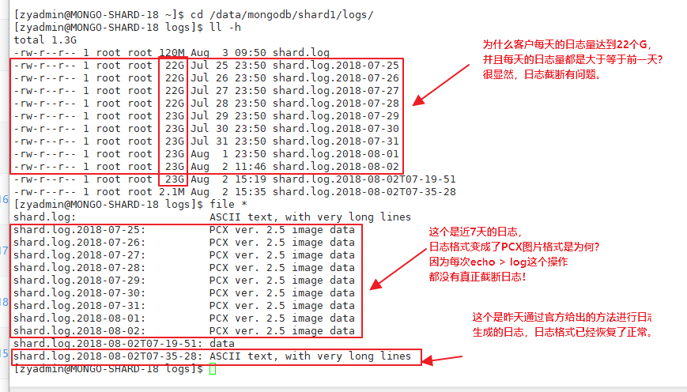
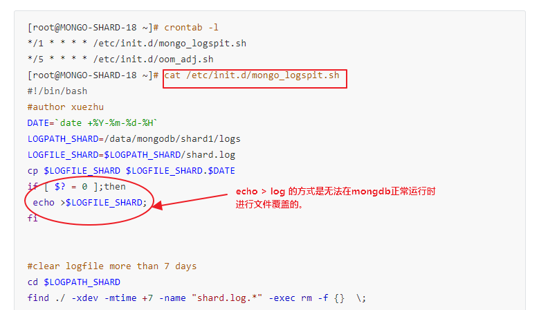
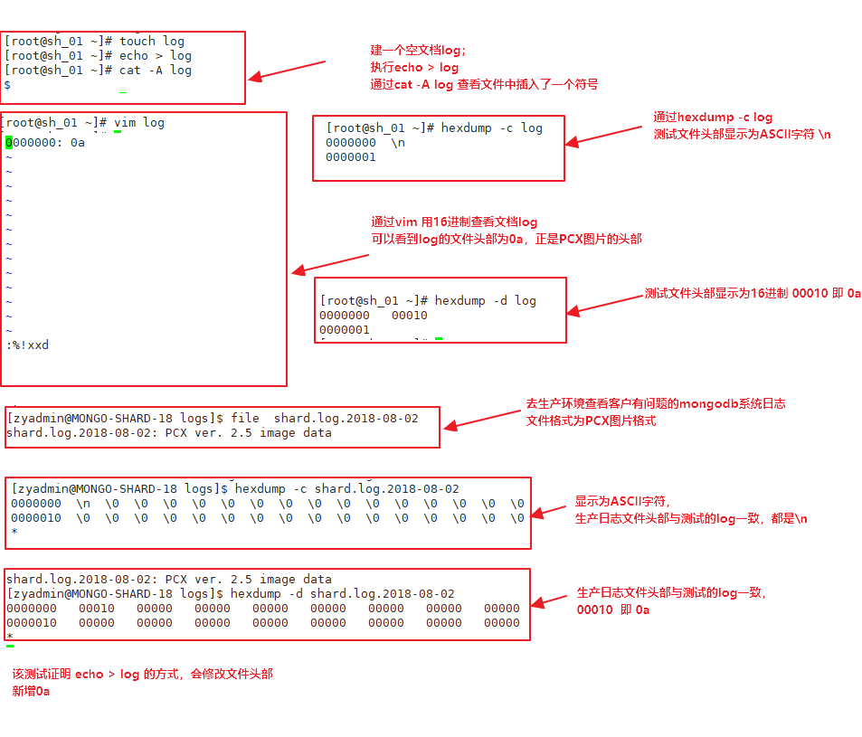
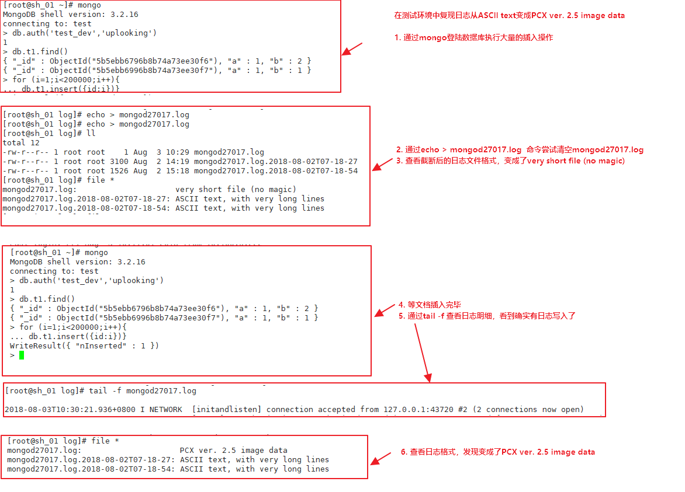
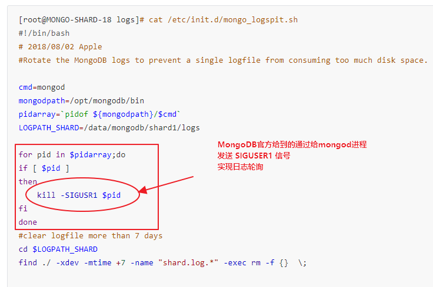
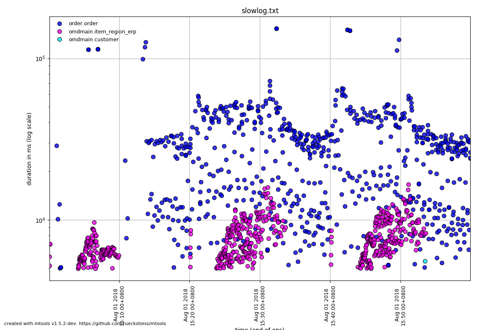

摘要：

- 某天晚上刚到家不久，就接到杭州同事的电话，客户MongoDB集群中的某个分片节点CPU飙高，初步判断是慢查询，现在需要拉取CPU飙高时间段的慢查询。心想拉取慢查询应该很快，不就是个系统日志吗？而且还做了日志切割一天一个，按道理很快搞定的，谁知当天晚上搞了接近三个小时也没搞定。究竟发生了什么？
- 进入到日志目录一看，目前保留近7天的日志，每天的日志量在23G~24G，我当时就想这个客户数据量这么大！后续发现日志格式本该为普通文本文件确变成了图片格式，究竟为何会文件格式会转变？能否从图片格式中拉取指定时间段的日志呢？
- 第二天到公司，由于客户环境我们也是第一次接手，因此咱们技术专家团队搞了一个3人的"专家会诊"，经过了一番折腾总算把原因找到了，具体过程请看下文！

<!--more-->

## 故事背景

### 数据库明细

说在前面：

- 数据库：MongoDB集群 4个分片节点
- 分片节点规格：16核 / 32G CentOS 7.4 64位
- 数据目录所在磁盘: 300G 49G 252G 17% /data

### 故事情节

- 某天晚上刚到家不久，就接到杭州同事的电话，客户MongoDB集群中的某个分片节点CPU飙高，初步判断是慢查询，现在需要拉取CPU飙高时间段的慢查询。心想拉取慢查询应该很快，不就是个系统日志吗？而且还做了日志切割一天一个，按道理很快搞定的，谁知当天晚上搞了接近三个小时也没搞定。究竟发生了什么？
- 进入到日志目录一看，目前保留近7天的日志，每天的日志量在23G~24G，我当时就想这个客户数据量这么大！后续发现日志格式本该为普通文本文件确变成了图片格式，究竟为何会文件格式会转变？能否从图片格式中拉取指定时间段的日志呢？
- 第二天到公司，由于客户环境我们也是第一次接受，因此咱们技术专家团队搞了一个3人的"专家会诊"，经过了一番折腾总算把原因找到了，具体过程请看下文！

## 复现与剖析

### 拉取日志异常

**使用mlogfilter过滤文件时报错说文件非mongodb的日志文件**

```shell
[root@sh_01 booboo]# mlogfilter shard.log.2018-08-01 --from 2018-08-01T15:00:00.000+0800 --to "+1h" --slow 1000 > /alidata/booboo/tf.1
报错:非mongodb日志格式
```

回到客户服务器检查日志文件格式，明细如下：

```shell
[root@MONGO-SHARD-18 logs]# file *
shard.log:            PCX ver. 2.5 image data
shard.log.2018-07-25: PCX ver. 2.5 image data
shard.log.2018-07-26: PCX ver. 2.5 image data
shard.log.2018-07-27: PCX ver. 2.5 image data
shard.log.2018-07-28: PCX ver. 2.5 image data
shard.log.2018-07-29: PCX ver. 2.5 image data
shard.log.2018-07-30: PCX ver. 2.5 image data
shard.log.2018-07-31: PCX ver. 2.5 image data
shard.log.2018-08-01: PCX ver. 2.5 image data
```

mongodb的日志正常应该为：`ASCII text, with very long lines`，但是现在却变成了`PCX ver. 2.5 image data`。需要弄清楚原因。

### 日志异常分析

- 为什么客户每天的日志量达到22个G，并且每天的日志量都是大于等于前一天？很显然，日志截断有问题。
- 这个是近7天的日志，而日志格式变成了PCX图片格式是为何？
- 怀疑每次日志轮询时都没有真正截断日志！



### 分析原日志切割明细



怀疑与`echo > `有关，进行验证。

### 验证`echo >`与`PCX图片头部0a一致`

1. 建一个空文档`log`；执行`echo > log`；通过`cat -A log `查看文件中插入了一个符号即换行符`\n`
2. 通过`hexdump -c log` 查看测试文件头部显示为ASCII字符 `\n`
3. 通过`hexdump -d log` 查看测试文件头部显示为16进制` 00010` 即` 0a`
4. 通过`vim` 用16进制查看文档`log`可以看到log的文件头部为`0a`，正是PCX图片的头部
5. 生产环境查看客户有问题的mongodb系统日志文件格式为`PCX`图片格式
6. 通过`hexdump -c log` 显示为ASCII字符，生产日志文件头部与测试的log一致，都是`\n`
7. 通过`hexdump -d log`显示为16进制，生产日志文件头部与测试的log一致`00010 ` 即 `0a`



**到此验证成功:通过`echo > log`的方式会往文件头部新增'0a'**

---

### 复现MongoDB日志从ASCII text转变为PCX 格式

在测试环境中复现日志从`ASCII text`变成`PCX ver. 2.5 image data`

1. 通过mongo登陆数据库执行大量的插入操作
2. 通过echo > mongod27017.log 命令尝试清空mongod27017.log
3. 查看截断后的日志文件格式，变成了very short file (no magic)
4. 等文档插入完毕
5. 通过`tail -f` 查看日志明细，看到确实有日志写入
6. 查看日志格式，发现变成了`PCX ver. 2.5 image data`



```shell
[root@sh_01 ~]# mongo
MongoDB shell version: 3.2.16
connecting to: test
> db.auth('test_dev','uplooking')
1
> db.t1.find()
{ "_id" : ObjectId("5b5ebb6796b8b74a73ee30f6"), "a" : 1, "b" : 2 }
{ "_id" : ObjectId("5b5ebb6996b8b74a73ee30f7"), "a" : 1, "b" : 1 }
> for (i=1;i<200000;i++){
... db.t1.insert({id:i})}
WriteResult({ "nInserted" : 1 })

[root@sh_01 ~]# cd /alidata/mongodb/logs
[root@sh_01 log]# ll
-rw-r--r-- 1 root root 2182 Aug  3 10:28 mongod27017.log
-rw-r--r-- 1 root root 3100 Aug  2 14:19 mongod27017.log.2018-08-02T07-18-27
-rw-r--r-- 1 root root 1526 Aug  2 15:18 mongod27017.log.2018-08-02T07-18-54
[root@sh_01 log]# file *
mongod27017.log:                     ASCII text, with very long lines
mongod27017.log.2018-08-02T07-18-27: ASCII text, with very long lines
mongod27017.log.2018-08-02T07-18-54: ASCII text, with very long lines

[root@sh_01 log]# echo > mongod27017.log
[root@sh_01 log]# echo > mongod27017.log
[root@sh_01 log]# ll
total 12
-rw-r--r-- 1 root root    1 Aug  3 10:29 mongod27017.log
-rw-r--r-- 1 root root 3100 Aug  2 14:19 mongod27017.log.2018-08-02T07-18-27
-rw-r--r-- 1 root root 1526 Aug  2 15:18 mongod27017.log.2018-08-02T07-18-54
[root@sh_01 log]# file *
mongod27017.log:                     very short file (no magic)
mongod27017.log.2018-08-02T07-18-27: ASCII text, with very long lines
mongod27017.log.2018-08-02T07-18-54: ASCII text, with very long lines

[root@sh_01 log]# tail -f mongod27017.log

2018-08-03T10:30:21.936+0800 I NETWORK  [initandlisten] connection accepted from 127.0.0.1:43720 #2 (2 connections now open)

[root@sh_01 log]# ll -h
total 12K
-rw-r--r-- 1 root root 2.8K Aug  3 10:30 mongod27017.log
-rw-r--r-- 1 root root 3.1K Aug  2 14:19 mongod27017.log.2018-08-02T07-18-27
-rw-r--r-- 1 root root 1.5K Aug  2 15:18 mongod27017.log.2018-08-02T07-18-54
[root@sh_01 log]# file *
mongod27017.log:                     PCX ver. 2.5 image data
mongod27017.log.2018-08-02T07-18-27: ASCII text, with very long lines
mongod27017.log.2018-08-02T07-18-54: ASCII text, with very long lines


# 一边不断产生日志，一边多次执行echo>
[root@sh_01 log]# echo > mongod27017.log
[root@sh_01 log]# echo > mongod27017.log
[root@sh_01 log]# file *
mongod27017.log:                     PCX ver. 2.5 image data
mongod27017.log.2018-08-02T07-18-27: ASCII text, with very long lines
mongod27017.log.2018-08-02T07-18-54: ASCII text, with very long lines
mongod27017.log.2018-08-03T03-09-08: PCX ver. 2.5 image data
[root@sh_01 log]# echo > mongod27017.log
[root@sh_01 log]# file *
mongod27017.log:                     very short file (no magic)
mongod27017.log.2018-08-02T07-18-27: ASCII text, with very long lines
mongod27017.log.2018-08-02T07-18-54: ASCII text, with very long lines
mongod27017.log.2018-08-03T03-09-08: PCX ver. 2.5 image data
[root@sh_01 log]# ll -h
total 16K
-rw-r--r-- 1 root root    1 Aug  3 11:28 mongod27017.log
-rw-r--r-- 1 root root 3.1K Aug  2 14:19 mongod27017.log.2018-08-02T07-18-27
-rw-r--r-- 1 root root 1.5K Aug  2 15:18 mongod27017.log.2018-08-02T07-18-54
-rw-r--r-- 1 root root 2.9K Aug  3 11:05 mongod27017.log.2018-08-03T03-09-08
[root@sh_01 log]# file *
mongod27017.log:                     very short file (no magic)
mongod27017.log.2018-08-02T07-18-27: ASCII text, with very long lines
mongod27017.log.2018-08-02T07-18-54: ASCII text, with very long lines
mongod27017.log.2018-08-03T03-09-08: PCX ver. 2.5 image data
[root@sh_01 log]# file *
mongod27017.log:                     PCX ver. 2.5 image data
mongod27017.log.2018-08-02T07-18-27: ASCII text, with very long lines
mongod27017.log.2018-08-02T07-18-54: ASCII text, with very long lines
mongod27017.log.2018-08-03T03-09-08: PCX ver. 2.5 image data
[root@sh_01 log]# hexdump -c mongod27017.log
0000000  \n  \0  \0  \0  \0  \0  \0  \0  \0  \0  \0  \0  \0  \0  \0  \0
0000010  \0  \0  \0  \0  \0  \0  \0  \0  \0  \0  \0  \0  \0  \0  \0  \0
*
0000850  \0  \0  \0  \0  \0  \0  \0   2   0   1   8   -   0   8   -   0
0000860   3   T   1   1   :   2   9   :   0   6   .   7   2   9   +   0
0000870   8   0   0       I       A   C   C   E   S   S               [
0000880   c   o   n   n   3   ]       U   n   a   u   t   h   o   r   i
0000890   z   e   d   :       n   o   t       a   u   t   h   o   r   i
00008a0   z   e   d       o   n       t   e   s   t       t   o       e
00008b0   x   e   c   u   t   e       c   o   m   m   a   n   d       {
00008c0       f   i   n   d   :       "   t   1   "   ,       f   i   l
00008d0   t   e   r   :       {   }       }  \n
```

成功复现了客户的情况：

1. 第一次`echo > log`，文件头部新增`\n`

2. 多次`echo > log`,文件头部如下：

   ```shell
   0000000  \n  \0  \0  \0  \0  \0  \0  \0  \0  \0  \0  \0  \0  \0  \0  \0
   0000010  \0  \0  \0  \0  \0  \0  \0  \0  \0  \0  \0  \0  \0  \0  \0  \0
   *
   ```

确实是mongodb日志轮询出了问题：

1. `echo > log`会往文件头部插入`\n`即16进制的`0a`
2. 在数据库正常运行中，对log文件是加了锁的，强制执行`echo > log`是无法进行覆盖的，会将所有的数据全部置为`0`
3. 强制覆盖后，文件头部变成了无数的空白

### 待解决问题

- MongoDB日志轮询方法调整为**kill -SIGUSER1 [mongodpid]**
- 修复目前已经变为图片格式的日志，并拉取15点到16点的日志

## 解决方法

### MongoDB日志轮询

#### 测试环境

```shell
[root@sh_01 log]# pidof mongod
1828
[root@sh_01 log]# kill -SIGUSER1 1828
-bash: kill: SIGUSER1: invalid signal specification
[root@sh_01 log]# kill -SIGUSR1 1828
[root@sh_01 log]# ll
total 16
-rw-r--r-- 1 root root 1526 Aug  3 11:09 mongod27017.log
-rw-r--r-- 1 root root 3100 Aug  2 14:19 mongod27017.log.2018-08-02T07-18-27
-rw-r--r-- 1 root root 1526 Aug  2 15:18 mongod27017.log.2018-08-02T07-18-54
-rw-r--r-- 1 root root 2942 Aug  3 11:05 mongod27017.log.2018-08-03T03-09-08
[root@sh_01 log]# file *
mongod27017.log:                     ASCII text, with very long lines
mongod27017.log.2018-08-02T07-18-27: ASCII text, with very long lines
mongod27017.log.2018-08-02T07-18-54: ASCII text, with very long lines
mongod27017.log.2018-08-03T03-09-08: PCX ver. 2.5 image data
```

#### 生产环境



修改日志轮询脚本：

```shell
[root@MONGO-SHARD-18 logs]# cat /etc/init.d/mongo_logspit.sh
#!/bin/bash
# 2018/08/02 Apple
#Rotate the MongoDB logs to prevent a single logfile from consuming too much disk space.

cmd=mongod
mongodpath=/opt/mongodb/bin
pidarray=`pidof ${mongodpath}/$cmd`
LOGPATH_SHARD=/data/mongodb/shard1/logs

for pid in $pidarray;do
if [ $pid ]
then
    kill -SIGUSR1 $pid
fi
done
#clear logfile more than 7 days
cd $LOGPATH_SHARD
find ./ -xdev -mtime +7 -name "shard.log.*" -exec rm -f {}  \;


```

所有的分片都去执行：

```shell
kill -SIGUSR1 pidof mongod
```

分片15操作如下：其他分片同样

```shell
[zyadmin@MONGO-SHARD-15 ~]$ sudo -i
[root@MONGO-SHARD-15 ~]# cd /data/mongodb/shard1/logs/
[root@MONGO-SHARD-15 logs]# ll -h
total 1.7G
-rw-r--r-- 1 root root 20G Aug  2 15:27 shard.log
-rw-r--r-- 1 root root 19G Jul 25 23:50 shard.log.2018-07-25
-rw-r--r-- 1 root root 19G Jul 26 23:50 shard.log.2018-07-26
-rw-r--r-- 1 root root 19G Jul 27 23:50 shard.log.2018-07-27
-rw-r--r-- 1 root root 20G Jul 28 23:50 shard.log.2018-07-28
-rw-r--r-- 1 root root 20G Jul 29 23:50 shard.log.2018-07-29
-rw-r--r-- 1 root root 20G Jul 30 23:50 shard.log.2018-07-30
-rw-r--r-- 1 root root 20G Jul 31 23:50 shard.log.2018-07-31
-rw-r--r-- 1 root root 20G Aug  1 23:50 shard.log.2018-08-01
[root@MONGO-SHARD-15 logs]# file *
shard.log:            PCX ver. 2.5 image data
shard.log.2018-07-25: PCX ver. 2.5 image data
shard.log.2018-07-26: PCX ver. 2.5 image data
shard.log.2018-07-27: PCX ver. 2.5 image data
shard.log.2018-07-28: PCX ver. 2.5 image data
shard.log.2018-07-29: PCX ver. 2.5 image data
shard.log.2018-07-30: PCX ver. 2.5 image data
shard.log.2018-07-31: PCX ver. 2.5 image data
shard.log.2018-08-01: PCX ver. 2.5 image data
[root@MONGO-SHARD-15 logs]# kill -SIGUSR1 `pidof mongod`
[root@MONGO-SHARD-15 logs]# file *
shard.log:                     ASCII text, with very long lines
shard.log.2018-07-25:          PCX ver. 2.5 image data
shard.log.2018-07-26:          PCX ver. 2.5 image data
shard.log.2018-07-27:          PCX ver. 2.5 image data
shard.log.2018-07-28:          PCX ver. 2.5 image data
shard.log.2018-07-29:          PCX ver. 2.5 image data
shard.log.2018-07-30:          PCX ver. 2.5 image data
shard.log.2018-07-31:          PCX ver. 2.5 image data
shard.log.2018-08-01:          PCX ver. 2.5 image data
shard.log.2018-08-02T07-27-29: PCX ver. 2.5 image data
[root@MONGO-SHARD-15 logs]# ll -h
total 1.7G
-rw-r--r-- 1 root root 2.0K Aug  2 15:27 shard.log
-rw-r--r-- 1 root root  19G Jul 25 23:50 shard.log.2018-07-25
-rw-r--r-- 1 root root  19G Jul 26 23:50 shard.log.2018-07-26
-rw-r--r-- 1 root root  19G Jul 27 23:50 shard.log.2018-07-27
-rw-r--r-- 1 root root  20G Jul 28 23:50 shard.log.2018-07-28
-rw-r--r-- 1 root root  20G Jul 29 23:50 shard.log.2018-07-29
-rw-r--r-- 1 root root  20G Jul 30 23:50 shard.log.2018-07-30
-rw-r--r-- 1 root root  20G Jul 31 23:50 shard.log.2018-07-31
-rw-r--r-- 1 root root  20G Aug  1 23:50 shard.log.2018-08-01
-rw-r--r-- 1 root root  20G Aug  2 15:27 shard.log.2018-08-02T07-27-29
```

### 修复异常日志

#### 修复思路

弄清楚日志变更的原因以及复现过程后，不难发现，日志因为头部变化从而导致文件格式变更。因此推测异常日志的组成如下：

1. 头部为`0a`
2. 中间全部都是`0`
3. 最后是正常的字符串记录着mongodb的日志信息，类似于`2018-08-03T10:30:21.936+0800 I NETWORK  [initandlisten] connection accepted from 127.0.0.1:43720 #2 (2 connections now open)`由日志和日志明细组成

因此修复的思路如下：

- 23G的日志，首先按照大小6G做切分`split -b 6G log`，切分成4个文件
- 查看切分后的日志格式，如果最后一个日志为`ASCII text`则不再切分否则，将最后一个日志继续切分
- 循环上一步，直到最后一个文件切分出来没有`ASCII text`为止

#### 操作明细

> 日志轮询的部署距离现在大概4个月

1. 第一次将23G的文件以6G切分成4个文件：xaa\xab\xac\xad，查看4个文件的属性为

```shell
xaa:               PCX ver. 2.5 image data
xab:               PCX ver. 2.5 image data
xac:               PCX ver. 2.5 image data
xad:                PCX ver. 2.5 image data
```

2. 重命名xad为x1第二次切分x1 5G，按照1G切分成5份，查看文件属性

```shell
xaa:               PCX ver. 2.5 image data
xab:               PCX ver. 2.5 image data
xac:               PCX ver. 2.5 image data
xad:                PCX ver. 2.5 image data
xae:                ASCII text, with very long lines
```

3. 重名xad 为 x2 按照15M的大小切分，查看文件的属性如下

```shell
xaa:	      PCX ver. 2.5 image data
此处省略。。。
xdo:               PCX ver. 2.5 image data
xdp:               ASCII text, with very long lines
xdq:               ASCII text, with very long lines
xdr:               ASCII text, with very long lines
xds:               ASCII text, with very long lines
xdt:               ASCII text, with very long lines
xdu:               ASCII text, with very long lines
xdv:               UTF-8 Unicode text, with very long lines
xdw:               ASCII text, with very long lines
xdx:               ASCII text, with very long lines
xdy:               ASCII text, with very long lines
```

4. 切分后文件类型为`ASCII text`的文件中找到15点~16点的文档

```shell
[root@sh_01 mongolog_20180801]# head -n 2 xdv
re: "x86_64", version: "Kernel 3.10.0-693.2.2.el7.x86_64" } }
2018-08-01T16:13:44.958+0800 I ACCESS   [conn4972925] Successfully authenticated as principal __system on local
[root@sh_01 mongolog_20180801]# head -n 2 xdu
38422 #4967772 (445 connections now open)
2018-08-01T14:00:10.575+0800 I NETWORK  [thread1] connection accepted from 172.16.0.44:38430 #4967773 (446 connections now open)
```

- `xdv` 的头部是`2018-08-01T16:13:44.958+0800`,因此可以确定15~16的日志在xdu中
- `xdu`记录的日志时间段为`2018-08-01T14:00:10.575+0800`~`2018-08-01T16:13:44.958+0800`
- 重命名`xdu`为`mongolog.18.14_16`

### 分析日志

#### 分析命令

```shell
# 获取08月01号下午3点开始到4点执行时间超过5秒的查询
mlogfilter mongolog.18.14_16 --from 2018-08-01T15 --to "+1h" --slow 5000 > slowlog.txt

# 获取08月01号下午3点开始到4点语句的执行次数、用时等统计信息
mloginfo slowlog.txt  --queries > an_slowlog.txt

# 通过mplotqueries进行慢查询散点分布图绘制，且只返回前10个
mplotqueries slowlog.txt --output-file 01.png --logscale --group-limit 10
```

#### 慢查询散点分布图

```shell
[root@sh_01 booboo]# mplotqueries slowlog.txt --output-file 01.png --logscale --group-limit 10

SCATTER plot
   id   #points  group
    1       692  order.order
    2       615  omdmain.item_region_erp
    3         1  omdmain.customer
()
```



## 总结

### mongodb日志轮询的问题

1. `echo > log`会往文件头部插入`\n`即16进制的`0a`
2. 在数据库正常运行中，对log文件是加了锁的，强制执行`echo > log`是无法进行覆盖的，会将所有的数据全部置为`0`
3. 强制覆盖后，文件头部变成了无数的空白

### 问题解决

- MongoDB日志轮询方法调整为**kill -SIGUSER1 [mongodpid]**
- 修复目前已经变为图片格式的日志，并拉取15点到16点的日志

该case花了一整天，从怀疑被攻击到确认是日志轮询引起文件格式变更是一个关键转折点；

另外PCX格式是第一次碰到，疑惑了半天~最后是@培尧发现了`echo`的端倪，@衾袭@大宝去验证最终确认了问题的根源。
