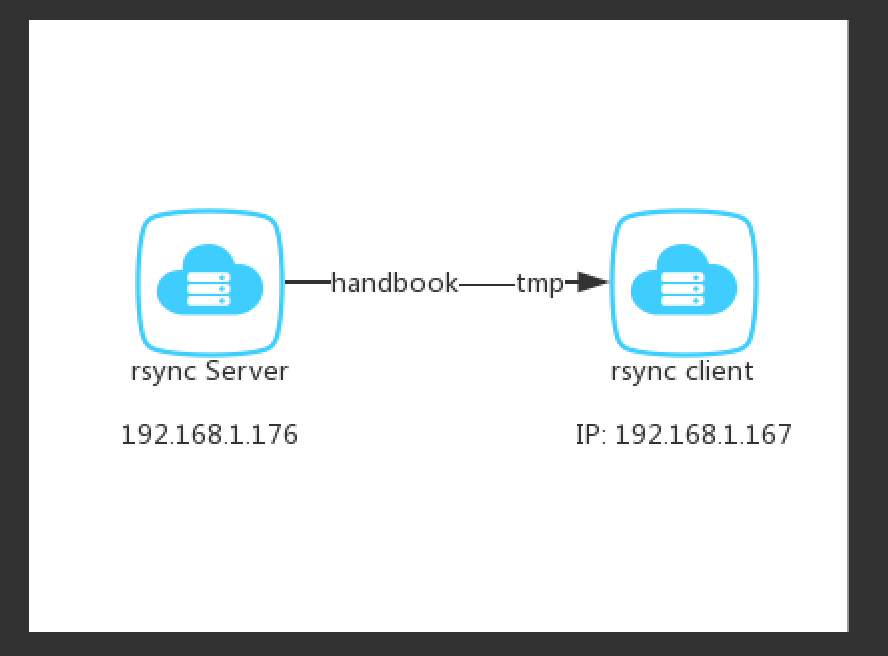
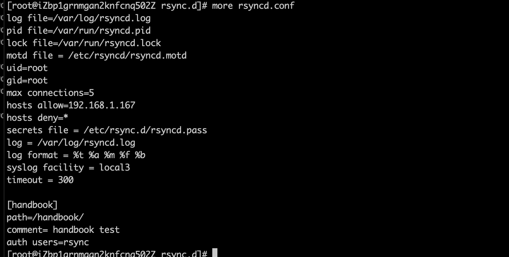
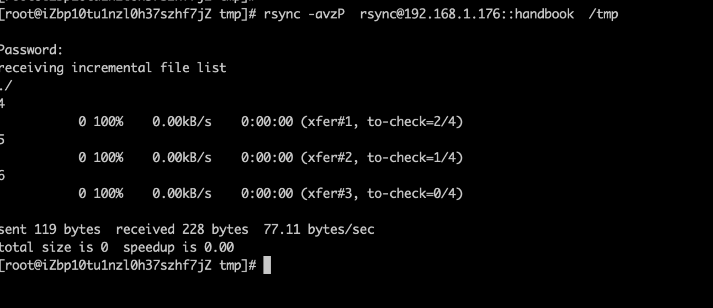
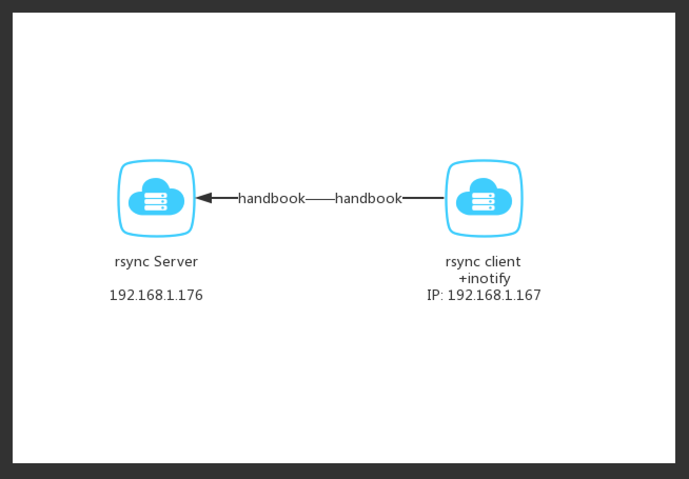
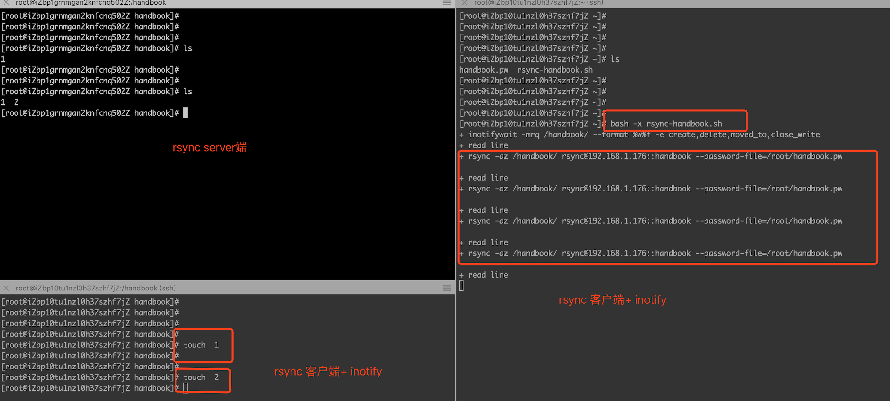

<!-- MDTOC maxdepth:6 firsth1:1 numbering:0 flatten:0 bullets:1 updateOnSave:1 -->

- [rsync介绍](#rsync介绍)
  - [RSYNC六种命令格式](#rsync六种命令格式)
  - [RSYNC安装](#rsync安装)
  - [RSYNC案例](#rsync案例)
  - [RSYNC参数](#rsync参数)
- [应用场景-Linux系统下实现文件实时同步](#应用场景-linux系统下实现文件实时同步)
  - [Server端配置](#server端配置)
    - [环境介绍](#环境介绍)
    - [安装方式](#安装方式)
    - [配置](#配置)
    - [编写主配置文件 rsyncd.conf](#编写主配置文件-rsyncdconf)
    - [编写用户认证文件](#编写用户认证文件)
    - [启动服务](#启动服务)
  - [rsync客户端](#rsync客户端)
    - [安装方式](#安装方式)
    - [验证](#验证)
  - [使用](#使用)
    - [检测创建事件](#检测创建事件)
    - [检测删除事件](#检测删除事件)
    - [编写实时同步脚本](#编写实时同步脚本)
  - [验证](#验证)

<!-- /MDTOC -->

## rsync介绍

rsync，remote synchronize顾名思意就知道它是一款实现远程同步功能的软件，它在同步文件的同时，可以保持原来文件的权限、时间、软硬链接等附加信息。 rsync是用 “rsync 算法”提供了一个客户机和远程文件服务器的文件同步的快速方法，而且可以通过ssh方式来传输文件，这样其保密性也非常好，另外它还是免费的软件。

### RSYNC六种命令格式

Rsync的命令格式可以为以下六种：

```bash
rsync [OPTION]... SRC DEST
　　rsync [OPTION]... SRC [USER@]HOST:DEST
　　rsync [OPTION]... [USER@]HOST:SRC DEST
　　rsync [OPTION]... [USER@]HOST::SRC DEST
　　rsync [OPTION]... SRC [USER@]HOST::DEST
　　rsync [OPTION]... rsync://[USER@]HOST[:PORT]/SRC [DEST]
```

对应于以上六种命令格式，rsync有六种不同的工作模式：

- 拷贝本地文件。当SRC和DES路径信息都不包含有单个冒号":"分隔符时就启动这种工作模式。如：rsync -a /data /backup
- 使用一个远程shell程序(如rsh、ssh)来实现将本地机器的内容拷贝到远程机器。当DST路径地址包含单个冒号":"分隔符时启动该模式。如：rsync -avz \*.c foo:src
- 使用一个远程shell程序(如rsh、ssh)来实现将远程机器的内容拷贝到本地机器。当SRC地址路径包含单个冒号":"分隔符时启动该模式。如：rsync -avz foo:src/bar /data
- 从远程rsync服务器中拷贝文件到本地机。当SRC路径信息包含"::"分隔符时启动该模式。如：rsync -av root@172.16.78.192::www /databack
- 从本地机器拷贝文件到远程rsync服务器中。当DST路径信息包含"::"分隔符时启动该模式。如：rsync -av /databack root@172.16.78.192::www
- 列远程机的文件列表。这类似于rsync传输，不过只要在命令中省略掉本地机信息即可。如：rsync -v rsync://172.16.78.192/www

### RSYNC安装

```bash
#注：在debian、ubuntu 等在线安装方法；
sudo apt-get install rsync


#注：Fedora、Redhat 等在线安装方法；
yum install rsync

#注：Fedora、Redhat 等rpm包安装方法；
rpm -ivh rsync
```

### RSYNC案例

在我们内部跳板机1：杭州节点（主）中，对应在“/etc/ssh/ssh_config.d”中配置了每个项目的ssh快捷登陆，所以后续我们只需要“ssh <主机名>”便能登陆到对应的目标服务器中。
但这里有个问题，我们在杭州节点（主）中，对应变更了“/etc/ssh/ssh_config.d”的配置，那其他跳板机怎么样同步更新呢？其实这里我们采用了rsync的方式来同步配置文件。

```bash
# rsync server配置
# 1.在内部跳板机1：杭州节点（主：srv-zy-ssh1）上，编辑配置文件/etc/rsyncd.conf
uid=root
git=root
use chroot=no
max connection=0
port=873
pid file=/var/log/rsync/rsyncd.pid
lock file=/var/log/rsync/rsync.lock
log file=/var/log/rsync/rsyncd.log
motd file=/var/log/rsync/rsyncd.motd
strict modes=yes
[sshconfig]
uid=root
git=root
path=/etc/ssh/ssh_config.d/
comment=rsync ssh_config
read only=false
list=false
host allow=ip1 ip2 ip3
#hosts deny=172.25.0.0/24
auth users=sshconfig
secrets file=/etc/rsyncd.passwd

#2.编辑/etc/rsyncd.passwd 文件加入以下内容
sshconfig:rsync20150128

#3.赋权（必须600权限，否则报错）
chmod 600 /etc/rsyncd.passwd

#4.启动rsync
rsync --daemon /etc/rsyncd.conf

# rsync cilent配置
分别在其他跳板机上面：
内部跳板机2：青岛节点（备：srv-zy-ssh2）
客户跳板机1：杭州节点（主：srv-zy-ssh3）
客户跳板机2：青岛节点（备：srv-zy-ssh4）

# 编辑/etc/rsyncd.passwd 文件加入以下内容：
sshconfig:rsync20150128

# 赋权（必须600权限，否则报错）:
chmod 600 /etc/rsyncd.passwd

# 执行同步命令：
rsync -vzrtopg --delete --progress sshconfig@115.29.244.224::sshconfig /etc/ssh/ssh_config.d/ --password-file=/etc/rsyncd.passwd
或者：
rsync -avz --delete --progress sshconfig@115.29.244.224::sshconfig /etc/ssh/ssh_config.d/ --password-file=/etc/rsyncd.passwd
```

### RSYNC参数

```bash
rsync参数的具体解释如下：
-v, --verbose 详细模式输出
-q, --quiet 精简输出模式
-c, --checksum 打开校验开关，强制对文件传输进行校验
-a, --archive 归档模式，表示以递归方式传输文件，并保持所有文件属性，等于-rlptgoD
-r, --recursive 对子目录以递归模式处理
-R, --relative 使用相对路径信息
-b, --backup 创建备份，也就是对于目的已经存在有同样的文件名时，将老的文件重新命名为~filename。可以使用--suffix选项来指定不同的备份文件前缀。
--backup-dir 将备份文件(如~filename)存放在在目录下。
-suffix=SUFFIX 定义备份文件前缀
-u, --update 仅仅进行更新，也就是跳过所有已经存在于DST，并且文件时间晚于要备份的文件。(不覆盖更新的文件)
-l, --links 保留软链结
-L, --copy-links 想对待常规文件一样处理软链结
--copy-unsafe-links 仅仅拷贝指向SRC路径目录树以外的链结
--safe-links 忽略指向SRC路径目录树以外的链结
-H, --hard-links 保留硬链结 -p, --perms 保持文件权限
-o, --owner 保持文件属主信息 -g, --group 保持文件属组信息
-D, --devices 保持设备文件信息 -t, --times 保持文件时间信息
-S, --sparse 对稀疏文件进行特殊处理以节省DST的空间
-n, --dry-run现实哪些文件将被传输
-W, --whole-file 拷贝文件，不进行增量检测
-x, --one-file-system 不要跨越文件系统边界
-B, --block-size=SIZE 检验算法使用的块尺寸，默认是700字节
-e, --rsh=COMMAND 指定使用rsh、ssh方式进行数据同步
--rsync-path=PATH 指定远程服务器上的rsync命令所在路径信息
-C, --cvs-exclude 使用和CVS一样的方法自动忽略文件，用来排除那些不希望传输的文件
--existing 仅仅更新那些已经存在于DST的文件，而不备份那些新创建的文件
--delete 删除那些DST中SRC没有的文件
--delete-excluded 同样删除接收端那些被该选项指定排除的文件
--delete-after 传输结束以后再删除
--ignore-errors 及时出现IO错误也进行删除
--max-delete=NUM 最多删除NUM个文件
--partial 保留那些因故没有完全传输的文件，以是加快随后的再次传输
--force 强制删除目录，即使不为空
--numeric-ids 不将数字的用户和组ID匹配为用户名和组名
--timeout=TIME IP超时时间，单位为秒
-I, --ignore-times 不跳过那些有同样的时间和长度的文件
--size-only 当决定是否要备份文件时，仅仅察看文件大小而不考虑文件时间
--modify-window=NUM 决定文件是否时间相同时使用的时间戳窗口，默认为0
-T --temp-dir=DIR 在DIR中创建临时文件
--compare-dest=DIR 同样比较DIR中的文件来决定是否需要备份
-P 等同于 --partial
--progress 显示备份过程
-z, --compress 对备份的文件在传输时进行压缩处理
--exclude=PATTERN 指定排除不需要传输的文件模式
--include=PATTERN 指定不排除而需要传输的文件模式
--exclude-from=FILE 排除FILE中指定模式的文件
--include-from=FILE 不排除FILE指定模式匹配的文件
--version 打印版本信息
--address 绑定到特定的地址
--config=FILE 指定其他的配置文件，不使用默认的rsyncd.conf文件
--port=PORT 指定其他的rsync服务端口
--blocking-io 对远程shell使用阻塞IO
-stats 给出某些文件的传输状态
--progress 在传输时现实传输过程
--log-format=formAT 指定日志文件格式
--password-file=FILE 从FILE中得到密码
--bwlimit=KBPS 限制I/O带宽，KBytes per second
-h, --help 显示帮助信息
```

## 应用场景-Linux系统下实现文件实时同步

在我们的日常场景中经常会经常碰到文件共享同步的问题，比如：

- 集群，提供高可用服务（需要网站代码或者目录实时同步，保证数据的一致性）
- 迁移数据 (实时增量传输)
- 文件备份（实时将数据备份到其他设备，防止数据丢失）

我们针对以上场景在 Linux 系统下实现文件实时同步

### Server端配置

#### 环境介绍

修改：调整了目录顺序

```
操作系统：CentOS 6.8 rsync: rsync-3.0.6 (yum 源默认安装)
```



#### 安装方式

安装方式

```
sudoapt-get ``installrsync#debian、ubuntu 等在线安装方法；``yum ``installrsync#Fedora、Redhat 等在线安装方法；``rpm -ivh ``rsync# Fedora、Redhat 等rpm包安装方法；``rpm -qa | ``greprsync# 查看安装的版本
```

#### 配置

修改： 文件名缺少“d” 字符

```
chmod 600 /etc/rsync.d/rsyncd.conf
chmod 600 /etc/rsync.d/rsyncd.pass
```

创建相关配置目录和文件

```
mkdir-p ``/etc/rsync``.d  ``# rsync 配置文件目录，默认没有touch/etc/rsync``.d``/rsyncd``.conf ``# rsync服务端配置文件touch/etc/rsync``.d``/rsyncd``.pass ``# 客户端拉取文件时使用的用户密码chmod600 ``/etc/rsync``.d``/rsyncd``.confchmod600 ``/etc/rsync``.d``/rsyncd``.pass
```

#### 编写主配置文件 rsyncd.conf

```bash
vim ``/etc/rsync``.d``/rsyncd``.conf
```

（以下是配置文件）

```bash
log file=/var/log/rsyncd.log

pid file=/var/run/rsyncd.pid

lock file=/var/run/rsyncd.lock

motd file = /etc/rsyncd/rsyncd.motd

uid=root

gid=root

max connections=5

hosts allow=192.168.1.167 # 允许访问的IP地址，我这里填写的是测试的客户端地址

hosts deny=*

secrets file = /etc/rsync.d/rsyncd.pass

log = /var/log/rsyncd.log l

og format = %t %a %m %f %b

syslog facility = local3 timeout = 300


[handbook]

path=/handbook/

comment= handbook

test auth users=rsync
```



详细参数可参考官网 [rsyncd.conf 介绍 ](https://download.samba.org/pub/rsync/rsyncd.conf.html)

#### 编写用户认证文件

```bash
vim /etc/rsync.d/rsyncd.pass
```

修改：将代码模式去除，并添加文字描述

输入以下内容：

```bash
rsync:cloudcare
```


#### 启动服务

```bash
rsync --daemon --config=/etc/rsync.d/rsyncd.conf
```

修改： 添加了“确认服务启动” 标题，以及相关命令; 将 “注：rsync 服务默认端口是 873” 前移 确认服务启动

注：rsync 服务默认端口是 873

确认服务启动

```bash
ps -ef | greprsyncnetstat-nltp | grep7589
```


### rsync客户端

客户端配置很简单，只需要安装 `rsync` 工具即可

#### 安装方式

```bash
# debian、ubuntu 等在线安装方法；
sudo apt-get install rsync
# Fedora、Redhat 等在线安装方法；
yum install rsync
# Fedora、Redhat 等rpm包安装方法；
rpm -ivh rsync
# 查看安装的版本
rpm -qa | greprsync
```

#### 验证

修改：添加了“示例内容”

示例： 将192.168.1.176 服务器上的 handbook （这里是定义的项目名称，可以参考rsync server 端的配置）项目同步到 192.168.1.167 的 /tmp 下

```bash
rsync -avzP ``rsync``@192.168.1.176::handbook ``/tmp
```

说明：
-a 参数，相当于-rlptgoD，
-r 是递归 -l 是链接文件，意思是拷贝链接文件；
-p 表示保持文件原有权限；
-t 保持文件原有时间；
-g 保持文件原有用户组；
-o 保持文件原有属主；
-D 相当于块设备文件；
-z 传输时压缩；
-P 传输进度；
-v 传输时的进度等信息

````





详细参数可以参考: [RSYNC 参数 ](https://confluence.jiagouyun.com/pages/viewpage.action?pageId=15503070)

如果想每隔一段时间同步一次，可以配合 crontab 来实现；但是如果想实时同步，那就需要用到inotify 工具了

## inotify

> inotify是Linux核心子系统之一，做为文件系统的附加功能，它可监控文件系统并将异动通知应用程序。摘自[维基百科](https://zh.wikipedia.org/wiki/Inotify) 可以配合rsync做实时同步，inotify 通过监控文件的变化，然后触发同步脚本，实现实时同步。

### 修改添加了“实验目地” 和“拓扑环境” 两个项目

### 实验目的

将 192.168.1.167 的 /handbook 目录下的内容实时同步到 192.168.1.176 定义的 “handbook” 目录下（实验环境依旧采用上面的老环境）

### 拓扑环境



### 安装

```bash
yum install-y inotify-tools
````

注：inotify 其实不需要任何的配置，安装好之后默认有两个命令;

> inotifywait : 在被监控的文件或目录上等待特定文件系统事件（open close delete等）发生
>
> inotifywatch :收集被监控的文件系统使用的统计数据,指文件系统事件发生的次数统计

### 使用

#### 检测创建事件

```
inotifywait -mrq ``/handbook/cd/handbook/touch1
```


#### 检测删除事件

```
inotifywait -mrq /handbook --timefmt "%d-%m-%y %H:%M" --format "%T %w%f 事 件 息: %e" -e delete cd /handbook/ rm -rf 1 4
```


#### 编写实时同步脚本

```
more rsync-handbook.sh
```

```
#!/bin/bash

inotifywait -mrq /handbook/ --format "%w%f" -e create,delete,moved_to,close_write | while read line do rsync -az /handbook/ rsync@192.168.1.176::handbook --password-file=/root/handbook.pw done
```

_注： 其中--password-file 是指定 `handbook`模块认用户认证的密码文件_

### 验证


