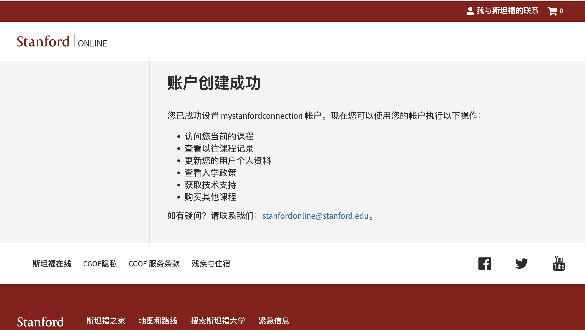
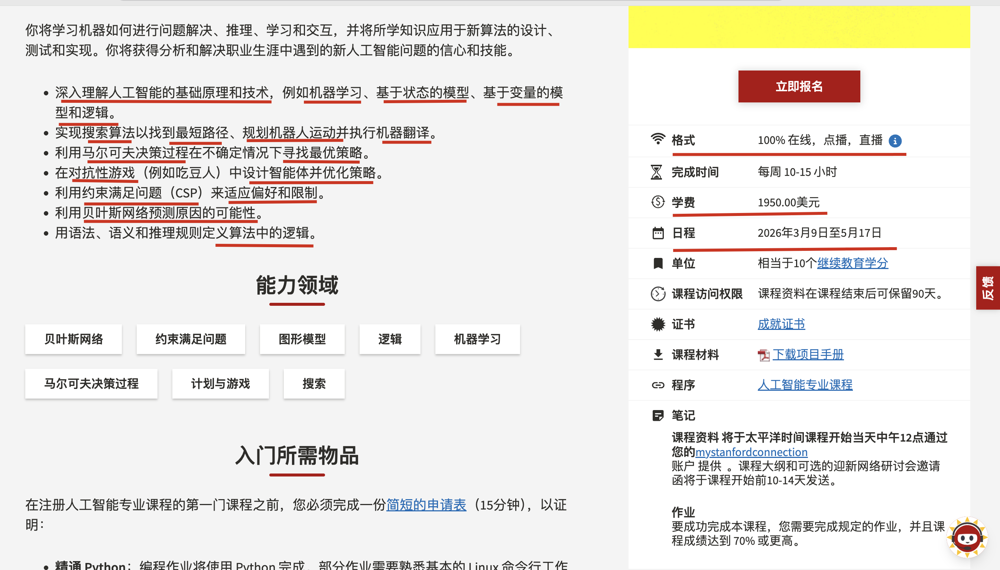
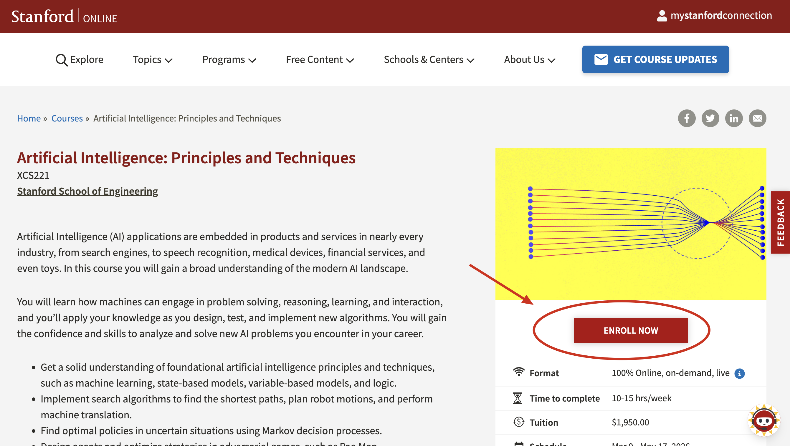
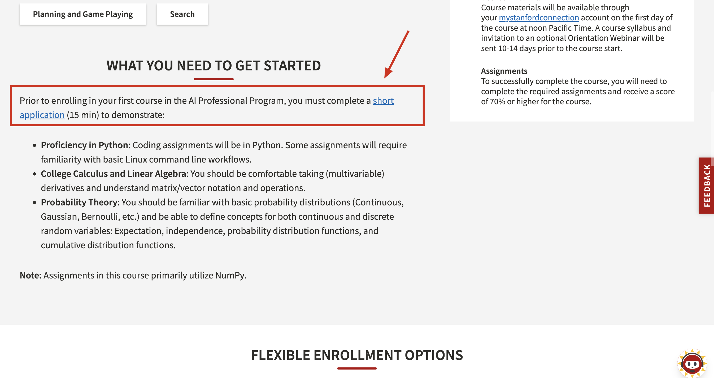
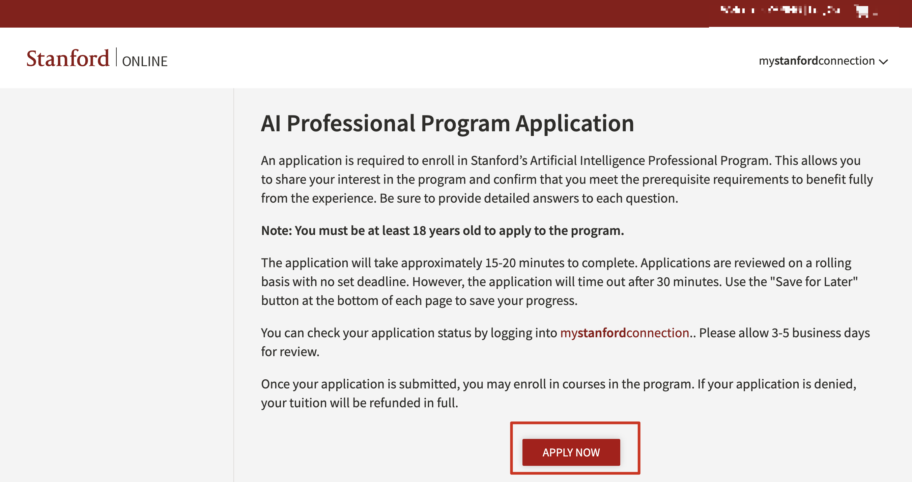
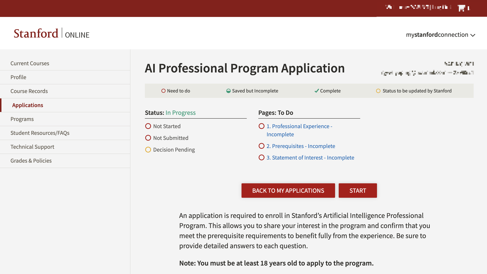
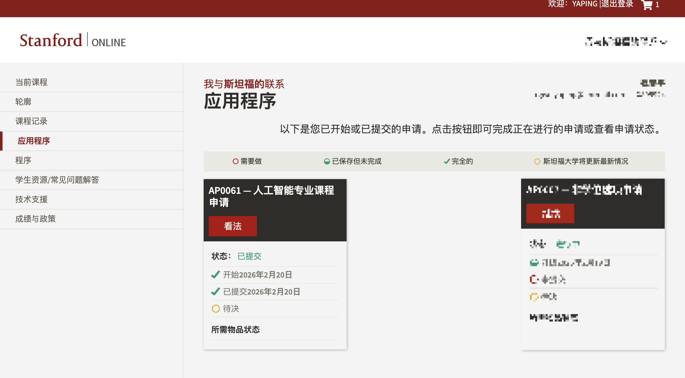
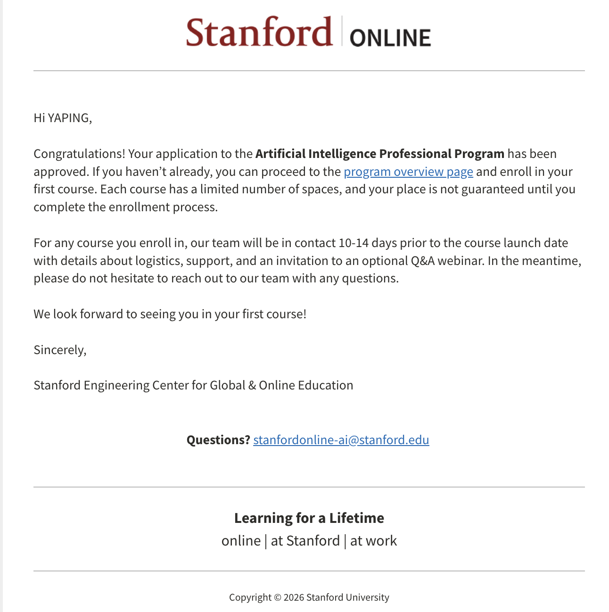
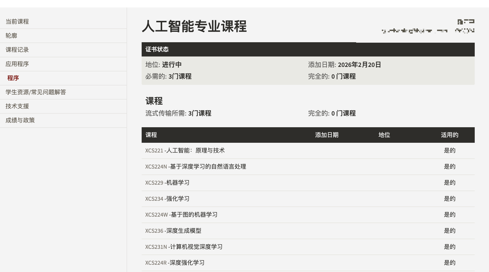

> 斯坦福官方：Artificial Intelligence Professional Program 人工智能专业教育项目

目标: 通过 **Stanford Online** 学习课程
本质: 走 **远程注册 + 非学位学习** 的路线

给已经在工作或不打算读全日制学位的人准备的正规入口。

---

## ✅ Stanford Online 实际申请流程

### 第一步：创建账户

进入 [Stanford Online](https://online.stanford.edu/) 官网
→ 注册一个学习账户
→ 填写基本身份信息

这一步没有学术筛选，就是建立学习档案。


---

### 第二步：找课程

斯坦福官方：职场 AI 进阶路线
如果你希望在简历上有“斯坦福”背书，以下两门课是专门为职场人士（XCS 系列）设计的：

XCS221：人工智能：原理与技术 (入门/进阶)

https://online.stanford.edu/courses/xcs221-artificial-intelligence-principles-and-techniques



- 适合理由： 这是 AI 的“百科全书”，涵盖搜索算法、博弈论和概率推理。作为 DBA，你会发现其中的“贝叶斯网络”和“逻辑推理”与数据库查询优化逻辑有异曲同工之妙。

- 硬性要求： 必须具备 Python 编程能力、多变量微积分和线性代数基础。

XCS229：机器学习 (硬核/高含金量)

- 适合理由： 侧重于监督学习和非监督学习。如果你想让数据库从“存储数据”进化为“预测趋势”，这是必修课。

- 建议： 斯坦福官方建议如果背景较浅，先修 XCS221 再修 XCS229。


CS230：CS230 帮助学生积累扎实的实战经验，到课程结束时，达到深度学习专家的水平。

- https://cs230.stanford.edu/

- 深度学习是人工智能领域最热门的技能之一。在本课程中，你将学习深度学习的基础知识，了解如何构建神经网络，以及如何领导成功的机器学习项目。你将学习卷积神经网络、循环神经网络（RNN）、长短期记忆网络（LSTM）、Adam优化器、Dropout优化器、BatchNorm归一化、Xavier/He初始化等内容。

---

### 第三步：提交课程注册申请

> XCS221: Artificial Intelligence: Principles and Techniques 










#### 回答问题

申请斯坦福大学人工智能专业课程需要提交申请。申请表可以帮助您表达对课程的兴趣，并确认您符合所有先决条件，以便充分利用课程资源。请务必详细回答每个问题。

注意：申请该项目者必须年满18岁。

填写申请表大约需要 15-20 分钟。申请将滚动审核，没有固定截止日期。但是，申请表将在 30 分钟后自动关闭。请使用每页底部的“稍后保存”按钮保存您的进度。

您可以通过登录我的斯坦福连接（my stanford connection）查看您的申请状态。审核需要3-5个工作日。

申请提交后，您即可报名参加该项目的课程。如果您的申请被拒绝，您的学费将全额退还。

1.熟练掌握 Python：所有课程作业均使用 Python 编写。如果您在其他编程语言（C/C++/MATLAB/Java/JavaScript）方面拥有丰富的编程经验，我们建议您在开始第一门课程之前熟悉 Python 的基础知识。部分作业需要您熟悉基本的 Linux 命令行操作流程。

```
I’ve been in the trenches for 14 years, with 12 of those years deep-diving into Linux systems. As a DBA and a Red Hat Certified System Administrator (RHCSA), the Linux command line is my natural habitat. Python has been my go-to tool for over a decade—I’ve used it to build everything from complex automation scripts for DB clusters to full-stack sites with Flask. I’m not just "familiar" with Python; I use it to solve real-world infrastructure problems every day.

中文逻辑：
我有14年实战经验，其中12年都在跟 Linux 打交道。作为一名持证的红帽系统管理员（RHCSA），Linux 命令行就是我的主场。Python 是我用了十多年的“老搭档”：从复杂的数据库自动化脚本到 Flask 站点开发，我样样都干。对我来说，Python 不只是代码，更是我解决日常架构问题的武器。
```

2.大学微积分、线性代数：你应该能够熟练地求（多元）导数，并理解矩阵/向量符号及其运算。 

```
My engineering background gave me the math, but my 14-year career built the intuition. I’m currently architecting and managing high-performance environments using Aurora MySQL, leveraging its cloud-native storage-compute separation. Beyond traditional RDBMS, I’m deep into the AI data stack: maintaining Vector Databases (Qdrant) for embeddings and Graph Databases (NebulaGraph, Neo4j) for complex relationship mapping. From scaling Google Spanner to optimizing high-dimensional searches, I live and breathe the matrix operations and data logic this program demands.

中文逻辑：
我的工程背景给了我数学基础，而 14 年的职业生涯则培养了我的技术直觉。目前我正负责 Aurora MySQL 高性能环境的架构与管理，对它的存储计算分离架构有深入实践。除了传统关系型数据库，我也深耕 AI 数据栈：维护 Qdrant（向量数据库） 处理嵌入向量，以及使用 NebulaGraph/Neo4j 处理复杂关系映射。从扩展 Google Spanner 到优化高维搜索，我每天都在处理该课程所需的矩阵运算和数据逻辑。
```


3.概率论：你应该熟悉基本的概率分布（连续分布、高斯分布、伯努利分布等），并能够定义以下连续和离散随机变量的概念：期望、独立性、概率


```
My foundation in Probability Theory stems from my Network Engineering degree, where I mastered distributions like Gaussian and Bernoulli. In my 14 years as a DBA, these aren't just academic concepts—I apply Expectation and Independence principles daily when analyzing database execution plans for Aurora MySQL and Spanner. To ensure I’m fully prepared for the rigor of Stanford's AI curriculum, I am currently conducting a comprehensive review of these probabilistic frameworks and their applications in machine learning.

```


4.Why are you interested in taking this professional course? 

```
I am a Principal Cloud Database Architect with 14 years of experience managing large-scale data systems across multi-cloud environments (AWS, GCP, Alibaba Cloud). My daily work has moved beyond traditional DevOps; we are now actively integrating AI to solve complex infrastructure problems.

We are currently building AI-driven tools for automated slow SQL analysis and natural language-based DB on-call agents. Furthermore, our AI platform’s reliance on Vector Databases (Qdrant) and Graph Databases (NebulaGraph) has created a new challenge for my team. While I have deep expertise in database internals and distributed systems (MySQL, TiDB, Spanner), I recognize that I need a more systematic understanding of AI principles to lead these initiatives effectively.

I am interested in this program because it provides the rigorous, technical framework I need to bridge the gap between "data storage" and "data intelligence." My goal is simple: to gain the theoretical depth required to architect and govern AI-native data infrastructures that are as reliable and cost-efficient as the traditional systems I’ve managed for over a decade.
```



第二天收到申请通过的邮件





需要从这些课程中至少完成3门课程才能获取人工智能专业证书。


### 第四步：购买课程

[Artificial Intelligence Professional Program](https://online.stanford.edu/programs/artificial-intelligence-professional-program?mkt_tok=MTk0LU9DUS00ODcAAAGgHs5vLWkQiM_x-oXITL5E1XzM0VL9o3mqfFC-HRy7gycqavRhcQ69qztaAgBHRW15ywwIcf-BtJQpPXiWkMUp3CmJRaAW8jcgwqHUVt3F88wfQG8)


Per course $1,950 USD

10 weeks per course, 10-15 hours per week

#### 斯坦福 AI 专业课程难度矩阵

| **课程编号** | **课程名称**             | **难度等级** | **核心难点所在**                                             |
| ------------ | ------------------------ | ------------ | ------------------------------------------------------------ |
| **XCS221**   | **人工智能：原理与技术** | ★★★          | **广度大**。涉及从经典搜索到逻辑推演的多种模型，思维切换快。 |
| **XCS229**   | **机器学习**             | ★★★★         | **数学底蕴**。强调底层公式推导（矩阵求导、概率建模），非单纯调包。 |
| **XCS231N**  | **计算机视觉深度学习**   | ★★★★         | **工程量**。作业涉及从零实现卷积神经网络（CNN），对图像处理算法要求高。 |
| **XCS224N**  | **深度学习自然语言处理** | ★★★★         | **架构理解**。需深入掌握 Transformer、注意力机制及大规模语言模型微调。 |
| **XCS224W**  | **基于图的机器学习**     | ★★★★☆        | **抽象空间建模**。非欧几里得数据结构（图）的数学表达比矩阵更抽象。 |
| **XCS234**   | **强化学习**             | ★★★★★        | **理论深度**。涉及马尔可夫决策过程、贝尔曼方程，数学推导极其密集。 |
| **XCS236**   | **深度生成模型**         | ★★★★★        | **最前沿/最烧脑**。涉及扩散模型、变分自编码器等，概率分布推导极难。 |
| **XCS224R**  | **深度强化学习**         | ★★★★★        | **综合难度**。是 XCS234 的进阶版，结合了强化学习的复杂性与深度神经网络的训练痛点。 |


#### 斯坦福的人工智能专业课程，建议选择哪3门？

##### 1. 基础入门类（奠基石）

- **XCS221 (Principles):** 难点在于作业，比如“吃豆人”项目，需要你把搜索、对弈、概率等多种算法融合在一起，考察的是解决问题的框架感。
- **XCS229 (Machine Learning):** 它是所有课的“爸爸”。如果你线性代数和微积分生疏了，看它的 Lecture Notes 会非常痛苦，难在理解损失函数背后的数学原理。

##### 2. 领域进阶类（工业界热门）

- **XCS224N (NLP) & XCS231N (CV):** 这两门课的难点在于**代码实现**。你需要处理庞大的数据集（文本或图像），且对 PyTorch 等框架的掌握必须非常熟练，否则训练一个模型可能耗费数天却无法收敛。
- **XCS224W (Graphs):** 难在“邻接矩阵”和“图卷积”的变换。你需要理解节点、边、子图之间是如何通过向量传递信息的。

#### 3. 极高难度类（学术前沿）

- **XCS234 / XCS224R (RL):** 强化学习的反馈是延迟的，这导致它的**数学期望推导**非常复杂。它是这几门课中最容易让人产生“每个字都认识，连起来不知道在说什么”感觉的课程。
- **XCS236 (Generative Models):** 它的难点在于**采样理论和密度估计**。如果你不习惯处理高维概率分布，这门课会非常吃力。

