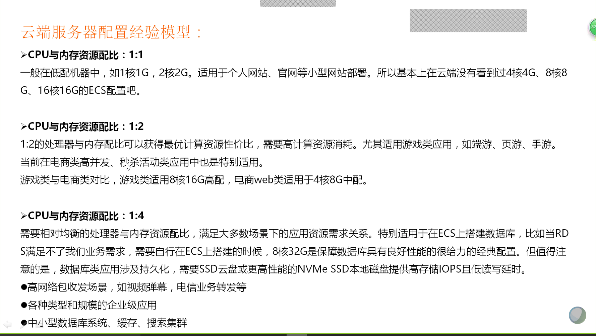
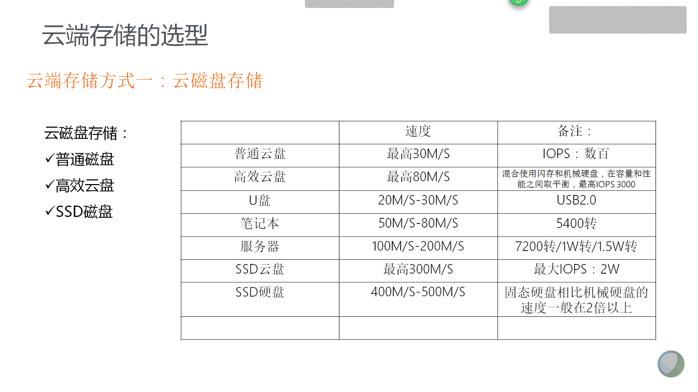
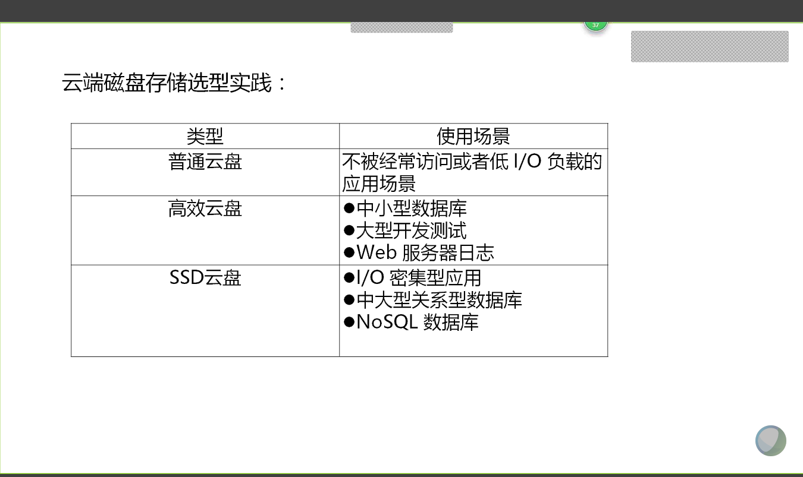

# 资源存储

运维环境安装配置所需的源码、安装包、插件等统一存放至运维oss中。

相应的脚本、程序、代码统一存放至gitlab中，脚本wget oss中的源码完成安装。

# 脚本库、软件安装规范

相应环境安装配置，统一采用gitlab中脚本完成，包含系统初始化、系统配置等。

数据库安装部署脚本需求，对接到DBA组，DBA组需要至多一个工作日内提供安装脚本（特殊复杂软件脚本除外），上传至gitlab中。

# MySQL安装部署

## 如何为MySQL选择合适的云服务器

### CPU选型

#### 应用是否是CPU密集型 ？

若是CPU密集型应用，我们需要的是加快SQL语句的处理速度，显然我们需要的**更好的**CPU而不是**更多的**CPU。另外，截止于2018年止，MYSQL不支持多CPU对同一SQL并发处理，也就是说，不管CPU多强或多弱，我们也只能用一个CPU核心来处理这一条SQL

多个CPU对提高一个SQL的处理效率是没有帮助的

#### 系统的并发量是多少 ？

为了提高系统的并发处理量（吞吐量），我们就需要CPU越多越好。
如，一个CPU处理一个SQL，那10个CPU就能同时处理10个SQL的并发（QPS：每秒处理SQL的数量），在WAB应用中，面对的是高访问量，这个时候，CPU数量就显得重要了

#### 所使用的MYSQL是什么版本 ？

为了更好的发挥多核CPU的效果，请使用最新的MYSQL版本，至少也要升级到5.6或以上，我们就是可以放心的使用16或者32核的CPU

#### 选择32位还是64位的CPU ？

选择 64 位CPU，这样才可以安装 64 位操作系统，有了 64 位操作系统才能利用好更大的内存。

#### 64位使用32位服务器版本的情况 ？

有些云服务器或者一些公司服务器会出现64位却装着32位系统版本的情况...请重装...

### 内存选型



### 磁盘的配置和选择





## MySQL推荐配置文件

首先根据《调研表格》填写信息，然后登陆到 自动生成配置文件连接地址：http://imysql.cn/my_cnf_generator 登陆后根据调研信息填写后，一键生成。

### 注意事项

1. 个别建议可能需要根据实际情况作调整，请自行判断或联系我，本人不对这些建议结果负相应责任
2. 本配置文件主要适用于MySQL 5.7/8.0版本

### 调研表格

| No. | Q                                            | 默认值                 | 客户填写 |
| :-- | :------------------------------------------- | :--------------------- | :------- |
| 1   | 您的服务器物理内存(单位：GB)                 | 8核                    |          |
| 2   | 您的MySQL版本 (5.7 or 8.0)                   | 5.7                    |          |
| 3   | 您的服务器架构, x86 或 x86-64                | x86-64                 |          |
| 4   | 该服务器是跑MySQL专属的吗                    | 是                     |          |
| 5   | MySQL安装文件路径                            | /data/mysql            |          |
| 6   | MySQL数据文件路径                            | /data/mysql/data       |          |
| 7   | MySQL监听端口                                | 3306                   |          |
| 8   | MySQL SOCKET 文件位置                        | /data/mysql/mysql.sock |          |
| 9   | 该实例预计有多少个数据表                     | 512                    |          |
| 10  | 该实例预计最大并发连接数                     | 512                    |          |
| 11  | binlog保留多久(单位：天)                     | 7                      |          |
| 12  | 排序(ORDER BY)、分组(GROUP BY)之类的查询多吗 | 不多                   |          |
| 13  | MySQL异常宕机时怕丢数据不？                  | 怕                     |          |

## 主从复制参数大全

```bash
master所有参数
1 log-bin=mysql-bin
1、控制master的是否开启binlog记录功能；
2、二进制文件最好放在单独的目录下，这不但方便优化、更方便维护。
3、重新命名二进制日志很简单，只需要修改[mysqld]里的log_bin选项，
如下例子：要重新调整logbin的路径为“/home/mysql/binlog”
[mysqld]
log_bin=/home/mysql/binlog/binlog.log

ll /home/mysql/binlog
-rw-rw---- 1 mysql mysql 98 Mar 7 17:24 binlog.000001
-rw-rw---- 1 mysql mysql 33 Mar 7 17:24 binlog.index

需要注意：指定目录时候一定要以*.log结尾，即不能仅仅指定到文件夹的级别，否则在重启mysql时会报错。


2. server-id=1
每个server服务的标识，在master/slave环境中，此变量一定要不一样

3. expire_logs_days=15
通过此来实现master自动删除binlog

4. innodb_flush_log_at_trx_commit=1
此参数表示在事务提交时，处理重做日志的方式；此变量有三个可选值0，1，2：
0：当事务提交时，并不将事务的重做日志写入日志文件，而是等待每秒刷新一次
1：当事务提交时，将重做日志缓存的内容同步写到磁盘日志文件，为了保证数据一致性，在replication环境中使用此值。
2：当事务提交时，将重做日志缓存的内容异步写到磁盘日志文件（写到文件系统缓存中）
建议必须设置innodb_flush_log_at_trx_commit=1

5.sync_binlog=1
1、此参数表示每写缓冲多少次就同步到磁盘；
2、sync_binlog=1表示同步写缓冲和磁盘二进制日志文件，不使用文件系统缓存
在使用innodb事务引擎时，在复制环境中，为了保证最大的可用性，都设置为“1”，但会对影响io的性能。
3、即使设置为“1”，也会有问题发生：
假如当二进制日志写入磁盘，但事务还没有commit，这个时候宕机，
当服务再次起来的恢复的时候，无法回滚以及记录到二进制日志的未提交的内容；
这个时候就会造成master和slave数据不一致
解决方案：
需要参数innodb_support_xa=1来保证。建议必须设置

6 .innodb_support_xa=1
此参数与XA事务有关，它保证了二进制日志和innodb数据文件的同步，保证复制环境中数据一致性。建议必须设置

7.binlog-do-db=skate_db
只记录指定数据库的更新到二进制日志中

8. binlog-do-table=skate_tab
只记录指定表的更新到二进制日志中

9. binlog-ignore-db=skate_db
忽略指定数据库的更新到二进制日志中

10.log_slave_updates=1
此参数控制slave数据库是否把从master接受到的log并在本slave执行的内容记录到slave的二进制日志中
在级联复制环境中（包括双master环境），这个参数是必须的

11.binlog_format=statement|row|mixed
控制以什么格式记录二进制日志的内容，默认是mixed

12. max_binlog_size
master的每个二进制日志文件的大小，默认1G

13.binlog_cache_size
1、所有未提交的事务都会被记录到一个缓存或临时文件中，待提交时，统一同步到二进制日志中，
2、此变量是基于session的，每个会话开启一个binlog_cache_size大小的缓存。
3、通过变量“Binlog_cache_disk_use”和“Binlog_cache_use”来设置binlog_cache_size的大小。
说明：
Binlog_cache_disk_use： 使用临时文件写二进制日志的次数
Binlog_cache_use： 使用缓冲记写二进制的次数

14.auto_increment_increment=2 //增长的步长
auto_increment_offset=1 //起始位置
在双master环境下可以防止键值冲突


slave所用参数
1.server-id=2
和master的含义一样，服务标识

2.log-bin=mysql-bin
和master的含义一样，开启二进制

3.relay-log=relay-bin
中继日志文件的路径名称

4. relay-log-index=relay-bin
中继日志索引文件的路径名称

5. log_slave_updates=1
和master的含义一样，如上

6.read_only=1
1、使数据库只读，此参数在slave的复制环境和具有super权限的用户不起作用，
2、对于复制环境设置read_only=1非常有用，它可以保证slave只接受master的更新，而不接受client的更新。
3、客户端设置：
mysq> set global read_only=1

7. skip_slave_start
使slave在mysql启动时不启动复制进程，mysql起来之后使用 start slave启动，建议必须

8.replicate-do-db
只复制指定db

9.replicate-do-table
只复制指定表

10. replicate-ingore-table
忽略指定表

11. replicate_wild_do_table=skatedb.%
模糊匹配复制指定db

12. auto_increment_increment=2
auto_increment_offset=1
和master含义一样，参考如上

13. log_slow_slave_statements
在slave上开启慢查询日志，在query的时间大于long_query_time时，记录在慢查询日志里

14. max_relay_log_size
slave上的relay log的大小，默认是1G

15.relay_log_info_file
中继日志状态信息文件的路径名称

16. relay_log_purge
当relay log不被需要时就删除，默认是on
SET GLOBAL relay_log_purge=1

17.replicate-rewrite-db=from_name->to_name
数据库的重定向，可以把分库汇总到主库便于统计分析
```

## 卸载MySQL冲突软件

MySQL的版本非常多，例如MySQL、Mariadb、Percona Server等，每个厂商又有很多不同的版本，版本之间不兼容问题可能会导致新装环境的失败，因此在安装之前请根据系统环境选择卸载。

若对已安装的软件熟悉，则根据实际清空进行卸载，例如通过包管理器进行安装的软件，可以使用卸载命令将其他MySQL数据库卸载，例如Redhat系列使用rpm\yum,Ubuntu选择apt 。

RedHat系列

```bash
rpm -e --nodeps 软件包
```

Ubuntu系列

```bash
apt remove 软件包
```

若为二进制安装且已清楚安装环境，需要卸载的软件包如何检测呢？

- 全系统查找mysql开头的文件
- 批量删除相关文件

```bash
find / -name 'mysql*' 2> /dev/null > pre.file
while read line; rm -rf $line;done < pre.file
```

# Oracle安装部署

- 单实例安装
- DG安装
- RAC安装

# Redis

- 单实例安装
- 主从安装
- 集群安装

# Mongodb安装部署

MongoDB的安装包括单机环境的安装、副本集环境的安装配置以及分片集环境的安装配置，下面分别进行描述。

- 基本安装
- 副本集安装配置
- 集群按安装配置
