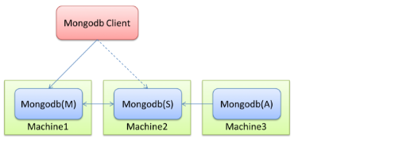
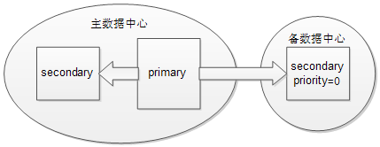

之前介绍了MongoDB的备份分冷备和热备，ReplicaSet的架构就是实现热备的技术，可以在瞬间恢复数据库服务。但是不能解决人为误操作。

## 什么是ReplicaSet

### 副本集的组成



| 节点角色 | 存储数据 | 提供连接 | 写请求 | 读请求 |
| -------- | -------- | -------- | ------ | ------ |
| 主节点   | √        | √        | √      | √      |
| 备节点   | √        | √        | ×      | ×      |
| 仲裁节点 | ×        | ×        | ×      | ×      |

- 主备节点存储数据，仲裁节点不存储数据。客户端同时连接主节点与备节点，不连接仲裁节点。
- 仲裁节点是一种特殊的节点，它本身并不存储数据，主要的作用是决定哪一个备节点在主节点挂掉之后提升为主节点，所以客户端不需要连接此节点。
- 在MongoDB副本集中，主节点负责处理客户端的读写请求，备份节点则负责映射主节点的数据。

### 备份节点的工作原理

1. `Primary`上执行数据库状态改变操作，并记录于`operation log`中即`oplog`
2. `Secondary`同步`Primary`的`oplog`并重演

`oplog`存储在`local`数据库的`oplog.rs`表中。

### `Oplog`

Oplog的大小是固定的，当集合被填满的时候，新的插入的文档会覆盖老的文档。

通过`oplog`同步数据的过程：

> 这个过程发生在当副本集中创建一个新的数据库或其中某个节点刚从宕机中恢复，或者向副本集中添加新的成员的时候，默认的，副本集中的节点会从离它最近的节点复制oplog来同步数据，这个最近的节点可以是primary也可以是拥有最新oplog副本的secondary节点。

一个复制集至少需要这几个成员：一个 [_主节点_](http://www.mongoing.com/docs/core/replica-set-members.html#replica-set-primary-member) ，一个 [_从节点_](http://www.mongoing.com/docs/core/replica-set-members.html#replica-set-secondary-members) ，和一个 [_投票节点_](http://www.mongoing.com/docs/core/replica-set-members.html#replica-set-arbiters) 。但是在大多数情况下，我们会保持3个拥有数据集的节点：一个 [_主节点_](http://www.mongoing.com/docs/core/replica-set-members.html#replica-set-primary-member) 和两个 [_从节点_](http://www.mongoing.com/docs/core/replica-set-members.html#replica-set-secondary-members) 。

## ReplicaSet的原理

### 副本集（replica set）

MongoDB的replica set是一个mongod进程实例簇，数据在这个簇中相互复制，并自动进行故障切换。

MongoDB的数据库复制增加了冗余，确保了高可用性，简化了管理任务如备份，并且增加了读能力。大多数产品部署都使用了复制。MongoDB中primary处理写操作，其它进行复制的成员则是secondaries。

一个副本集可以最多支持12个成员，但是只有7个成员可以参与投票。

_注：**MongoDB**同时提供了传统的**master/slave**复制，这种复制的操作方法与副本集相同，但是**master/slave**复制不支持自动故障切换。很容易理解，主备模式下，**cli**端是指定了地址和端口进行**mongodb**的访问的，而副本集模式则是通过访问**mongos**来隐藏动态切换的。_

### 成员配置

成员可以是以下某种角色：

|                | 成为primary | 对客户端可见 | 参与投票 | 延迟同步 | 复制数据 |
| -------------- | ----------- | ------------ | -------- | -------- | -------- |
| Default        | √           | √            | √        | ×        | √        |
| Secondary-Only | ×           | √            | √        | ×        | √        |
| Hidden         | ×           | ×            | √        | ×        | √        |
| Delayed        | ×           | √            | √        | √        | √        |
| Arbiters       | ×           | ×            | √        | ×        | ×        |
| Non-Voting     | √           | √            | ×        | ×        | √        |

### 故障切换恢复

副本集能够自动进行故障切换恢复。如果`primary`掉线或者无反应且多数的副本集成员能够相互连接，则选出一个新的primary。

在多数情况下，当primary宕机、不可用或者是不适合做primary时，在没有管理者干预的几秒后会进行故障切换。

如果MongoDB部署没有如预期那样进行故障切换，则可能是下面的问题：

- 剩余的成员个数少于副本集的一半
- 没有成员有资格成为primary

### Rollback

多数情况下，回滚操作可以优雅的对不能进行故障切换恢复的情况进行恢复。

Rollbacks操作发生在primary处理写操作，但其它成员没有成功的进行复制之前primary掉线时。当先前的primary开始复制时，则表现出rollback。如果操作复制到其它成员，该成员可用，并且可以和大多数的副本集连接，则没有rollback。

Rollbacks删除了那些没有进行复制的操作，以保证数据集的一致性。

### 选举（Elections）

当任意的故障切换发生，都会伴随着一个选举的出现，以此来决定哪个成员成为primary。

选举提供了一种机制，用于副本集中的成员无需管理员的干预，自动的选出一个新的primary。选举可以让副本集快速和坚决的从故障中恢复。

当primary变为不可达时，secondary成员发起选举，第一个收到大多数选票的成员成为新的primary。

### 成员优先级

在副本集中，每个成员都有优先级，它可以帮助决定选举出primary。默认情况下，所有的成员的优先级都为1。

### 一致性

在MongoDB中，所有针对于primary的读操作都与最后的写操作结果相一致。

如果客户端配置了读选项以允许secondary读，读操作能从没有近期复制更新或操作的secondary成员返回结果。在这种情况下，查询操作可能返回之前的状态。

这种行为有时称为最终一致性，因为secodary成员的状态最终都会是primary的状态。MongoDB不能保证从secondary成员的读操作的强一致性。

没有办法保证从secondary成员读的一致性，除非在配置时保证写操作成功的在所有节点上都执行成功后才返回成功。

## 副本集架构和部署模式

### 架构

副本集部署的架构对其容量和性能都有很大影响。大多数产品部署成包含3个优先级为1 的成员就足够了。

当开发一个副本集架构时要注意下面的因素：

- 确保副本集的成员总能选出一个primary。运行奇数个成员或者运行一个仲裁者（arbiter）+偶数个成员。
- 分布在不同地理位置的成员，知道“群体”的成员在任意网络分区中的情况。试图确保在主数据中心的成员中选举出primary。
- 考虑副本集中包含hidden或者delayed成员用于支持专用功能，如备份、reporting和测试。
- 考虑保留一或者两个位于其他数据中心的成员，同时通过配置确保其不会成为primary。
- 使用replica set tags创建定制的写规则以确保应用能够控制写操作成功的门限值。使用写规则确保操作在返回成功之前将操作传递给指定的数据中心或不同功能的机器。

### 部署策略

不存在一个理想的副本集架构可以满足任意部署环境。

**最小的副本集推荐架构为三成员集合，其中一个为primary，另外两个为secondary，secondary在一定情况下可以成为primary。**

如果副本集中的成员多于三个，则需要遵照下面的架构条件：

- 集合中有奇数个参与投票的成员。如果有偶数个投票成员，则部署一个仲裁者将个数变为奇数。
- 集合中同一时刻不多于7个参与投票的成员
- 如果不想让某些成员在故障切换时成为primary，则将它们的优先级设为0。
- 集合的多数成员运行在主要的数据中心

### 地理上的分布式集

一个基于地理的分布式副本集可以应对一个数据中心恢复失败的情况。这种集合至少包含了一个在备份数据中心的集合成员。



图：基于地理上的分布式副本集

如果primary掉线，则副本集选出一个新的primary；如果主数据中心和备数据中心连接失败，备数据中心的secondary不能成为primary。如果主数据中心失败，则需要人为的从备数据中心恢复数据。

值得注意的是，这种架构下，必须注意在主数据中心要保持奇数个参与投票的成员，上图中则需要在主数据中心添加一个仲裁者。

### 非生产者成员

在有些时候，我们可能想有一个成员能够拷贝整个的数据集，但并不使其成为primary。这种成员可以作为备份、支持报告操作或者作为一个冷备。这种成员被分为以下几种：

- 低优先级：通过 [local.system.replset.members[n\].priority](http://docs.mongodb.org/manual/reference/replica-configuration/#local.system.replset.members[n].priority)设置成员的低优先级，从而使其不可能成为primary
- 隐藏（Hidden）：这种成员不可能primary，对客户端不可见。
- 投票（Voting）：这会改变进行选举的副本集的票数。

---

> 复制设置注意事项、应用和发展行为

### 写关注（Write Concerns）

写关注（Write concern）是指每个MongoDB写操作的质量，描述关心应用写操作结果的总量。如果写关注设置为weak或者disabled，则应用会将写操作 发送给MongoDB，不需要等待数据库的响应而继续执行；如果设置为强关注，则写操作会等待MongoDB的写操作确认。MongoDB提供不同的写关 注来适应不同的应用场景。

写关注的类型（按照从弱到强的顺序）：

- Errors Ignored：写操作不需要MongoDB的确认。这种效率是最高的，因为无需等待响应，但由于其隐藏了有可能的异常和错误，会对数据的持续性和持久性带来很大的危险。（注意：通常情况下不会用这种类型）
- Unacknowledged：MongoDB不会发送ack因为写关注的级别是igore，但驱动会接收和处理网络错误。
- Acknowledge：mongod会确认收到的写操作。在这个级别的写关注下，客户端能够捕获网络、key重复和其它异常。这是默认的写关注级别。默认的写关注下无参数的调用getLastError。
- Journaled：mongod会在写入日志后确认写操作。这确保了写操作在mongod关闭时不会丢失，保证了写操作的持久性。
- Replica Acknowledge：这是对副本集的写关注进行设置的。你能保证写操作传播到副本集的成员。详见副本集的写关注（Write Concern for Replica Set）。

**副本集的写关注（Write Concern for Replica Set）**

MongoDB内嵌了写关注来确保写操作在副本集中primary的成功。写关注在写操作完成后，使用getLastError命令来获取一个对象，包含错误信息或者是无错误的确认。

- 验证写操作

  默认的写关注只在primary上确认写操作。可以通过getLastError命令的w选项配置副本集中其它成员的写关注。

  w选项指定写操作被复制到副本集成员的数目，包括primary。可以通过指定一个数或者majority来确保写操作传播到集合的多数成员。

- 修改默认的写关注

  可以通过getLastError来配置自己的默认副本集行为。使用getLastErrorDefaults设置副本集的配置。下面的命令行是创建一个配置，指定写操作需要在多数成员完成后才能返回。

  ```shell
  cfg = rs.conf()
  cfg.settings = {}
  cfg.settings.getLastErrorDefaults = {w: “majority”}
  rs.reconfig(cfg)
  ```

- 定制写关注

  ```shell
  可以通过副本集标记（tag）使用getLastErrorDefaults和getLastErrorModes副本集设置来创建一个定制写关注。
  举个例子：如果有一个三个成员的副本集，它们有以下标记：
  {“disk”:”ssd”}
  {“disk”:san, “disk.san”:san}
  {“disk”:”spinning”}
  然后创建一个定制的getLastErrorModes值：
  cfg = rs.conf()
  cfg.settings = { getLastErrorModes : { san : { “disk.san” : 1} } }
  rs.reconfig(cfg)
  通过san使用这个模式指定w选项：
  db.runCommand( { getLastError : 1, w : san } )
  这个操作在标签disk.san返回之前不会返回。
  也可以使用getLastErrorDefaults设置定制写关注：
  cfg = rs.conf()
  cfg.settings.getLastErrorDefaults = { ssd : 1 }
  rs.reconfig(cfg)
  ```

### 读偏好（Read Preference）

读偏好描述了MongoDB客户端如何将读请求路由到副本集的成员。

默认情况下，一个应用会将其读操作导向副本集中的primary。从primary中读可以保证读操作返回的是最新的文档。然后，一个应用如果不需 要完全实时的数据，则可以通过分布一些或全部的读操作到副本集的secondary成员上，从而提高读操作的吞吐量或者降低时延。

MongoDB驱动允许客户端应用对于每个连接、每个collection或者每个操作进行读偏好设置。

读偏好模式同样对通过mongos连接分片簇的客户端有效。

注意：如果一个应用的读操作比例很大，则从secondary成员分布式读可以提高吞吐量。

读偏好模式：

- primary

  所有的读操作只访问当前副本集的primary，为默认模式。如果primary不可用，则读操作会产生一个error或抛出一个异常。

  这个模式与标签集模式的读偏好不兼容。

- primaryPreferred

  在通常情况下，从副本集的primary上读数据，当primary不可用时，也就是在故障切换的过程中，从副本集的secondary成员上读数据。

  当读偏好包含了标签集时，如果primary可用，客户端从primary上读数据，否则从指定标签的secondary成员上读数据。如果没有匹配标签的secondary时，则产生一个error。

- secondary

  读操作只从副本集的secondary成员上读数据。如果没有secondary可用，则产生一个error或者抛出一个异常。

  当读偏好包含标签集时，客户端试图找出指定标签集的secondary成员，并将读操作随机的导向其中一个secondary成员。如果没有相匹配的secondary则产生一个error。

- secondaryPreferred

  在通常情况下，读操作从secondary成员上读数据，但是当副本集中只有一个primary成员时，则从primary读数据。

  当读偏好包含标签集时，客户端试图找出指定标签集的secondary成员，并将读操作随机的导向其中一个secondary成员。如果没有相匹配的secondary则产生一个error。

- nearest

  驱动从最近的集合成员中读数据时一个成员选择的过程。该模式不关注成员的类型，不管是primary还是secondary成员。

  当读偏好包含标签集时，客户端试图找到指定标签的集合成员并将读操作导向其中任意的一个成员。

### 自动重试

在MongoDB驱动和副本集中mongod实例之间的链接必须平衡两个问题：

- 客户端应该试图获取当前的结果，并且任何连接应该尽可能从相同的副本集成员上读取数据。
- 客户端应该最小化由于连接问题、网络问题或者副本集故障切换造成的不可达时间。

方法如下：

- 当连接稳定后尽可能长时间的复用指定mongod的连接。连接与mongod绑定在一起。

- 如果与mongod的连接失败，则在遵守以后的读偏好模式下，试图连接到一个新的成员。

  重连操作对于应用本身是透明的。如果连接允许从secondary成员上读数据，在重连后，应用能够相继从不同的secondary收到两个读取结果。依照个别secondary成员的状态，文档能够反映不同时间的数据库状态。

- 只有在试图依照读偏好模式和标签集，连接集合的三个成员后返回error。如果集合少于3个成员，则客户端在连接所有存在的成员后返回error。

  在收到error后，驱动使用指定的读偏好模式选择一个新的成员。如果没有指定的读偏好，则使用primary。

- 在检测故障切换状态后，驱动会尽快的尝试刷新副本集的状态。

> ### 请求联合

从secondary读数据能够反映数据集在不同时间点的状态，因为副本集的secondary成员相对于primary的最新状态都有不同程度的 滞后。为了防止后面的读操作在时间上的跳跃，驱动能在第一个读操作后把应用线程绑定到指定的集合成员上。线程持续的从相同成员上读取，直到一下情况发生：

- 应用执行一个有不同读偏好设置的读操作
- 线程终止
- 客户端收到一个socket异常，造成这种情况的原因可能是网络错误，或是在故障切换过程中mongod关闭了连接操作的。这会引起一次重连操作，但其对应用来说是透明的。

如果应用线程在primary不可用时，发出一次primaryPreferred模式的查询操作，则线程会一直固定的访问一个secondary 成员，尽管primary恢复后，也不会切回。同样的，如果线程在所有secondary成员都down掉时，发起一次 secondaryPreferred模式的查询，应用线程会一直从primary上进行读取，尽管secondary恢复。

> ### 成员选择

客户端通过驱动和分片簇的`mongos`实例会定期的更新副本集的状态：哪些成员`up`或`down`了，哪个成员成为了`primary`，以及每个`mongod`实例的延迟。

对于任意针对非primary成员的操作，驱动会：

- 汇集一个合适成员的列表，考虑成员的类型（如secondary、primary或者所有成员）
- 如果指定标签集，则排除所有不匹配标签集的成员
- 判断出那个合适的成员离客户端最近
- 建立一个成员列表，其包含了一个到绝对最近成员的ping距离。
- 在这些主机中随机选择一个成员，这个成员接收读操作。

> ### 分片和mongos

在多数的分片簇中，一个副本集提供每一个分片，这里读偏好也是可用的。分片簇中的带有读偏好的读操作与不分片副本集是完全相同的。

与简单的副本集不同的是，在分片簇中，客户端所有与分片的交互都是通过mongos连接到副本集成员上。Mongos负责应用的读偏好，这对应用是透明的。

在支持所有读偏好的分片环境中没有配置更改的需要。所有的mongos保存着他们自己与副本集成员间的连接池。

## 副本集内部组成和行为

### Oplog内部组成

在各种异常情况下，更新一个secondary的oplog可能会比预期时间有所延迟。

所有副本集的成员会在集合中向其它所有成员发送心跳（ping）包，并且能够将集合中的其它成员的操作加入本地oplog。

副本集的oplog操作时幂等的。下面的操作时需要幂等的：

- 初始同步
- 快速回滚（post-rollback catch-up）
- 分片块迁移

### 读偏好的内部组成

MongoDB使用单一主复制来确保数据库保持一致性。然而，客户端可能修改每个连接的读偏好来分发读操作到从副本集中的secondary成员上。一个以读为主的部署能够通过分发读取到secondary成员上实现更多的查询。但

> ### 选举内部组成

选举是副本集选择某个成员成为primary的过程。primary是一个副本集中唯一能够接收写操作的成员。

下面的事件能够引发一次选举：

- 第一次初始化一个副本集
- Primary失效。replSetStepDown命令能够使Primary失效，或者当前secondary成员中有合适的选举者且优先级更 高。当Primary与集合中的大多数成员失去联系时也会失效，它会关闭所有的客户端连接，以此防止客户端向一个没有primary成员写数据。
- 一个secondary成员于primary失去联系。当secondary成员不能与primary建立一个稳定的连接时会发起选举。
- 故障切换发生。

在选举过程中，所有的成员都有一票，包括隐藏成员、仲裁者和正在恢复的成员。任意mongod能够否决一次选举。在默认的配置中，所有成员都有相同 的机会成为primary。然而可以通过设置优先级来影响选举。在一些结构中，这可能有操作因素来提高一个成员成为primary的可能性。例如，一个在 远程数据中心的成员不应该成为primary。

任意成员都能否决一次选举，尽管这个成员是一个非投票成员。

一个成员在下列情况下会否决一次选举：

- 如果发起选举的成员不是一个投票集中的成员
- 如果发起选举的成员没有更新副本集最新的操作
- 如果发起选举的成员比集合中其他更适合发起选举的成员的优先级低
- 如果一个只能是secondary成员在选举时是最新的成员，其它合适的集合成员赶上了这个secondary成员的状态，并试图成为primary
- 如果当前primary比发起选举的成员有更多的最近操作，从投票成员的角度上。
- 如果当前的primary与发起选举的成员有相同或者更新的操作时，会否决这次选举。

第一个接收到集合中多数选票的成员将成为primary，只到下次选举。了解下面的条件和可能的情况：

- 副本集成员每两秒发一次心跳包。如果心跳包没有在10秒内收到响应，则其他成员将这个不良成员标记为不可达的。
- 副本集成员只与集合内的其它成员进行优先级比较。优先级的绝对值不会影响副本集选举的结果，当然除了0之外，它表明这个成员不能成为primary，也不能发起选举。
- 如果一个副本集成员在可见的成员中有最高的操作时间，则其不能成为primary
- 如果一个成员拥有副本集中的最高优先级，但其与最近的oplog操作有10秒的差距，则集合不会选举出primary，只到这个拥有最高优先级的成员更新到最近的操作。

> ### 同步

为了能够跟上副本集的最近状态，设置成员从其它成员同步或者复制oplog记录。成员同步数据在两个不同的点：

- 当MongoDB在一个新的或者修复后的成员上创建一个新的数据库时进行初始同步。当一个新的或者修复后的成员加入或重新加入一个集合时，该成员 会等待接收其它成员的心跳包。默认情况下，成员从最近的集合成员进行同步，这个成员有更近的oplog记录，无论其是primary还是其它 secondary。
- 在初始同步后，复制会继续进行，以此保证副本集的成员能够保持数据更新。

例子：

- 如果有两个secondary成员在一个数据中心，一个primary在另一个中，如果同时启动这三个实例（没有数据或oplog存在），则两个 secondary成员都很有可能从primary进行同步，因为任何一个secondary成员都没有更近的oplog记录。如果重启其中的一个 secondary成员，然后当其重新加入到集合后很可能从另一个secondary成员同步数据，因为其距离更近。
- 如果有一个primary在一个设施中，一个secondary成员在另一个设施中。如果在另一个设施中增加一个secondary成员，那么它将从已存在的secondary成员处同步数据，因为这个成员比primary距离更近。

在MongoDB2.2以后，secondary成员还可以进行以下附加的同步行为：

- 如果没有其它成员可用，Secondary成员将从延迟成员上同步数据
- Secondary成员不从隐藏成员上读取数据
- Secondary成员不会开始从一个正在恢复状态的成员上同步
- 因为一个成员从另一个成员同步，两个成员必须在buildIndexes域有相同的值，无论是true还是false。

​ 如果用于来oplog记录的连接有30秒时间没有反应，则Secondary成员停止从这个成员进行同步。如果一个连接超时，则该成员会重新选择一个新的成员进行同步。

> ### 多线程复制

MongoDB的批量写操作使用的多线程方式。复制过程将一组有大量并发操作的线程中每个批处理分开。

尽管多线程可能会使操作失序，客户端从secondary成员读取数据不会收到返回的documents，这反映了一个不会在primary存在的中间状态。为了确保一致性，MongoDB会在处理批操作时阻塞所有的读操作。

为了改进操作应用的性能，MongoDB获取所有保存数据的内存页和批处理将要影响的操作的索引。预取阶段将MongoDB持有写操作锁的时间缩到最短。

> ### 预取索引以提高复制的吞吐量

默认情况下，secondary在通常会预取与操作影响的document的索引以此提高复制的吞吐量。可以限制只针对于\_id域使用预取功能，或者完全关闭该功能。

## 搭建节点的ReplicaSet

关键配置信息

```shell
replication:
##oplog大小
 oplogSizeMB: 20
##复制集名称
 replSetName: zhou1
#--replSet = mmm/192.168.200.245:27017  # mmm是副本集的名称，192.168.200.25:27017 为实例的位子。
```
