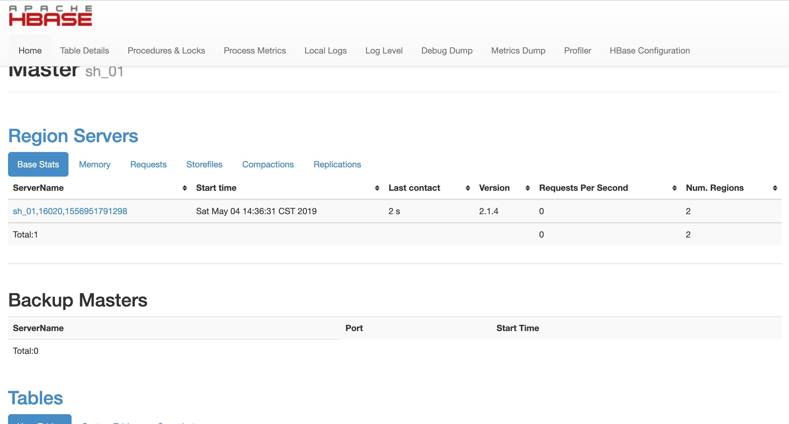

[TOC]

## 单机安装（测试）

> 单机：此模式使用本地文件系统而不是HDFS存储表和数据，所有的守护进程运行在一个JVM中。此模式一般用于 测试，如果你想要展现HBase的真正威力，还需要结合Hadoop。

[单机安装](https://hbase.apache.org/book.html#quickstart)

### 1. 查看操作系统版本

```shell
[root@db ~]# cat /etc/redhat-release
CentOS release 6.9 (Final)
```

### 2. 安装合适的java软件

```shell
[root@db ~]# yum install -y java-1.8.0-openjdk.x86_64
[root@db ~]# which java
/usr/bin/java
```

### 3. 下载Hbase至/alidata/install/目录中

[Apache Hbase](https://www.apache.org/dyn/closer.lua/hbase/)

```shell
[root@db ~]# mkdir /alidata/install -p
[root@db ~]# cd /alidata/install
[root@db install]# wget http://apache.claz.org/hbase/2.1.4/hbase-2.1.4-bin.tar.gz
[root@db install]# tar -xf hbase-2.1.4-bin.tar.gz
```

### 4. 修改 `conf/hbase-env.sh`文件

添加`JAVA_HOME`和 `HBASE_MANAGES_ZK`环境变量

```shell
[root@db install]# cd hbase-2.1.4
[root@db hbase-2.1.4]# cat >> conf/hbase-env.sh << ENDF
export JAVA_HOME=/usr/
export HBASE_MANAGES_ZK=false
ENDF
[root@db hbase-2.1.4]# grep -v '^#\|^$' conf/hbase-env.sh
export JAVA_HOME=/usr/
export HBASE_OPTS="$HBASE_OPTS -XX:+UseConcMarkSweepGC"
export HBASE_MANAGES_ZK=false
```

### 5. 修改`conf/hbase-site.xml`文件

创建`testuser`

```shell
useradd -s /sbin/nologin testuser
```

修改配置文件，指定hbase的文件系统使用本地文件系统。

```xml
<?xml version="1.0"?>
<?xml-stylesheet type="text/xsl" href="configuration.xsl"?>
<configuration>
  <property>
    <name>hbase.rootdir</name>
    <value>file:///home/testuser/hbase</value>
  </property>
  <property>
    <name>hbase.zookeeper.property.dataDir</name>
    <value>/home/testuser/zookeeper</value>
  </property>
  <property>
    <name>hbase.unsafe.stream.capability.enforce</name>
    <value>false</value>
    <description>
      Controls whether HBase will check for stream capabilities (hflush/hsync).

      Disable this if you intend to run on LocalFileSystem, denoted by a rootdir
      with the 'file://' scheme, but be mindful of the NOTE below.

      WARNING: Setting this to false blinds you to potential data loss and
      inconsistent system state in the event of process and/or node failures. If
      HBase is complaining of an inability to use hsync or hflush it's most
      likely not a false positive.
    </description>
  </property>
</configuration>
```

### 6. 启动hbase

```shell
[root@db hbase-2.1.4]# bin/start-hbase.sh
running master, logging to /alidata/install/hbase-2.1.4/bin/../logs/hbase-root-master-db.out
[root@db hbase-2.1.4]# ps -ef|grep hbase
root     28558     1  0 21:51 pts/4    00:00:00 bash /alidata/install/hbase-2.1.4/bin/hbase-daemon.sh --config /alidata/install/hbase-2.1.4/bin/../conf foreground_start master
root     28572 28558 99 21:51 pts/4    00:00:07 /usr//bin/java -Dproc_master -XX:OnOutOfMemoryError=kill -9 %p -XX:+UseConcMarkSweepGC -Dhbase.log.dir=/alidata/install/hbase-2.1.4/bin/../logs -Dhbase.log.file=hbase-root-master-db.log -Dhbase.home.dir=/alidata/install/hbase-2.1.4/bin/.. -Dhbase.id.str=root -Dhbase.root.logger=INFO,RFA -Dhbase.security.logger=INFO,RFAS org.apache.hadoop.hbase.master.HMaster start
root     28824 24178  0 21:51 pts/4    00:00:00 grep hbase
[root@db hbase-2.1.4]# ss -luntp|grep hbase
[root@db hbase-2.1.4]# ss -luntp|grep java
tcp    LISTEN     0      128        172.19.34.227:16000                 *:*      users:(("java",28572,203))
tcp    LISTEN     0      50                     *:2181                  *:*      users:(("java",28572,182))
tcp    LISTEN     0      128                    *:16010                 *:*      users:(("java",28572,210))
tcp    LISTEN     0      128        172.19.34.227:16020                 *:*      users:(("java",28572,227))
tcp    LISTEN     0      128                    *:16030                 *:*      users:(("java",28572,233))
```

访问 `http://localhost:16010`



### 7. 登录hbase shell

```shell
[root@db hbase-2.1.4]# bin/hbase shell
2019-05-03 21:54:12,749 WARN  [main] util.NativeCodeLoader: Unable to load native-hadoop library for your platform... using builtin-java classes where applicable
HBase Shell
Use "help" to get list of supported commands.
Use "exit" to quit this interactive shell.
For Reference, please visit: http://hbase.apache.org/2.0/book.html#shell
Version 2.1.4, r5b7722f8551bca783adb36a920ca77e417ca99d1, Tue Mar 19 19:05:06 UTC 2019
Took 0.0029 seconds
hbase(main):001:0>
```

### 8. 查看命令帮助

```shell
hbase(main):002:0> help "create"
Creates a table. Pass a table name, and a set of column family
specifications (at least one), and, optionally, table configuration.
Column specification can be a simple string (name), or a dictionary
(dictionaries are described below in main help output), necessarily
including NAME attribute.
Examples:

Create a table with namespace=ns1 and table qualifier=t1
  hbase> create 'ns1:t1', {NAME => 'f1', VERSIONS => 5}

Create a table with namespace=default and table qualifier=t1
  hbase> create 't1', {NAME => 'f1'}, {NAME => 'f2'}, {NAME => 'f3'}
  hbase> # The above in shorthand would be the following:
  hbase> create 't1', 'f1', 'f2', 'f3'
  hbase> create 't1', {NAME => 'f1', VERSIONS => 1, TTL => 2592000, BLOCKCACHE => true}
  hbase> create 't1', {NAME => 'f1', CONFIGURATION => {'hbase.hstore.blockingStoreFiles' => '10'}}
  hbase> create 't1', {NAME => 'f1', IS_MOB => true, MOB_THRESHOLD => 1000000, MOB_COMPACT_PARTITION_POLICY => 'weekly'}

Table configuration options can be put at the end.
Examples:

  hbase> create 'ns1:t1', 'f1', SPLITS => ['10', '20', '30', '40']
  hbase> create 't1', 'f1', SPLITS => ['10', '20', '30', '40']
  hbase> create 't1', 'f1', SPLITS_FILE => 'splits.txt', OWNER => 'johndoe'
  hbase> create 't1', {NAME => 'f1', VERSIONS => 5}, METADATA => { 'mykey' => 'myvalue' }
  hbase> # Optionally pre-split the table into NUMREGIONS, using
  hbase> # SPLITALGO ("HexStringSplit", "UniformSplit" or classname)
  hbase> create 't1', 'f1', {NUMREGIONS => 15, SPLITALGO => 'HexStringSplit'}
  hbase> create 't1', 'f1', {NUMREGIONS => 15, SPLITALGO => 'HexStringSplit', REGION_REPLICATION => 2, CONFIGURATION => {'hbase.hregion.scan.loadColumnFamiliesOnDemand' => 'true'}}
  hbase> create 't1', {NAME => 'f1', DFS_REPLICATION => 1}

You can also keep around a reference to the created table:

  hbase> t1 = create 't1', 'f1'

Which gives you a reference to the table named 't1', on which you can then
call methods.
```

### 9. 根据Example完成练习

```shell
Example Command File
create 'test', 'cf'
list 'test'
put 'test', 'row1', 'cf:a', 'value1'
put 'test', 'row2', 'cf:b', 'value2'
put 'test', 'row3', 'cf:c', 'value3'
put 'test', 'row4', 'cf:d', 'value4'
scan 'test'
get 'test', 'row1'
disable 'test'
enable 'test'
```

除了交互式访问hbase，还可以通过非交互式访问：

```shell
[root@db hbase-2.1.4]# cat > sample_commands.txt << ENDF
create 'test', 'cf'
list 'test'
put 'test', 'row1', 'cf:a', 'value1'
put 'test', 'row2', 'cf:b', 'value2'
put 'test', 'row3', 'cf:c', 'value3'
put 'test', 'row4', 'cf:d', 'value4'
scan 'test'
get 'test', 'row1'
disable 'test'
enable 'test'
ENDF
[root@db hbase-2.1.4]# bin/hbase shell < ./sample_commands.txt
2019-05-03 22:10:32,498 WARN  [main] util.NativeCodeLoader: Unable to load native-hadoop library for your platform... using builtin-java classes where applicable
HBase Shell
Use "help" to get list of supported commands.
Use "exit" to quit this interactive shell.
For Reference, please visit: http://hbase.apache.org/2.0/book.html#shell
Version 2.1.4, r5b7722f8551bca783adb36a920ca77e417ca99d1, Tue Mar 19 19:05:06 UTC 2019
Took 0.0026 seconds
create 'test', 'cf'
Created table test
Took 1.3079 seconds
Hbase::Table - test
list 'test'
TABLE
test
1 row(s)
Took 0.0166 seconds
["test"]
put 'test', 'row1', 'cf:a', 'value1'
Took 0.1695 seconds
put 'test', 'row2', 'cf:b', 'value2'
Took 0.0073 seconds
put 'test', 'row3', 'cf:c', 'value3'
Took 0.0036 seconds
put 'test', 'row4', 'cf:d', 'value4'
Took 0.0039 seconds
scan 'test'
ROW                                            COLUMN+CELL
 row1                                          column=cf:a, timestamp=1556892636812, value=value1
 row2                                          column=cf:b, timestamp=1556892636836, value=value2
 row3                                          column=cf:c, timestamp=1556892636863, value=value3
 row4                                          column=cf:d, timestamp=1556892636895, value=value4
4 row(s)
Took 0.0511 seconds
get 'test', 'row1'
COLUMN                                         CELL
 cf:a                                          timestamp=1556892636812, value=value1
1 row(s)
Took 0.0338 seconds
disable 'test'
Took 0.4514 seconds
enable 'test'
Took 0.7514 seconds
```

### 10. 停止hbase

```shell
[root@db hbase-2.1.4]# bin/stop-hbase.sh
stopping hbase.............
```
