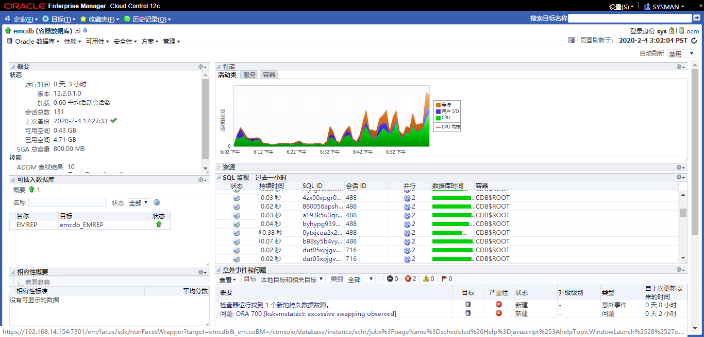
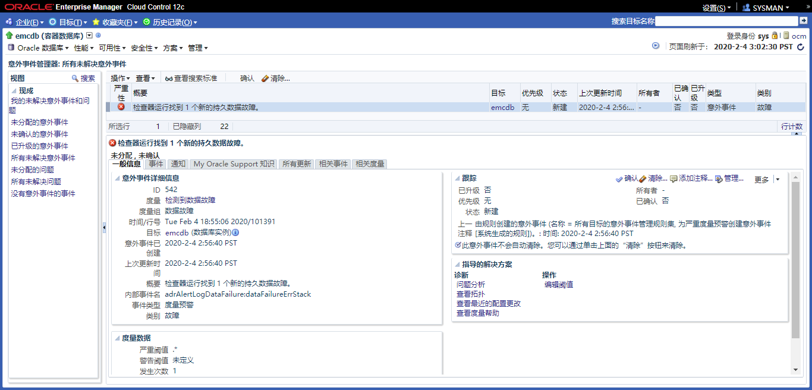
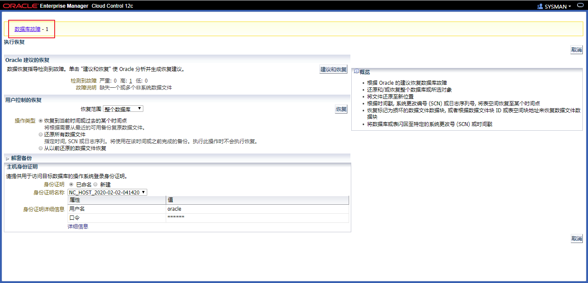
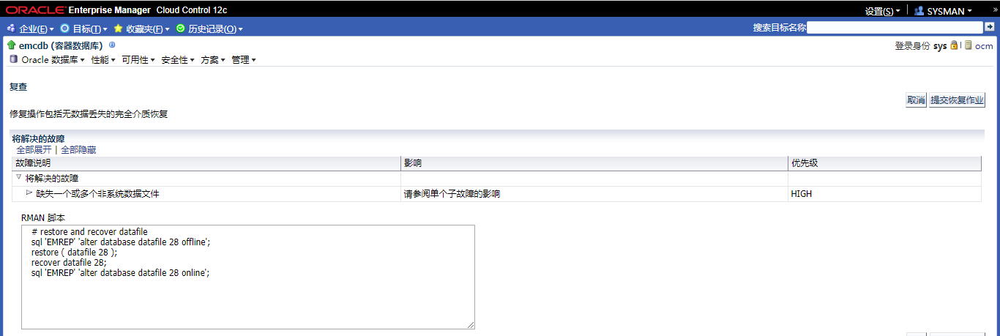
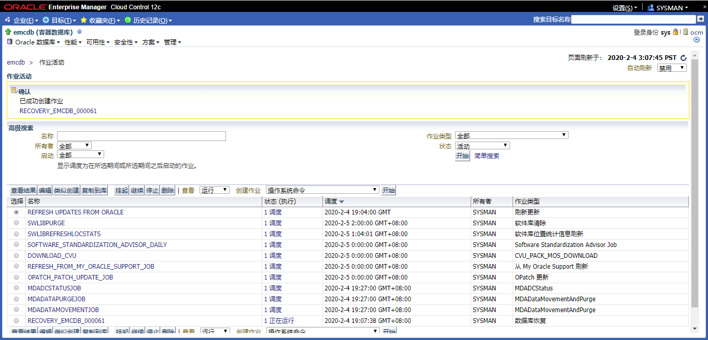
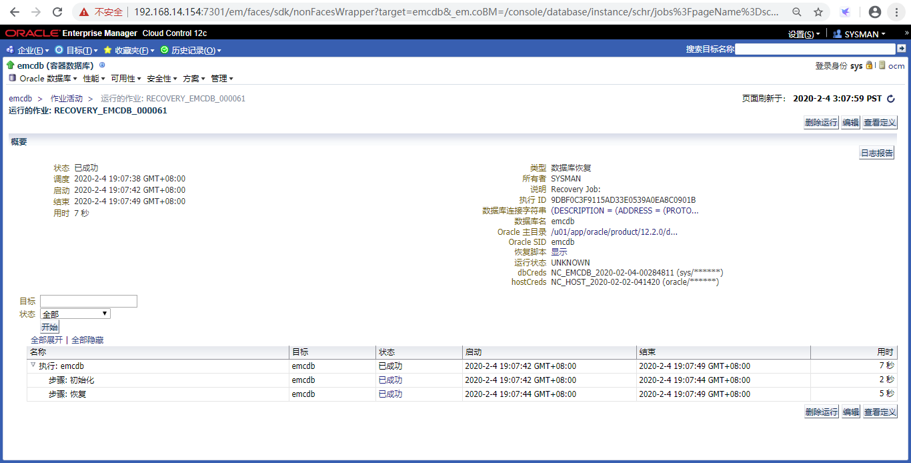
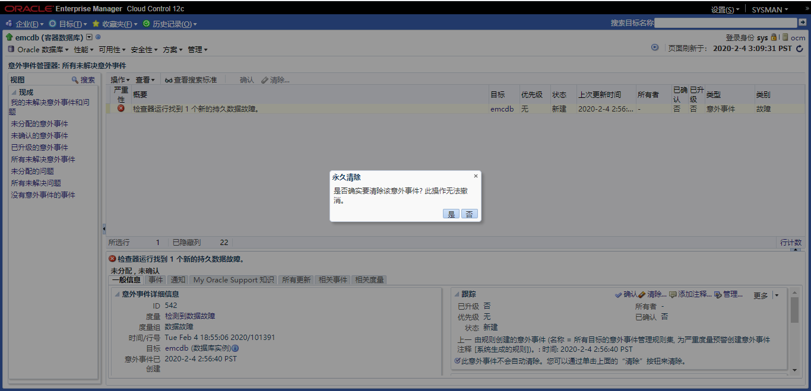

> **Practices for Lesson 15: Performing Database Recovery**
>
> 2020.01.29 BoobooWei

<!-- MDTOC maxdepth:6 firsth1:1 numbering:0 flatten:0 bullets:1 updateOnSave:1 -->

- [实践15:执行恢复](#实践15执行恢复)
  - [实践15:概览](#实践15概览)
  - [实践15-1:从数据文件丢失中恢复](#实践15-1从数据文件丢失中恢复)
    - [Overview](#overview)
    - [Task](#task)
    - [Practice](#practice)
    - [KnowledgePoint](#knowledgepoint)

<!-- /MDTOC -->

## 实践15:概览

Practices for Lesson 15: Overview

In these practices, you will use the Data Recovery Advisor to recover a lost data file.

在这个实践中，您将使用Data Recovery Advisor来恢复丢失的数据文件。

## 实践15-1:从数据文件丢失中恢复

Practice 15-1: Recovering from the Loss of a Data File

### Overview

In this practice, you recover from the loss of a data file belonging to the EXAMPLE tablespace.

在这个实践中，EXAMPLE 表空间数据丢失，对其进行恢复。

### Task

1. Log in to SQL\*Plus as the **HR** user and query the **REGIONS** table.

2. Now connect as the DBA1 user using the SYSDBA role.

3. Execute the **$LABS/P15/lab_15_01_03.sql** script to create a procedure that will be used later in this practice.

4. Execute the **$LABS/P15/lab_15_01_04.sql** script. This script simulates a failure in the database environment by deleting a data file.

5. Invoke SQL\*Plus again and log in as the **HR** user. Again query the REGIONS table.

6. Use Enterprise Manager Cloud Control to troubleshoot the error and recover the data file. Launch Enterprise Manager Cloud Control and log in as the **ADMIN** user.

| 步骤 | 操作                                                                                                                                                                        |
| ---- | --------------------------------------------------------------------------------------------------------------------------------------------------------------------------- |
| a.   | Launch Enterprise Manager Cloud Control and log in as the **ADMIN** user.                                                                                                   |
| b.   | Navigate to the orcl database home page.                                                                                                                                    |
| c.   | Log in with your saved database credentials.                                                                                                                                |
| d.   | Expand **Oracle Database**. Select **Monitoring** > **Incident Manager**. Note that there is a critical error listed, indicating a data failure.                            |
| e.   | Expand **Availability**. Select **Backup & Recovery** > **Perform Recovery**.                                                                                               |
| f.   | Specify a named host credential, or enter **oracle** as the username and your OS                                                                                            |
| g.   | Click the “**Database Failures**” link.                                                                                                                                     |
| i.   | Click “**Continue with Advise**.”                                                                                                                                           |
| j.   | Review the RMAN script that will be used to restore the file and perform recovery. Click **Continue**.                                                                      |
| k.   | Review the information, and then click “**Submit Recovery Job**.”                                                                                                           |
| l.   | A processing page appears, and then the Job Activity page appears. Click the job name link.                                                                                 |
| m.   | On the Job Run page, verify that the status is “Succeeded.” Then return to the **orcl** database home page.                                                                 |
| n.   | Return to your SQL*Plus session. Once again query the **HR.REGIONS** table to verify that the data file has been restored and recovered. Exit from SQL*Plus.                |
| o.   | Return to Enterprise Manager Cloud Control. Expand **Oracle Database**. Select **Monitoring** > **Incident Manager**. Select the data failure incident and click **Clear**. |
| p.   | Select “Clear and do not send e-mail or page notifications.” Click **OK** to confirm.                                                                                       |
| q.   | Return to the **orcl** database home page.                                                                                                                                  |

### Practice

1. 以**HR**用户身份登录SQL\*Plus，查询**REGIONS**表。

   ```sql
   sqlplus hr/hr@emrep
   SELECT * FROM regions;
   ```

2. 现在使用SYSDBA角色的DBA1用户连接。

   ```sql
   conn dba1/oracle as sysdba
   ```

3. 执行` $LABS/P15/lab_15_01_03.sql`创建一个存储过程，待后续使用。

   ```sql
   CREATE OR REPLACE JAVA SOURCE NAMED "ExecuteCmd" as
    import java.lang.Runtime;
    import java.lang.Process;
    import java.io.IOException;
    import java.lang.InterruptedException;
    public class ExecuteCmd {
         public static void main(String args[]) {
             System.out.println("Start executing");
             try {
                 Process p = Runtime.getRuntime().exec(args[0]);
                   try {
                   p.waitFor();}
                 catch (InterruptedException intexc) {
                    System.out.println("Interrupted Exception on waitFor: " +  intexc.getMessage());}
                    System.out.println("Return code from process: "+ p.exitValue());
                    System.out.println("Done executing");}
                 catch (IOException e) {
                    System.out.println("IO Exception from exec: " + e.getMessage());
                    e.printStackTrace();}
                 }
        }
    /

   --Create a PL/SQL wrapper function to call the java stored procedure
   --
   CREATE OR REPLACE PROCEDURE execcmd (S1 VARCHAR2)
      AS LANGUAGE JAVA
      name 'ExecuteCmd.main(java.lang.String[])';
   /

   --Grant the JVM permission to interface with the operating system. Notice the first
   --   grants give the JVM permission to call rm,ls and kill. You will have to add any OS commands
   --   that you want executed using this format.
   exec dbms_java.grant_permission( 'SYSTEM', 'SYS:java.io.FilePermission', '/bin/rm','execute')
   exec dbms_java.grant_permission( 'SYSTEM', 'SYS:java.io.FilePermission', '/bin/ls','execute')
   exec dbms_java.grant_permission( 'SYSTEM', 'SYS:java.io.FilePermission', '/bin/kill','execute')
   exec dbms_java.grant_permission( 'SYSTEM', 'SYS:java.io.FilePermission', '<<ALL FILES>>', 'execute' )
   exec dbms_java.grant_permission( 'SYSTEM','SYS:java.lang.RuntimePermission', 'writeFileDescriptor', '' )
   exec dbms_java.grant_permission( 'SYSTEM','SYS:java.lang.RuntimePermission', 'readFileDescriptor', '' )

   create public synonym execcmd for execcmd;

   grant execute on execcmd to public;
   ```

4. 执行` $LABS/P15/lab_15_01_04.sql`，此脚本通过删除数据文件来模拟数据库环境中的故障。

   > 执行前确保已经创建了 EXAMPLE 的表空间；且hr.region表使用的是该表空间。

   ```sql
   set termout on
   set feed on
   --set feed off
   set echo off
   --set termout off

   DECLARE
           v_cmd varchar2(300);
   BEGIN
           execute immediate 'alter system switch logfile';
           execute immediate 'alter system switch logfile';
           select '/bin/rm -f '||dfile into v_cmd from
              (select rownum "NUM",a.name "DFILE", b.name "TBS"
               from v$datafile a join v$tablespace b using (ts#)
               where b.name='EXAMPLE'
               and a.name not like '+%')
               where num=1;
            dbms_output.put_line(v_cmd);
            execcmd(v_cmd);
            execute immediate 'alter system flush buffer_cache';
            execute immediate 'alter system checkpoint';
    END;
    /

   PROMPT "Data file deleted. Wait a couple minutes before proceeding."
   PROMPT "Database should be open."

   exit
   ```

5. 再次调用SQL\*Plus并作为**HR**用户登录。再次查询区域表。

   ```sql
   sqlplus hr/hr@emrep
   SELECT * FROM regions;
   ```

   1-5执行结果

   ```sql
   [oracle@ocm trace]$ sqlplus hr/hr@emrep

   SQL*Plus: Release 12.2.0.1.0 Production on Tue Feb 4 18:20:09 2020

   Copyright (c) 1982, 2016, Oracle.  All rights reserved.

   Last Successful login time: Tue Feb 04 2020 18:19:24 +08:00

   Connected to:
   Oracle Database 12c Enterprise Edition Release 12.2.0.1.0 - 64bit Production

   SQL> SELECT * FROM regions;

    REGION_ID REGION_NAME
   ---------- -------------------------
   	 1 Europe
   	 2 Americas
   	 3 Asia
   	 4 Middle East and Africa

   SQL> conn dba1/oracle as sysdba
   Connected.

   SQL> conn dba1/oracle as sysdba
   Connected.
   SQL> @/u01/software/labs/P15/lab_15_01_03.sql
   Connected.
   Java created.
   Procedure created.
   PL/SQL procedure successfully completed.
   PL/SQL procedure successfully completed.
   PL/SQL procedure successfully completed.
   PL/SQL procedure successfully completed.
   PL/SQL procedure successfully completed.
   PL/SQL procedure successfully completed.
   Synonym created.
   Grant succeeded.

   SQL> @/u01/software/labs/P15/lab_15_01_04.sql

   PL/SQL procedure successfully completed.

   "Data file deleted. Wait a couple minutes before proceeding."
   "Database should be open."
   Disconnected from Oracle Database 12c Enterprise Edition Release 12.2.0.1.0 - 64bit Production

   SQL> select * from hr.regions;
   select * from hr.regions
   *
   ERROR at line 1:
   ORA-01116: error in opening database file 5
   ORA-01110: data file 5:
   '/u01/app/oracle/oradata/booboo./booboopdb1/example01.dbf'
   ORA-27041: unable to open file
   Linux-x86_64 Error: 2: No such file or directory
   Additional information: 3
   ```

6. 使用Enterprise Manager Cloud Control对错误进行故障排除并恢复数据文件。启动企业管理器云控制，以**ADMIN**用户登录。

   

   
   
   
   
   
   
   

### KnowledgePoint

1. 某个表空间无意中被删除
2. 通过控制体进行恢复
3. 通过rman手动恢复
   ```sql
   sql 'EMREP' 'alter database datafile 28 offline';
   restore ( datafile 28 );
   recover datafile 28;
   sql 'EMREP' 'alter database datafile 28 online';
   ```
