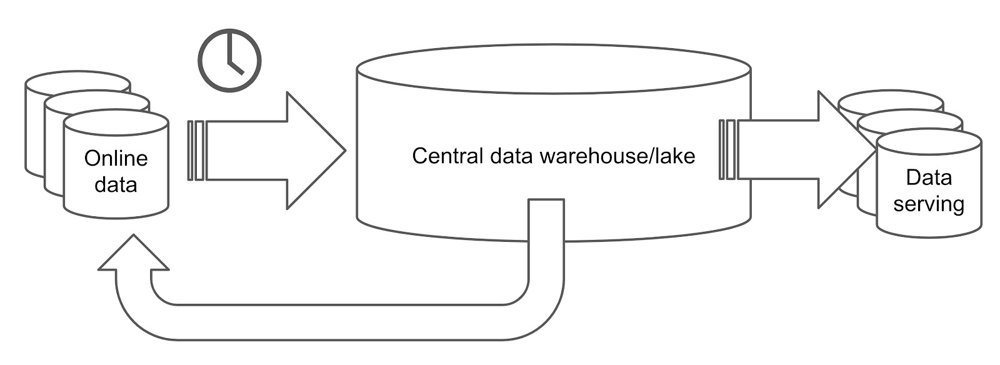
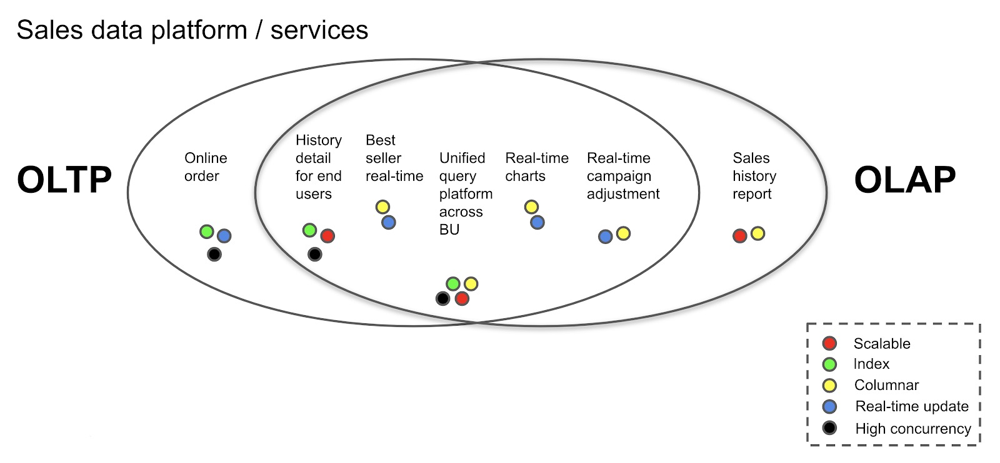
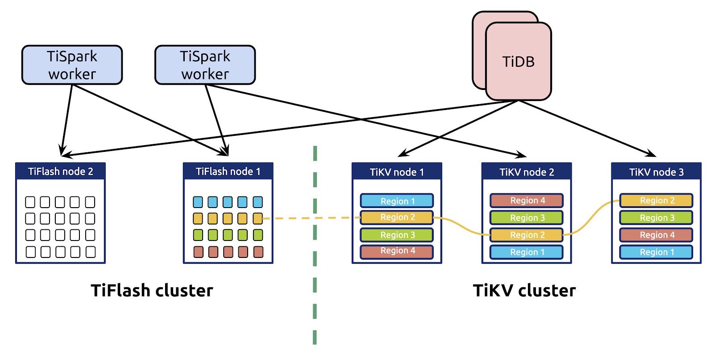
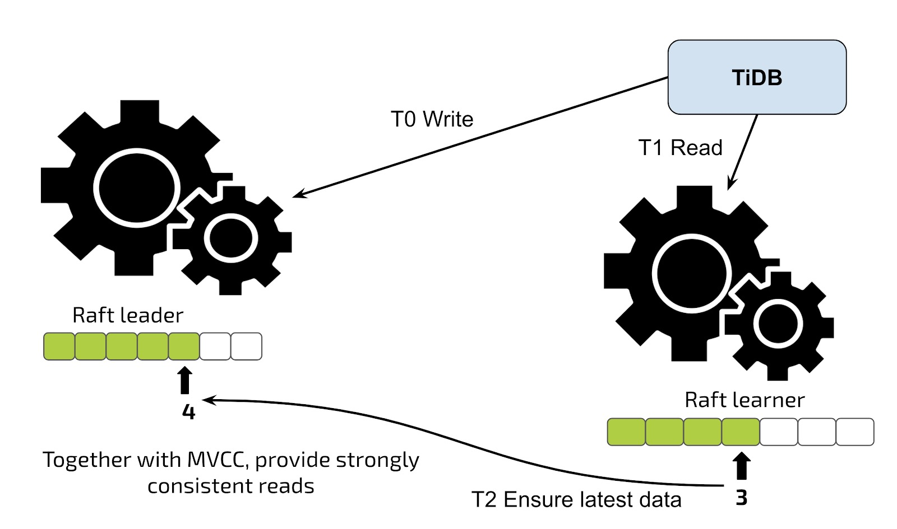
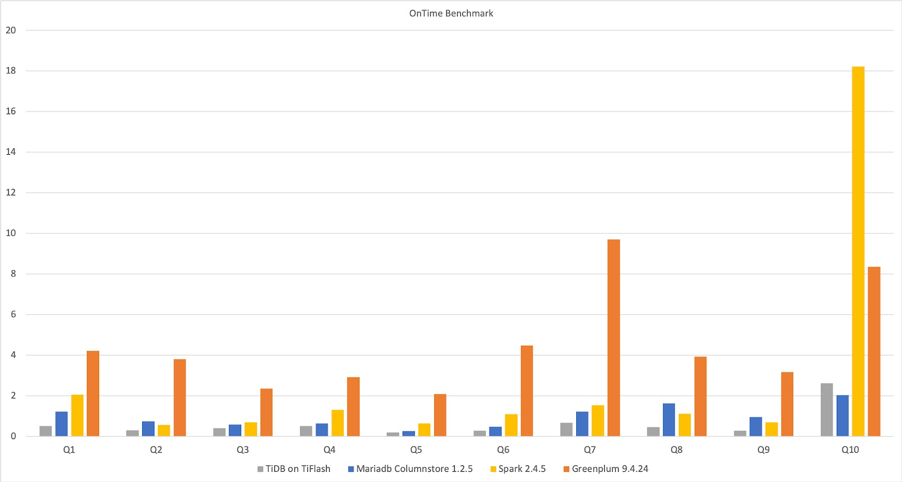
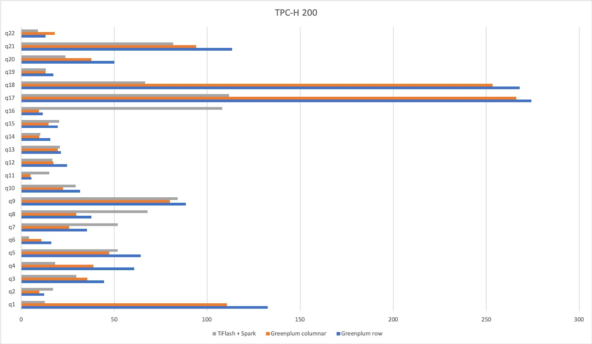
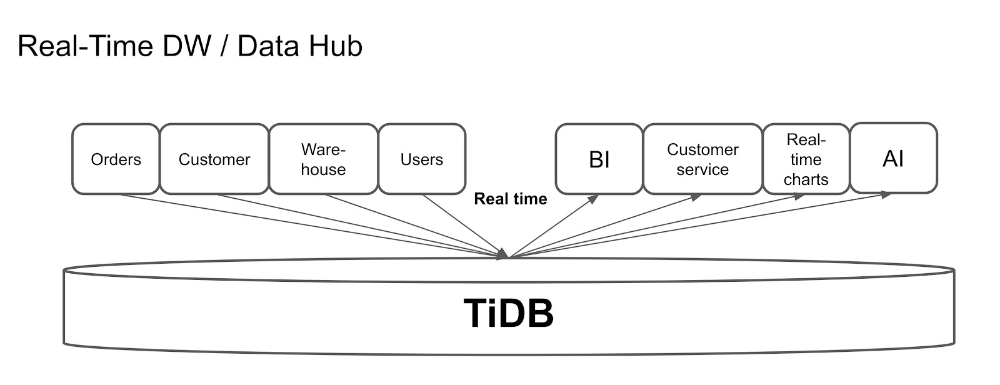
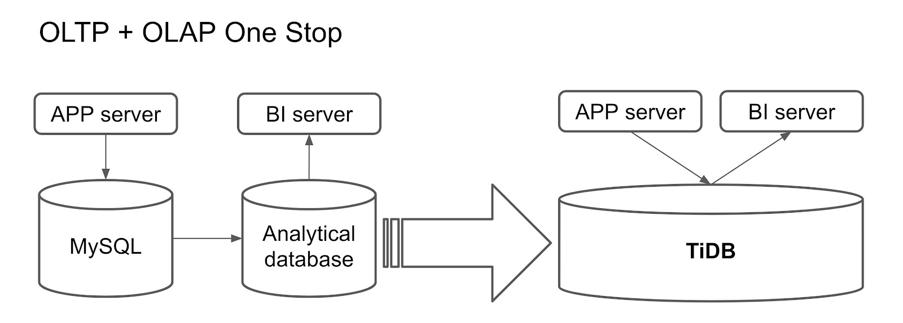
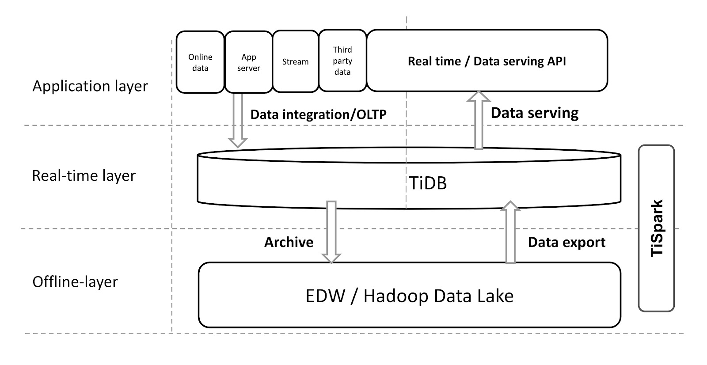

# 学习时长

10min

# 课程收获

熟悉 HTAP 领域

# 课程内容

> 本课程简要介绍了 HTAP 意义，技术难点，TiDB 如何实现 HTAP 以及相关的应用场景。

## 什么是HTAP？

传统上，有两种类型的数据库：

- [在线事务处理](https://en.wikipedia.org/wiki/Online_transaction_processing)（OLTP）数据库

- [在线分析处理](https://en.wikipedia.org/wiki/Online_analytical_processing)（OLAP）数据库

另一方面，HTAP数据库是混合数据库，可同时处理两个工作负载。

HTAP functionality is offered by database companies, such as [Microsoft Azure](https://en.wikipedia.org/wiki/Microsoft_Azure) Synapse Link[[9\]](https://en.wikipedia.org/wiki/Hybrid_transactional/analytical_processing#cite_note-9) for [Cosmos DB](https://en.wikipedia.org/wiki/Cosmos_DB), DbAlibaba DRDS, LeanXcale,[[10\]](https://en.wikipedia.org/wiki/Hybrid_transactional/analytical_processing#cite_note-10) [TiDB](https://en.wikipedia.org/wiki/TiDB),[[11\]](https://en.wikipedia.org/wiki/Hybrid_transactional/analytical_processing#cite_note-11)[[12\]](https://en.wikipedia.org/wiki/Hybrid_transactional/analytical_processing#cite_note-12) Hubble, [ArangoDB](https://en.wikipedia.org/wiki/ArangoDB), [Aerospike](<https://en.wikipedia.org/wiki/Aerospike_(database)>), [Apache Ignite/GridGain In-Memory Data Fabric](https://en.wikipedia.org/wiki/GridGain_Systems), [IBM](https://en.wikipedia.org/wiki/IBM) [IBM_Db2](https://en.wikipedia.org/wiki/IBM_Db2) IDAA,[[13\]](https://en.wikipedia.org/wiki/Hybrid_transactional/analytical_processing#cite_note-13) [InterSystems](https://en.wikipedia.org/wiki/InterSystems),[[14\]](https://en.wikipedia.org/wiki/Hybrid_transactional/analytical_processing#cite_note-14)[[15\]](https://en.wikipedia.org/wiki/Hybrid_transactional/analytical_processing#cite_note-15) [Kdb+](https://en.wikipedia.org/wiki/Kdb%2B), [Microsoft SQL Server](https://en.wikipedia.org/wiki/Microsoft_SQL_Server), [Neo4j](https://en.wikipedia.org/wiki/Neo4j), [Oracle 12c In-Memory](https://en.wikipedia.org/w/index.php?title=Oracle_12c_In-Memory&action=edit&redlink=1),[[16\]](https://en.wikipedia.org/wiki/Hybrid_transactional/analytical_processing#cite_note-oracle.com_2018-16) [SAP HANA](https://en.wikipedia.org/wiki/SAP_HANA),[[17\]](https://en.wikipedia.org/wiki/Hybrid_transactional/analytical_processing#cite_note-17)[[18\]](https://en.wikipedia.org/wiki/Hybrid_transactional/analytical_processing#cite_note-18) [MemSQL](https://en.wikipedia.org/wiki/MemSQL), [MongoDB](https://en.wikipedia.org/wiki/MongoDB), [VoltDB](https://en.wikipedia.org/wiki/VoltDB), [NuoDB](https://en.wikipedia.org/wiki/NuoDB), [OrientDB](https://en.wikipedia.org/wiki/OrientDB), [DataStax](https://en.wikipedia.org/wiki/DataStax), [eXtremeDB](https://en.wikipedia.org/wiki/EXtremeDB), [Splice Machine](https://en.wikipedia.org/w/index.php?title=Splice_Machine&action=edit&redlink=1),[[19\]](https://en.wikipedia.org/wiki/Hybrid_transactional/analytical_processing#cite_note-19) [EsgynDB](https://en.wikipedia.org/w/index.php?title=EsgynDB&action=edit&redlink=1), [Cloud Spanner](<https://en.wikipedia.org/wiki/Spanner_(database)>), HarperDB, [Amazon Aurora](https://en.wikipedia.org/wiki/Amazon_Aurora) (Parallel Query), BlobCity, [Couchbase](https://en.wikipedia.org/wiki/Couchbase),[[20\]](https://en.wikipedia.org/wiki/Hybrid_transactional/analytical_processing#cite_note-20) [YugabyteDB](https://en.wikipedia.org/wiki/YugabyteDB)[[21\]](https://en.wikipedia.org/wiki/Hybrid_transactional/analytical_processing#cite_note-21) and Postgres.

### 传统数据平台架构

一般来说，OLTP数据库使用基于行的存储引擎。它们存储当前数据，实时更新它们，并支持高并发性和强一致性。每个请求最多只能修改几行数据。另一方面，OLAP数据库更可能是列式数据库。它们批量处理历史数据，这意味着并发性不高，每个请求都涉及大量行。

如您所见，OLTP和OLAP请求具有不同的要求，因此它们需要不同的技术。因此，OLTP和OLAP请求通常在隔离的数据库中处理。因此，传统的数据处理系统可能如下所示：



在以上架构中，在线数据存储在在线数据库中，该数据库处理事务性工作负载。定期从在线数据库中提取数据（例如每天一次），并将数据加载到分析处理数据库中，例如关系数据仓库或Hadoop数据湖。数据仓库或数据湖处理提取的数据，然后将其导出为报告，然后加载到数据服务数据库或发送回在线数据库。

这个过程漫长而复杂。数据执行的过程越多，获得的延迟就越高。

### 为什么HTAP很重要

您的数据平台是否必须与上述平台一样复杂？当然不是。HTAP数据库可帮助您简化系统并提供实时性能。让我解释一下原因。

HTAP描述**了一个可同时处理OLTP和OLAP工作负载的数据库**。使用HTAP数据库，您不必在一个数据库中执行事务，而在另一个数据库中执行分析。它可以让您同时做到。通过组合行存储和列存储，HTAP数据库利用了两者的优点，并且完成了比简单地连接两种格式更多的工作。

但是，为什么需要HTAP数据库？您的旧数据平台可能很复杂且运行缓慢，但是仍然可以使您的应用程序保持运行状态。

答案在于，**事务和分析工作负载之间的界限越来越模糊**：

- **OLAP用例变得事务化**。提供报告时，我们可能还必须执行高度并行的简短查询，并对历史数据进行小范围查询。
- **OLTP用例变得分析起来**。交易运行时，我们可能还需要执行大规模分析。我们可能需要向在线数据库提供反馈，以改善在线行为，对应用程序数据进行实时分析或在不同的应用程序中进行查询。

如果您看下面的情况，即使是普通销售平台中的数据库也必须处理一组混合的动态需求。左侧是类似OLTP的工作负载，而右侧是类似OLAP的工作负载。在两个椭圆形相交的区域，工作负载既需要OLTP功能又需要OLAP功能。即HTAP功能。每个工作负载对数据库功能都有各种要求，例如可伸缩性，细粒度索引，列存储，实时更新和高并发性。



为了满足这些要求，HTAP数据库必须同时具有行存储和列存储。但是，仅仅将它们放在一起并不是怎么工作的。我们需要将它们作为一个有机的整体进行整合：让列存储和行存储自由地相互通信，并确保数据是实时且一致的。

## TiDB如何实施HTAP

从一开始，TiDB就被设计为OLTP数据库。现在，它最大的单个数据库拥有数万亿行数据，并且可以在生产中每秒处理数千万个查询（QPS）。但是令我们惊讶的是，甚至在4.0之前，一些用户已经将TiDB部署为功能良好的数据中心或数据仓库。当时，TiDB支持OLTP和OLAP工作负载。

那么，TiDB 4.0中有什么新功能？简而言之，TiDB 4.0通过引入实时列式存储引擎[TiFlash来](https://docs.pingcap.com/tidb/stable/tiflash-overview)提供改进的HTAP体验。TiFlash是[TiKV](https://docs.pingcap.com/tidb/dev/tikv-overview)（分布式，事务性键值存储）的列式扩展。它根据[Raft共识算法](<https://en.wikipedia.org/wiki/Raft_(computer_science)>)异步复制来自TiKV的数据，并通过验证Raft索引和多版本并发控制（MVCC）来确保快照隔离级别的一致性。

现在，如下图所示，将TiFlash与TiKV结合使用时，TiDB具有集成行和列存储的可伸缩体系结构。



在这种架构中：

- TiKV和TiFlash使用单独的存储节点以确保完全隔离。
- 柱状副本中的数据是实时且一致的。
- TiKV和TiFlash之间没有中间层，因此数据复制既快速又简单。
- 它通过行存储索引和列存储支持点获取，小范围扫描和大批量扫描。优化器使用成本模型根据实际工作量在列存储和行存储之间进行选择。

### 可扩展的实时更新

在TiDB的HTAP架构中，行存储和列存储是可伸缩和实时更新的。

就像TiKV一样，TiFlash实现了多筏组副本机制。唯一的区别是TiFlash将数据从行存储复制到列存储。复制或存储数据的基本单位称为[Region](https://docs.pingcap.com/tidb/stable/glossary#regionpeerraft-group)。

同样，数据复制没有中间层。在其他数据复制过程中，数据必须通过某些分布式管道，例如Kafka或其他消息队列系统，这会增加延迟。但是在TiDB中，TiKV和TiFlash之间的复制是对等的。没有中间层，因此可以实时复制数据。

HTAP架构在复制和存储可伸缩性之间取得平衡。它使用与以前的OLTP体系结构相同的复制和分片机制。因此，调度策略仍然适用于HTAP架构，集群仍可以水平扩展或扩展。此外，您可以分别扩展列存储和行存储，以满足您的应用程序的需求。

要启用TiFlash复制，您只需要一个命令：

```sql
# To create 2 columnar replicas for orders table
mysql> ALTER TABLE orders SET TIFLASH REPLICA 2;
```

### 具有实时和一致读取的异步复制

在TiFlash中，数据复制是异步的。此设计有两个优点：

- 列存储的复制不会阻止事务处理。
- 即使列状副本已关闭，行存储仍然可以工作。

尽管复制是异步的，但是由于Raft共识算法，应用程序始终读取最新数据。



当应用程序从TiFlash中的学习者副本读取数据时，该应用程序将读取验证发送到TiKV中的Leader副本，然后接收有关复制进度的信息。如果进度没有完成，则不会将最新数据复制到学习者副本，并且学习者副本将等待直到获得最新数据。除非系统达到峰值利用率，否则整个等待时间只有几十到几百毫秒。

### 智能选择的优化器

请注意，列存储和行存储不是两个独立的系统，而是一个有机整体。两家商店如何协调？好吧，诀窍在我们的优化器中。

优化器选择查询执行计划时，会将列存储视为特殊索引。在行存储和特殊列存储索引中的所有索引中，优化器通过统计信息和基于成本的优化（CBO）选择最快的索引。这样，既考虑了列存储又考虑了行存储。您不必决定要在复杂查询中使用哪个存储引擎，因为优化器会为您做出最佳决定。

但是，如果打算完全隔离列存储和行存储，则可以手动指定查询使用两个存储引擎之一。

以下来自[ClickHouse的](https://en.wikipedia.org/wiki/ClickHouse)结果显示了TiFlash，MariaDB，Spark和Greenplum在单个宽表上的实时基准测试。对于相同的10个查询，四个数据库具有不同的执行时间。如您所见，在这种体系结构中，TiFlash上的TiDB的性能优于其他体系结构。



### Apache Spark与TiSpark携手合作

TiDB的HTAP架构在TiSpark的帮助下可以与Apache Spark无缝协作。[TiSpark](https://docs.pingcap.com/tidb/stable/tispark-overview)是一个薄计算层，旨在在TiKV或TiFlash之上运行Spark以响应复杂的OLAP查询，例如提供AI计算和数据科学工具箱，以及与商业智能（BI）集成。通过与Spark生态系统连接，TiDB可以为这些复杂的场景提供服务。

您可以将TiSpark与Hadoop数据湖一起使用。在这种情况下，TiDB是为重量级，复杂查询提供分布式计算的绝佳方法。

当我们在TiSpark和Greenplum上运行[TPC-H](http://www.tpc.org/tpch/)基准测试时，TiSpark + TiFlash使Greenplum陷入困境。有时Greenplum更快，而其他时候TiSpark + TiFlash更快，如下所示。



## 在HTAP方案中应用TiDB

如前所述，在HTAP方案中，TiDB帮助用户构建简化的体系结构，从而降低维护复杂性，为应用程序提供实时数据并提高业务敏捷性。

### 实时数据仓库

下图显示了一个流行的TiDB用例：实时数据仓库。TiDB支持连续更新，因此可以轻松同步来自其他OLTP数据库的数据。在这种体系结构中，TiDB从多个应用程序收集数据并实时聚合它们的数据。



### 一站式交易和分析处理

在HTAP方案中应用TiDB的另一种方法是建立一个用于事务处理和分析处理的一站式数据库。以前，用户可能会将MySQL视为在线数据库，并在T + 1天内将数据从MySQL复制到分析数据库或Hadoop。MySQL为在线应用程序提供服务，BI工具连接到分析数据库或Hadoop以执行数据分析。



但是对于这种情况，您只需要一个TiDB集群。在线应用程序连接到TiDB的行存储，BI服务器连接到列存储。这种架构不仅降低了架构的复杂性，而且提高了整体性能。

### 将TiDB与您现有的数据仓库集成

有人可能会说：但是我已经有了一个可行的数据仓库系统。我不能简单地放弃他们并将所有内容迁移到TiDB，可以吗？

实际上，如果您已经在使用Hadoop或数据仓库，则先前的用例可能不适用于您的系统。但是TiDB是如此灵活和可扩展，您可以将其与现有的数据仓库系统集成在一起，如下图所示：



这些应用程序将数据聚合到TiDB中，从而为实时查询和外部数据服务提供了一个实时层。通过此实时层，TiSpark可以将数据发送到脱机Hadoop层，在Hadoop层中Hadoop建模并清除数据，然后将数据导出回TiDB，以便TiDB可以更有效地服务数据。

通常，由于Hadoop不支持高速实时查询，因此我们无法将其API直接公开给外部服务。借助TiDB，我们使现有系统能够实时提供数据服务。

# 学习过程中参考的其他资料

- [视频教程-1.2 Why HTAP Matters（HTAP 数据库简介）](https://university.pingcap.com/courses/TiDB%204.0%20%E6%96%B0%E6%89%8B%E6%8C%87%E5%8D%97/chapter/101-%E7%AB%A0%E8%8A%82/lesson/Why-HTAP-Matters)
- [Hybrid transactional/analytical processing](https://en.wikipedia.org/wiki/Hybrid_transactional/analytical_processing)
- [我们如何构建可简化数据平台的HTAP数据库](https://en.pingcap.com/blog/how-we-build-an-htap-database-that-simplifies-your-data-platform)
- [DB-Engine TiDB](https://db-engines.com/en/system/TiDB)
