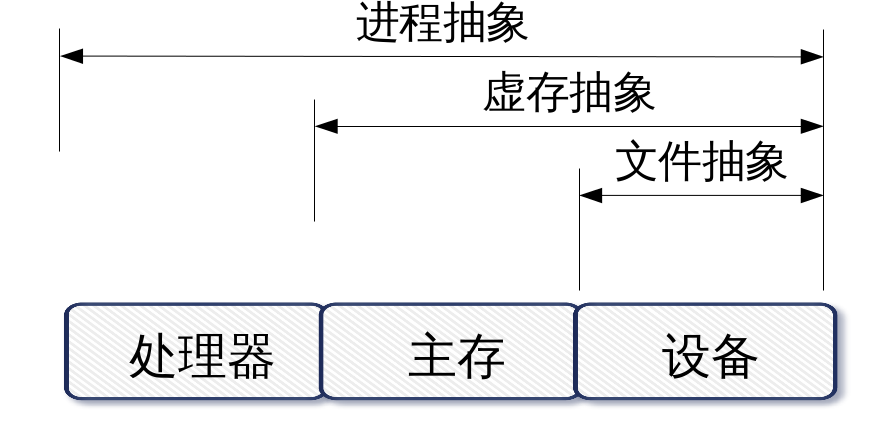
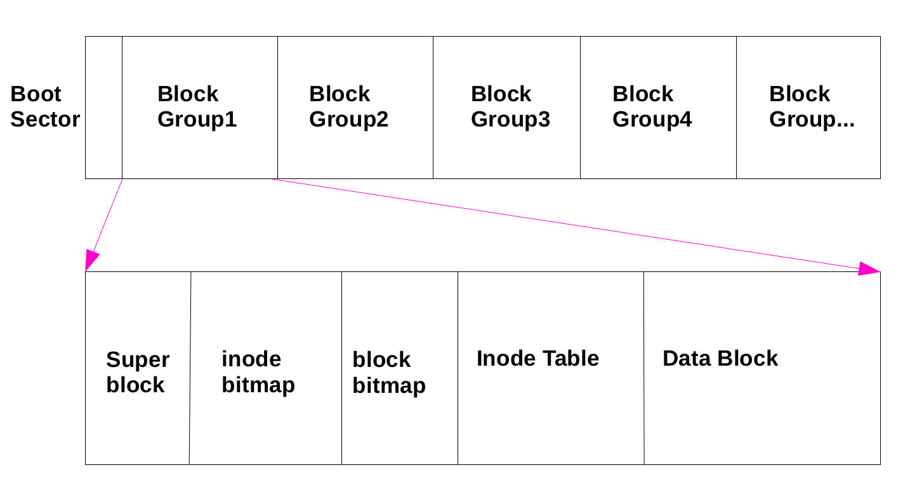
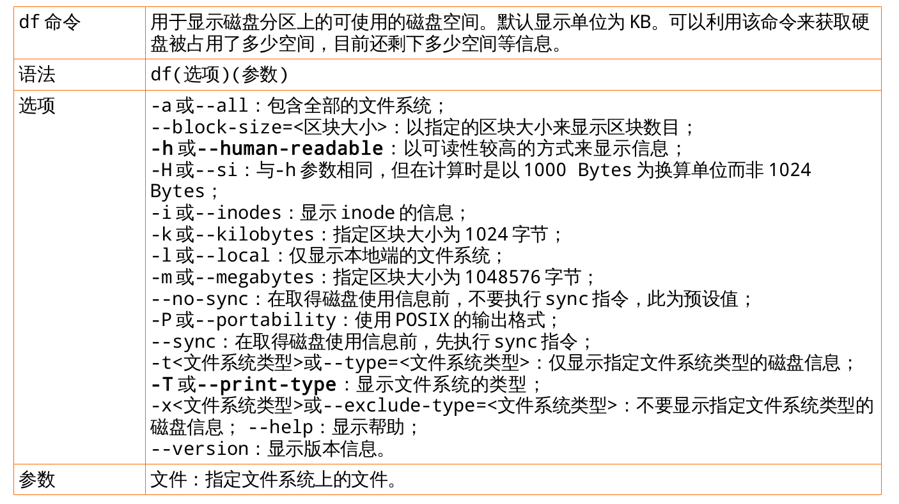
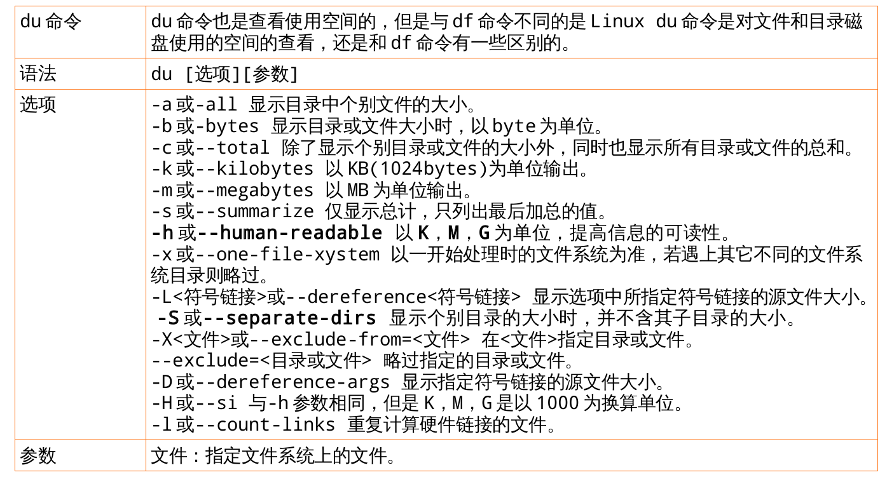
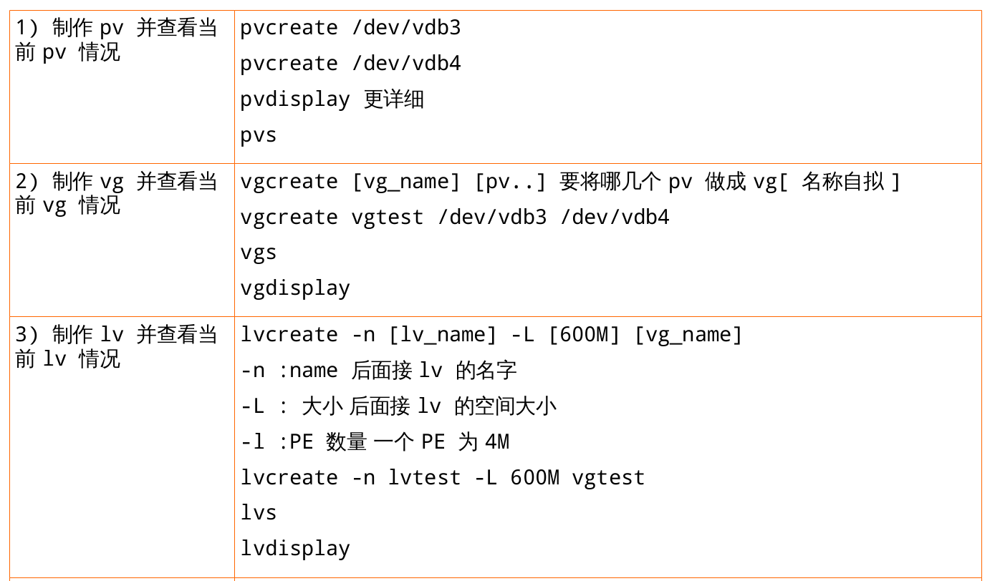
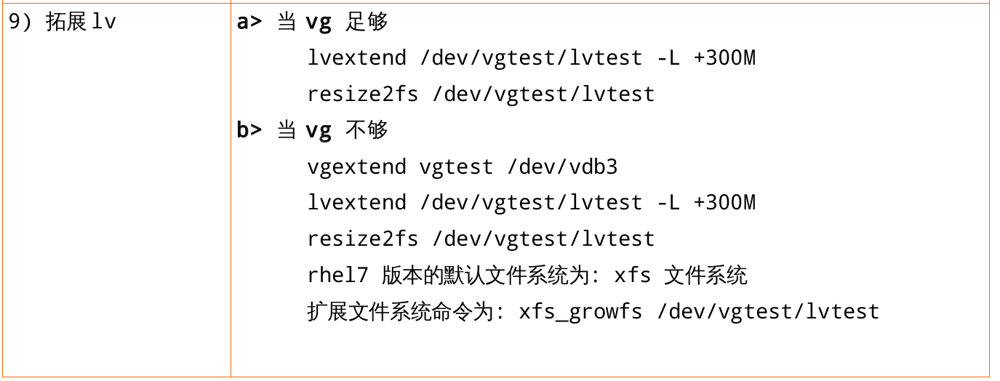
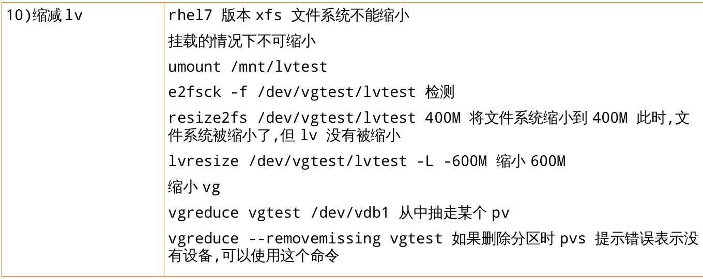
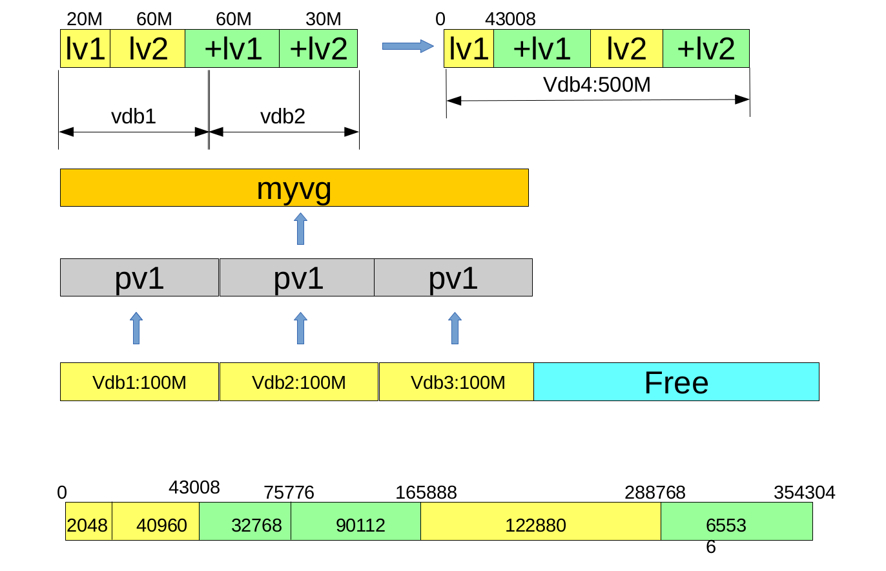

## 文件系统

### 资源虚拟化



Linux操作系统内核由6个部分组成：

- 进程调度与管理
- 主存管理和虚存管理
- VFS和文件管理
- 设备管理
- 网络接口和通信
- 用来实现资源抽象
- 资源分配和资源共享等功能。

### 文件系统的概念

操作系统中负责管理和存储文件信息的软件机构称为文件管理系统，简称文件系统。

从系统角度来看，文件系统是对文件存储设备的空间进行组织和分配，负责文件存储并对存入的文件进行保护和检索的系统。

具体地说，它负责为用户建立文件，存入、读出、修改、转储文件，控制文件的存取，当用户不再使用时撤销文件等。

### 文件系统的类型

查看系统支持的文件系统
`ls /lib/modules/$(uname -r)/kernel/fs `

系统目前已加载到内存中支持的文件系统
`more /proc/filesystems`

### 文件系统的结构

索引式文件系统(indexed allocation)



文件系统内的信息主要有:

- superblock:记录filesystem的整体信息,包括 inode/block的总量、使用量、剩余量, 以及文件系统的格式等;
- inode:记录文件属性,一个文件占一个inode,同时记录该文件数据所在的block 号码;
- block:实际记录文件的内容,若档案太大时,会占用多个 block

### 文件系统的区别

rhel6

```shell
[root@rhel6 ~]# mkfs
mkfs          mkfs.ext2     mkfs.ext4     mkfs.msdos
mkfs.cramfs   mkfs.ext3     mkfs.ext4dev  mkfs.vfat
```

rhel7

```shell
[root@rhel7 ~]# mkfs
mkfs         mkfs.cramfs  mkfs.ext3    mkfs.fat     mkfs.msdos   mkfs.xfs
mkfs.btrfs   mkfs.ext2    mkfs.ext4    mkfs.minix   mkfs.vfat
```

EXT4 Linux kernel 自 2.6.28 开始正式支持新的文件系统 Ext4。Ext4 是 Ext3 的改进版，修改了 Ext3 中部分重要的数据结构，而不仅仅像 Ext3 对 Ext2 那样，只是增加了一个日志功能而已。Ext4 可以提供更佳的性能和可靠性，还有更为丰富的功能，不向下兼容ext3。

XFS 针对海量小文件的存储及超大文件的存储有一些有时,但 EXT 系统相对稳定。XFS 是 Silicon Graphics，Inc. 于 90 年代初开发的文件系统。它至今仍作为 SGI 基于 IRIX 的产品（从工作站到超级计算机）的底层文件系统来使用。现在，XFS 也可以用于 Linux。XFS 的 Linux 版的到来是激动人心的，首先因为它为 Linux 社区提供了一种健壮的、优秀的以及功能丰富的文件系统，并且这种文件系统所具有的可伸缩性能够满足最苛刻的存储需求。

### 文件系统的简单操作


#### df



实例：

1. 使用-h选项以KB以上的单位来显示，可读性高

```shell
[#3#root@rhel6 ~]#df -h
Filesystem                     Size  Used Avail Use% Mounted on
/dev/mapper/vg_rhel6-LogVol01   17G  3.0G   13G  19% /
tmpfs                          499M   72K  499M   1% /dev/shm
/dev/vda1                      477M   58M  390M  13% /boot
/dev/mapper/vg_rhel6-LogVol00  380M  2.3M  354M   1% /home
```

2. 查看全部文件系统：

```shell
[#4#root@rhel6 ~]#df -a
Filesystem                    1K-blocks    Used Available Use% Mounted on
/dev/mapper/vg_rhel6-LogVol01  17535796 3127044  13494936  19% /
proc                                  0       0         0    - /proc
sysfs                                 0       0         0    - /sys
devpts                                0       0         0    - /dev/pts
tmpfs                            510368      72    510296   1% /dev/shm
/dev/vda1                        487652   58631    399325  13% /boot
/dev/mapper/vg_rhel6-LogVol00    388480    2335    361569   1% /home
none                                  0       0         0    - /proc/sys/fs/binfmt_misc
```

#### du



实例：

1. 查看指定目录所占空间

```shell
[#9#root@rhel6 ~]#du -s /var/
140252	/var/
[#10#root@rhel6 ~]#du -sh /var/
137M	/var/
```

2. 查看指定目录下的所有文件，包括隐藏文件

```shell
[#16#root@rhel6 ~]#du -h /tmp
8.0K	/tmp/pulse-oCBy0hGD1JT6
4.0K	/tmp/.X11-unix
4.0K	/tmp/.esd-0
4.0K	/tmp/virtual-root.JyC7Qb
8.0K	/tmp/orbit-gdm
4.0K	/tmp/.ICE-unix
8.0K	/tmp/pulse-q5sECpImz7Ju
48K	/tmp
[#15#root@rhel6 ~]#du -ha /tmp
4.0K	/tmp/pulse-oCBy0hGD1JT6/pid
0	/tmp/pulse-oCBy0hGD1JT6/native
8.0K	/tmp/pulse-oCBy0hGD1JT6
0	/tmp/.X11-unix/X0
4.0K	/tmp/.X11-unix
0	/tmp/.esd-0/socket
4.0K	/tmp/.esd-0
4.0K	/tmp/virtual-root.JyC7Qb
4.0K	/tmp/.X0-lock
0	/tmp/orbit-gdm/linc-6c2-0-7846478690c68
0	/tmp/orbit-gdm/bonobo-activation-register-75c59b1ecf3edd6ad04cfcfd00000056.lock
4.0K	/tmp/orbit-gdm/bonobo-activation-server-75c59b1ecf3edd6ad04cfcfd00000056-ior
0	/tmp/orbit-gdm/linc-6e5-0-3bda60586d2f0
0	/tmp/orbit-gdm/linc-6bb-0-2bf2fd0bb015c
0	/tmp/orbit-gdm/linc-6e1-0-44f3459db98f9
0	/tmp/orbit-gdm/linc-6d9-0-26db8cdee8dec
0	/tmp/orbit-gdm/linc-6e0-0-7f7b8d4664593
0	/tmp/orbit-gdm/linc-6e4-0-540f978681aee
0	/tmp/orbit-gdm/linc-6d4-0-3a04cbe9566
0	/tmp/orbit-gdm/linc-6d5-0-75caf0f81ab48
8.0K	/tmp/orbit-gdm
0	/tmp/.ICE-unix/1723
4.0K	/tmp/.ICE-unix
4.0K	/tmp/pulse-q5sECpImz7Ju/pid
0	/tmp/pulse-q5sECpImz7Ju/native
8.0K	/tmp/pulse-q5sECpImz7Ju
48K	/tmp
```

## 磁盘的分割、格式化与挂载

新增一颗硬盘时 , 该怎么做 :

1. 对磁盘进行分割 , 以建立可用的分区 partition ; <fdisk>
2. 对该 partition 进行格式化 ( format ), 以建立系统可用的文件系统 filesystem;<mkfs>
3. 若想要仔细一点 , 则可对刚刚建立好的 filesystem 进行检验 ;<fsck, badblocks>
4. 在 Linux 系统上 , 需要建立挂载点 ( 目录 ), 并将他挂载上来。 <mount>
5. 如果 ll /dev/ 新建的分区不存在,则使用 partx -a /dev/vdb 让新建的分区被读取生效,或者重启电脑

### 分割 fdisk

fdisk命令用于观察硬盘实体使用情况，也可对硬盘分区。它采用传统的问答式界面。

语法 fdisk(选项)(参数)

选项

- -b<分区大小>：指定每个分区的大小；
- -l：列出指定的外围设备的分区表状况；
- -s<分区编号>：将指定的分区大小输出到标准输出上，单位为区块；
- -u：搭配"-l"参数列表，会用分区数目取代柱面数目，来表示每个分区的起始地址；
- -v：显示版本信息。

参数 设备文件：指定要进行分区或者显示分区的硬盘设备文件。

```shell
[#20#root@rhel6 ~]#fdisk -l

Disk /dev/vda: 21.5 GB, 21474836480 bytes
16 heads, 63 sectors/track, 41610 cylinders
Units = cylinders of 1008 * 512 = 516096 bytes
Sector size (logical/physical): 512 bytes / 512 bytes
I/O size (minimum/optimal): 512 bytes / 512 bytes
Disk identifier: 0x000d166b

   Device Boot      Start         End      Blocks   Id  System
/dev/vda1   *           3        1018      512000   83  Linux
Partition 1 does not end on cylinder boundary.
/dev/vda2            1018        5179     2097152   82  Linux swap / Solaris
Partition 2 does not end on cylinder boundary.
/dev/vda3            5179       41611    18361344   8e  Linux LVM
Partition 3 does not end on cylinder boundary.

Disk /dev/vdb: 10.7 GB, 10737418240 bytes
16 heads, 63 sectors/track, 20805 cylinders
Units = cylinders of 1008 * 512 = 516096 bytes
Sector size (logical/physical): 512 bytes / 512 bytes
I/O size (minimum/optimal): 512 bytes / 512 bytes
Disk identifier: 0x00000000


Disk /dev/mapper/vg_rhel6-LogVol01: 18.4 GB, 18379440128 bytes
255 heads, 63 sectors/track, 2234 cylinders
Units = cylinders of 16065 * 512 = 8225280 bytes
Sector size (logical/physical): 512 bytes / 512 bytes
I/O size (minimum/optimal): 512 bytes / 512 bytes
Disk identifier: 0x00000000


Disk /dev/mapper/vg_rhel6-LogVol00: 419 MB, 419430400 bytes
255 heads, 63 sectors/track, 50 cylinders
Units = cylinders of 16065 * 512 = 8225280 bytes
Sector size (logical/physical): 512 bytes / 512 bytes
I/O size (minimum/optimal): 512 bytes / 512 bytes
Disk identifier: 0x00000000
[#21#root@rhel6 ~]#fdisk /dev/vdb
Device contains neither a valid DOS partition table, nor Sun, SGI or OSF disklabel
Building a new DOS disklabel with disk identifier 0x23c41712.
Changes will remain in memory only, until you decide to write them.
After that, of course, the previous content won't be recoverable.

Warning: invalid flag 0x0000 of partition table 4 will be corrected by w(rite)

WARNING: DOS-compatible mode is deprecated. It's strongly recommended to
         switch off the mode (command 'c') and change display units to
         sectors (command 'u').

Command (m for help): m <== 输入 m 后 , 就会看到底下这些指令介绍
Command action
a toggle a bootable flag
b edit bsd disklabel
c toggle the dos compatibility flag
d delete a partition <== 删除一个分区
l list known partition types
m print this menu
n add a new partition <== 新增一个分区
o create a new empty DOS partition table
p print the partition table== 在屏幕上显示分割表
q quit without saving changes<== 不储存离开 fdisk 程序
s create a new empty Sun disklabel
t change a partition's system id
u change display/entry units
v verify the partition table
w write table to disk and exit<== 将刚刚的动作写入分割表
x extra functionality (experts only)
Command (m for help): p

Disk /dev/vdb: 10.7 GB, 10737418240 bytes
16 heads, 63 sectors/track, 20805 cylinders
Units = cylinders of 1008 * 512 = 516096 bytes
Sector size (logical/physical): 512 bytes / 512 bytes
I/O size (minimum/optimal): 512 bytes / 512 bytes
Disk identifier: 0x23c41712

   Device Boot      Start         End      Blocks   Id  System

Command (m for help): n
Command action
   e   extended
   p   primary partition (1-4)
p
Partition number (1-4): 1
First cylinder (1-20805, default 1):
Using default value 1
Last cylinder, +cylinders or +size{K,M,G} (1-20805, default 20805):
Using default value 20805

Command (m for help): p

Disk /dev/vdb: 10.7 GB, 10737418240 bytes
16 heads, 63 sectors/track, 20805 cylinders
Units = cylinders of 1008 * 512 = 516096 bytes
Sector size (logical/physical): 512 bytes / 512 bytes
I/O size (minimum/optimal): 512 bytes / 512 bytes
Disk identifier: 0x23c41712

   Device Boot      Start         End      Blocks   Id  System
/dev/vdb1               1       20805    10485688+  83  Linux

Command (m for help): w
The partition table has been altered!

Calling ioctl() to re-read partition table.
Syncing disks.
[#22#root@rhel6 ~]#ls /dev|grep vdb
vdb
vdb1
[root@rhel7 ~]# fdisk /dev/vdb
Welcome to fdisk (util-linux 2.23.2).

Changes will remain in memory only, until you decide to write them.
Be careful before using the write command.

Device does not contain a recognized partition table
Building a new DOS disklabel with disk identifier 0x8366bb08.

Command (m for help): p

Disk /dev/vdb: 10.7 GB, 10737418240 bytes, 20971520 sectors
Units = sectors of 1 * 512 = 512 bytes
Sector size (logical/physical): 512 bytes / 512 bytes
I/O size (minimum/optimal): 512 bytes / 512 bytes
Disk label type: dos
Disk identifier: 0x8366bb08

   Device Boot      Start         End      Blocks   Id  System

Command (m for help): n
Partition type:
   p   primary (0 primary, 0 extended, 4 free)
   e   extended
Select (default p): p
Partition number (1-4, default 1): 1
First sector (2048-20971519, default 2048):
Using default value 2048
Last sector, +sectors or +size{K,M,G} (2048-20971519, default 20971519):
Using default value 20971519
Partition 1 of type Linux and of size 10 GiB is set

Command (m for help): p

Disk /dev/vdb: 10.7 GB, 10737418240 bytes, 20971520 sectors
Units = sectors of 1 * 512 = 512 bytes
Sector size (logical/physical): 512 bytes / 512 bytes
I/O size (minimum/optimal): 512 bytes / 512 bytes
Disk label type: dos
Disk identifier: 0x8366bb08

   Device Boot      Start         End      Blocks   Id  System
/dev/vdb1            2048    20971519    10484736   83  Linux

Command (m for help): w
The partition table has been altered!

Calling ioctl() to re-read partition table.
Syncing disks.
```

### 磁盘格式化 mkfs


1. rhel6实例：查看支持的文件系统；将/dev/vdb1格式化成ext4文件系统

```shell
[#23#root@rhel6 ~]#mkfs
mkfs          mkfs.cramfs   mkfs.ext2     mkfs.ext3     mkfs.ext4     mkfs.ext4dev  mkfs.msdos    mkfs.vfat
[#24#root@rhel6 ~]#mkfs.ext4 /dev/vdb1
mke2fs 1.41.12 (17-May-2010)
Filesystem label=
OS type: Linux
Block size=4096 (log=2)
Fragment size=4096 (log=2)
Stride=0 blocks, Stripe width=0 blocks
655360 inodes, 2621422 blocks
131071 blocks (5.00%) reserved for the super user
First data block=0
Maximum filesystem blocks=2684354560
80 block groups
32768 blocks per group, 32768 fragments per group
8192 inodes per group
Superblock backups stored on blocks:
	32768, 98304, 163840, 229376, 294912, 819200, 884736, 1605632
Writing inode tables: done
Creating journal (32768 blocks): done
Writing superblocks and filesystem accounting information: done
This filesystem will be automatically checked every 38 mounts or
180 days, whichever comes first.  Use tune2fs -c or -i to override.
```

2. rhel7实例：查看支持的文件系统；将/dev/vdb1格式化成xfs文件系统

```shell
[root@rhel7 ~]# mkfs
mkfs         mkfs.cramfs  mkfs.ext3    mkfs.fat     mkfs.msdos   mkfs.xfs
mkfs.btrfs   mkfs.ext2    mkfs.ext4    mkfs.minix   mkfs.vfat
[root@rhel7 ~]# mkfs.xfs /dev/vdb1
meta-data=/dev/vdb1              isize=256    agcount=4, agsize=655296 blks
         =                       sectsz=512   attr=2, projid32bit=1
         =                       crc=0
data     =                       bsize=4096   blocks=2621184, imaxpct=25
         =                       sunit=0      swidth=0 blks
naming   =version 2              bsize=4096   ascii-ci=0 ftype=0
log      =internal log           bsize=4096   blocks=2560, version=2
         =                       sectsz=512   sunit=0 blks, lazy-count=1
realtime =none                   extsz=4096   blocks=0, rtextents=0
```

### 挂载

/etc/fstab

/etc/filesystems: 系统指定的测试挂载文件系统类型 ;

/proc/filesystems:Linux 系统已经加载的文件系统类型。

#### mount 的用法

1. 标准用法 `mount -t ext4 /dev/vdb1 /mnt/vdb1 `

2. 远程挂载 `mount ip:/xx /xx`

   `mount 172.25.254.250 : /content /mnt` <== 远程挂载案例

3. 其他选项:

A.-o loop 挂载镜像文件

- 用法: mount -o loop 被挂载的文件 挂载点
- 例如: mount -o loop rhel-server-6.5-x86_64-dvd.iso /test

B.-o ro 以只读方式挂载

- 用法: mount -o ro 被挂在的设备 挂载点
- 例如: mount -o ro /dev/vdb1 /test

C.-o remount 重新挂载

- 用法: mount -o remount 被挂载的设备 挂载点
- 例如: mount -o remount,rw,auto / <== 重新挂载根目录

  mount -o remount,ro newdir <== 重新挂载为只读

D.-t iso9660 挂载CD/DVD

- 用法: mount -t iso9660 被挂载的设备 挂载点
- 例如: mount -t iso9660 /dev/dvdrom /media/dvdrom

#### mount 的查看

df -h

mount <== 查看设备和目录挂载点的关系

```shell
[#27#root@rhel6 ~]#mount
/dev/mapper/vg_rhel6-LogVol01 on / type ext4 (rw)
proc on /proc type proc (rw)
sysfs on /sys type sysfs (rw)
devpts on /dev/pts type devpts (rw,gid=5,mode=620)
tmpfs on /dev/shm type tmpfs (rw,rootcontext="system_u:object_r:tmpfs_t:s0")
/dev/vda1 on /boot type ext4 (rw)
/dev/mapper/vg_rhel6-LogVol00 on /home type ext4 (rw)
none on /proc/sys/fs/binfmt_misc type binfmt_misc (rw)
```

#### umount

umount [-fn] 设备文件名与挂载点

umount /mnt

注意事项:

1. 对某个挂载点使用多次 mount ,会把之前的内容隐藏起来,只能看到最后一次挂载的设备文件里的内容
2. 不要在挂载点里面执行 umount 命令,会报错
3. 尽量不要在挂载点里执行 mount 挂载命令
4. mount 命令为临时生效

### /etc/fstab 将永久生效


是否需要检测:非 0 代表检测,数字越小优先级越高

修改后保存,通过 `mount -a `让配置生效

## 磁盘配额 Quota

如前面介绍章节讲到的类 Unix 系统最初设计理念就让许多人一起使用,多任务的操作系统,但是硬件的资源是固定有限 的,如果出现个小破坏份子不断的创建文件或下载电影,那么硬盘空间总有一天会被占满的吧,这时就需要 quota服务 帮助我们为每个用户限制可以使用的硬盘空间,一旦超出预算就不再允许他们使用。

### 作用和分类

quota 的磁盘配额可以限制用户的硬盘可用空间或最大创建文件数量,并且还有软/硬限制的区别:

- 软限制:当达到软限制时会提示用户,但允许用户在规定期限内继续使用。
- 硬限制:当达到硬限制时会提示用户,且强制终止用户的操作。

### 相关命令

#### quotacheck

quotacheck命令通过扫描指定的文件系统，获取磁盘的使用情况，创建、检查和修复磁盘配额（quota）文件。执行quotacheck指令，扫描挂入系统的分区，并在各分区的文件系统根目录下产生quota.user和quota.group文件，设置用户和群组的磁盘空间限制。

语法 quotacheck(选项)(参数)

选项

- -a：扫描在/etc/fstab文件里，有加入quota设置的分区；
- -d：详细显示指令执行过程，便于排错或了解程序执行的情形；
- -g：扫描磁盘空间时，计算每个群组识别码所占用的目录和文件数目；
- -R：排除根目录所在的分区；
- -u：扫描磁盘空间时，计算每个用户识别码所占用的目录和文件数目；
- -v：显示指令执行过程。

参数 文件系统：指定要扫描的文件系统。

#### quota

quota命令用于显示用户或者工作组的磁盘配额信息。输出信息包括磁盘使用和配额限制。

语法 quota(选项)(参数)

选项

- -g：列出群组的磁盘空间限制；
- -q：简明列表，只列出超过限制的部分；
- -u：列出用户的磁盘空间限制；
- -v：显示该用户或群组，在所有挂入系统的存储设备的空间限制；
- -V：显示版本信息。

参数 用户或者工作组：指定要显示的用户或者工作组。

#### quotaon

quotaon命令用于激活Linux内核中指定文件系统的磁盘配额功能。

语法 quotaon(选项)(参数)

选项

- -a：开启在/ect/fstab文件里，有加入quota设置的分区的空间限制；
- -g：开启群组的磁盘空间限制；
- -u：开启用户的磁盘空间限制；
- -v：显示指令指令执行过程。

参数 文件系统：指定要激活磁盘配额功能的文件系统。

#### repquota

repquota命令以报表的格式输出指定分区，或者文件系统的磁盘配额信息。

语法 repquota(选项)(参数)

选项

- -a：列出在/etc/fstab文件里，有加入quota设置的分区的使用状况，包括用户和群组；
- -g：列出所有群组的磁盘空间限制；
- -u：列出所有用户的磁盘空间限制；
- -v：显示该用户或群组的所有空间限制。

参数 文件系统：要打印报表的文件系统或者对应的设备文件名。

#### edquota

edquota 命令用于超级用户编辑其他用户的 quota 配额限制

格式为: “ edquota [参数] [用户]”。

参数 作用

- -u 编辑用户的配额限制。
- -g 编辑用户组的配额限制。
- -r 通过 RPC 协议编辑远程的配额。

#### xfs_quota

xfs_quota 命令用于管理 XFS 文件系统的 quota 硬盘配额

格式为: “ quota [参数] 配额 文件系统 ” 。

参数 作用

- -c 命令 以交换式或参数的形式设置要执行的命令。
- -p 设置提示或报错信息的程序名称,默认为 xfs_quota。
- -x 专家模式,能够对 quota 做更多复杂的配置。

### 实验

#### rhel6 quota实验

划分分区/dev/vdb2，格式化成ext4文件系统，并挂载在student家目录下使用，限制磁盘软限制为 3M、磁盘硬限制为 6M、文件软限制为 20 个且文件硬限制为 30 个

1. 挂载时需要加上 -o usrquota,grpquota 选项 ：mount -o usrquota,grpquota /dev/vdb2 /home/student
2. /etc/skel 需要的文件需要复制到家目录下 ：cp .bash\* .gnome2 .mozilla -r /home/student
3. 修改家目录权限 ：chown student.student /home/student ;setenforce 0
4. 检测:quotacheck -cugm /home/student/ 检测结果 : aquota.group aquota.user <== 只有 root 用户有读写权限
5. 激活 :quotaon /home/student
6. 打印磁盘配额的报告 :repquota /home/student
7. 编辑edquota student

```shell
[root@rhel6 ~]# mount -o usrquota,grpquota /dev/vdb2 /home/student
[root@rhel6 ~]# ll /home/student
total 16
drwx------. 2 root root 16384 Jul  1 15:56 lost+found
[root@rhel6 ~]# cd /etc/skel
[root@rhel6 skel]# cp .bash* .gnome* .moz* -r /home/student
[root@rhel6 skel]# ll /home/student -a
total 42
drwxr-xr-x. 5 root root  4096 Jul  1 16:00 .
drwxr-xr-x. 4 root root  1024 Jul  2  2015 ..
-rw-r--r--. 1 root root    18 Jul  1 16:00 .bash_logout
-rw-r--r--. 1 root root   176 Jul  1 16:00 .bash_profile
-rw-r--r--. 1 root root   124 Jul  1 16:00 .bashrc
drwxr-xr-x. 2 root root  4096 Jul  1 16:00 .gnome2
drwx------. 2 root root 16384 Jul  1 15:56 lost+found
drwxr-xr-x. 4 root root  4096 Jul  1 16:00 .mozilla
[root@rhel6 skel]# chown student. /home/student -R
[root@rhel6 skel]# setenforce 0
[root@rhel6 skel]# quotacheck -cugm /home/student
[root@rhel6 skel]# ll /home/student
total 32
-rw-------. 1 root    root     6144 Jul  1 16:03 aquota.group
-rw-------. 1 root    root     6144 Jul  1 16:03 aquota.user
drwx------. 2 student student 16384 Jul  1 15:56 lost+found
[root@rhel6 skel]# quotaon /home/student
[root@rhel6 skel]# repquota /home/student
*** Report for user quotas on device /dev/vdb2
Block grace time: 7days; Inode grace time: 7days
                        Block limits                File limits
User            used    soft    hard  grace    used  soft  hard  grace
----------------------------------------------------------------------
student   --      48       0       0              9     0     0


[root@rhel6 skel]# edquota student
edquota: WARNING - /dev/vdb2: cannot change current inode allocation
[root@rhel6 skel]# edquota student
[root@rhel6 skel]# repquota /home/student
*** Report for user quotas on device /dev/vdb2
Block grace time: 7days; Inode grace time: 7days
                        Block limits                File limits
User            used    soft    hard  grace    used  soft  hard  grace
----------------------------------------------------------------------
student   -+      48    3072    6144              9     3     6  7days


[root@rhel6 skel]# quota student
Disk quotas for user student (uid 500):
     Filesystem  blocks   quota   limit   grace   files   quota   limit   grace
      /dev/vdb2      48    3072    6144               9*      3       6   7days
[root@rhel6 skel]# su - student
[student@rhel6 ~]$ touch file{1..10}
vdb2: write failed, user file limit reached.
touch: cannot touch `file1': Disk quota exceeded
touch: cannot touch `file2': Disk quota exceeded
touch: cannot touch `file3': Disk quota exceeded
touch: cannot touch `file4': Disk quota exceeded
touch: cannot touch `file5': Disk quota exceeded
touch: cannot touch `file6': Disk quota exceeded
touch: cannot touch `file7': Disk quota exceeded
touch: cannot touch `file8': Disk quota exceeded
touch: cannot touch `file9': Disk quota exceeded
touch: cannot touch `file10': Disk quota exceeded
```

#### rhel7 quota实验

root用户：

1. 查看内核是否支持 quota 功能: dmesg | grep quota
2. 查看 quota 程序包是否已经安装: rpm -q quota
3. 查看 boot 目录是否支持 quota 功能(noquota 表示暂时不支持): mount|grep boot
4. 让/boot 目录支持 quota 功能: vim /etc/fstab 属性中添加usrquota
5. 重启主机后即可生效: reboot
6. 查看 boot 目录是否支持 quota 功能(usrquota 表示已经支持): mount|grep boot
7. 创建一个用于 quota 实验的用户 tom: useradd tom && echo uplooking|passwd tom
8. 需要允许其他用户对/boot 目录写入文件操作: chmod -Rf o+w /boot
9. 使用 xfs_quota 命令设置对 tom 用户在/boot 目录的磁盘配额,具体要求如下:
   使用 quota 专家模式限制磁盘软限制为 3m、磁盘硬限制为 6m、文件软限制为 3 个且文件硬限制为 6 个。 获取当前/boot 目录上的 quota 配额限制

```shell
xfs_quota -x -c 'limit bsoft=3m bhard=6m isoft=3 ihard=6 tom' /boot
xfs_quota -x -c report /boot
```

切换至 tom 用户: su - tom

1. 正常创建了一个为 5M 的文件: dd if=/dev/zero of=/boot/tom bs=5M count=1
2. 创建 8M 文件时强制终止并报错了: dd if=/dev/zero of=/boot/tom bs=8M count=1
3. 查看当前用户的 quota 限制(显示硬盘配额已占满): quota

切换至root用户：exit

1. 编辑 tom 的配额限制,将硬盘的硬限制修改为 8m(8192k): edquota -u tom

切换至 tom 用户: su - tom

1. 再来创建 8m 的文件就不会有问题了: dd if=/dev/zero of=/boot/tom bs=8M count=1

```shell
[root@rhel7 ~]# dmesg|grep quota
[    0.836809] VFS: Disk quotas dquot_6.5.2
[root@rhel7 ~]# rpm -q quota
quota-4.01-11.el7.x86_64
[root@rhel7 ~]# mount|grep boot
/dev/vda1 on /boot type xfs (rw,relatime,seclabel,attr2,inode64,noquota)
[root@rhel7 ~]# vim /etc/fstab
UUID=abbadca9-0a0d-453f-b713-d3d978cd6909 /boot                   xfs     defaults,usrquota        1 2
[root@rhel7 ~]# reboot
[root@rhel7 ~]# mount|grep boot
/dev/vda1 on /boot type xfs (rw,relatime,seclabel,attr2,inode64,usrquota)
[root@rhel7 ~]# useradd tom
[root@rhel7 ~]# passwd tom
Changing password for user tom.
New password:
BAD PASSWORD: The password fails the dictionary check - it is based on a dictionary word
Retype new password:
passwd: all authentication tokens updated successfully.
[root@rhel7 ~]# chmod -Rf o+w /boot
[root@rhel7 ~]# ll -d /boot
dr-xr-xrwx. 3 root root 4096 Jun 27 03:59 /boot
[root@rhel7 ~]# xfs_quota -x -c 'limit bsoft=3m bhard=6m isoft=3 ihard=6 tom' /boot
[root@rhel7 ~]# xfs_quota -x -c report /boot
User quota on /boot (/dev/vda1)
                               Blocks
User ID          Used       Soft       Hard    Warn/Grace
---------- --------------------------------------------------
root           120384          0          0     00 [--------]
tom                 0       3072       6144     00 [--------]

[root@rhel7 ~]# su - tom
Last login: Fri Jul  1 02:51:33 EDT 2016 on pts/0
[tom@rhel7 ~]$ dd if=/dev/zero of=/boot/tom bs=5M count=1
1+0 records in
1+0 records out
5242880 bytes (5.2 MB) copied, 0.0270144 s, 194 MB/s
[tom@rhel7 ~]$ dd if=/dev/zero of=/boot/tom bs=8M count=1
dd: error writing ‘/boot/tom’: Disk quota exceeded
1+0 records in
0+0 records out
6291456 bytes (6.3 MB) copied, 0.218067 s, 28.9 MB/s
[tom@rhel7 ~]$ quota
Disk quotas for user tom (uid 1001):
     Filesystem  blocks   quota   limit   grace   files   quota   limit   grace
      /dev/vda1    6144*   3072    6144   6days       1       3       6
[tom@rhel7 ~]$ exit
logout
[root@rhel7 ~]# edquota -u tom
Disk quotas for user tom (uid 1001):
  Filesystem                   blocks       soft       hard     inodes     soft     hard
  /dev/vda1                      8192       3072       8192          1        3        6
[root@rhel7 ~]# xfs_quota -x -c report /boot
User quota on /boot (/dev/vda1)
                               Blocks
User ID          Used       Soft       Hard    Warn/Grace
---------- --------------------------------------------------
root           120384          0          0     00 [--------]
tom              6144       3072       8192     00  [6 days]

[root@rhel7 ~]# su - tom
Last login: Fri Jul  1 02:58:22 EDT 2016 on pts/0
[tom@rhel7 ~]$ dd if=/dev/zero of=/boot/tom bs=8M count=1
1+0 records in
1+0 records out
8388608 bytes (8.4 MB) copied, 0.267325 s, 31.4 MB/s
[tom@rhel7 ~]$ exit
logout
```

## 逻辑卷管理 LVM

逻辑卷管理 (Logical Volume Manager)

### 作用

当用户根据实际情况需要对分区增加、减小等调整时,经常会受到硬盘 “ 灵活性 ” 的限制,很不方便。

逻辑卷管理器则是在磁盘分区与文件系统之间添加的逻辑层,提供一个抽象的卷组,使得管理者可以忽略底层磁盘布局, 从而实现对分区的灵活动态调整,这毫不夸张,所以红帽 RHEL7 系统已经默认启用了 LVM(Logical Volume Manager) 机制。

### 原理


将物理分区做成 pv ；将 pv 组合成 vg ；再从 vg 分出 lv 分区 -->pv-->vg-->lv

- 物理卷(PV,Physical Volume ): 整个硬盘设备或使用 fdisk 命令建立的硬盘分区。
- 卷组(VG,Volume Group ) :由一个或多个物理卷(PV)组成的整体
- 逻辑卷(LV,Logical Volume ):从卷组(VG)出切割出的空间来用于创建文件系统,大小由 PE 的个数决定。

### 步骤






### 实验

实验：linear 目前用户的映射目标为linear型，线性型，/dev/vdb1 pv1 100M;/dev/vdb2 pv2 100M;/dev/vdb3 pv 3 100M----->myvg 300M----->lv1-linear 20M;lv2-linear 60M现在lv1-linear不够用了，需要拓展60M的空间，lv2-linear也不够用了，需要拓展30M的空间，如何做才能提高读写速度？



```shell
root@iscsi1-f15 ~]# dmsetup table|grep my
myvg-lv1--linear: 0 40960 linear 252:21 2048
myvg-lv1--linear: 40960 32768 linear 252:21 165888
myvg-lv1--linear: 73728 90112 linear 252:22 2048
myvg-lv2--linear: 0 122880 linear 252:21 43008
myvg-lv2--linear: 122880 65536 linear 252:22 92160
–------------------------------------------------------------------------
[root@iscsi1-f15 ~]# dmsetup table|grep myvg
myvg-lv1--linear: 0 73728 linear 252:25 2048
myvg-lv1--linear: 73728 90112 linear 252:25 75776
myvg-lv2--linear: 0 122880 linear 252:25 165888
myvg-lv2--linear: 122880 65536 linear 252:25 288768
```

```shell
[root@iscsi1-f15 ~]# fdisk /dev/vdb --->vdb[123] 100M
[root@iscsi1-f15 ~]# pvcreate /dev/vdb[123]
[root@iscsi1-f15 ~]# vgcreate myvg /dev/vdb[123]
[root@iscsi1-f15 ~]# lvcreate -L 20M myvg -n lv1-linear
[root@iscsi1-f15 ~]# lvcreate -L 60M myvg -n lv2-linear
[root@iscsi1-f15 ~]# mkfs.ext4 /dev/myvg/lv1-linear
[root@iscsi1-f15 ~]# mkfs.ext4 /dev/myvg/lv2-linear
[root@iscsi1-f15 ~]# mount /dev/myvg/lv1-linear /opt/lv1
[root@iscsi1-f15 ~]# mount /dev/myvg/lv2-linear /opt/lv2
[root@iscsi1-f15 ~]# lvextend -L +60M /dev/myvg/lv1-linear
[root@iscsi1-f15 ~]# lvextend -L +30M /dev/myvg/lv2-linear
[root@iscsi1-f15 ~]# resize2fs /dev/myvg/lv1-linear
[root@iscsi1-f15 ~]# resize2fs /dev/myvg/lv2-linear
[root@iscsi1-f15 ~]# dmsetup table|grep my
myvg-lv1--linear: 0 40960 linear 252:21 2048
myvg-lv1--linear: 40960 32768 linear 252:21 165888
myvg-lv1--linear: 73728 90112 linear 252:22 2048
myvg-lv2--linear: 0 122880 linear 252:21 43008
myvg-lv2--linear: 122880 65536 linear 252:22 92160
–------------------------------------------------------------------------
[root@iscsi1-f15 ~]# fdisk /dev/vdb --->vdb4 500M vdb5 500M
[root@iscsi1-f15 ~]# partx -a /dev/vdb
[root@iscsi1-f15 ~]# pvcreate /dev/vdb[45]
[root@iscsi1-f15 ~]# vgextend myvg /dev/vdb[45]
[root@iscsi1-f15 ~]# pvmove /dev/vdb1 /dev/vdb4
[root@iscsi1-f15 ~]# pvmove /dev/vdb2 /dev/vdb4
[root@iscsi1-f15 ~]# pvmove /dev/vdb4 /dev/vdb5
[root@iscsi1-f15 ~]# dmsetup table|grep myvg
myvg-lv1--linear: 0 73728 linear 252:25 2048
myvg-lv1--linear: 73728 90112 linear 252:25 75776
myvg-lv2--linear: 0 122880 linear 252:25 165888
myvg-lv2--linear: 122880 65536 linear 252:25 288768
```

## Linux文件系统和磁盘管理作业

1. 分别在rhel6和rhel7上划分/dev/vdb磁盘，要求，/dev/vdb1大小为1G，/dev/vdb2大小为2G；创建对应操作系统默认的文件系统，rhel6默认ext4，rhel7默认xfs。
2. rhel6上将/dev/vdb2挂载在student家目录下使用，限制磁盘软限制为 3M、磁盘硬限制为 6M、文件软限制为 20 个且文件硬限制为 30 个
3. rhel7上完成：
   root用户：

```shell
 1. 查看内核是否支持 quota 功能:
 2. 查看 quota 程序包是否已经安装:
 3. 查看 boot 目录是否支持 quota 功能(noquota 表示暂时不支持):
 4. 让/boot 目录支持 quota 功能:
 5. 重启主机后即可生效:
 6. 查看 boot 目录是否支持 quota 功能(usrquota 表示已经支持):
 7. 创建一个用于 quota 实验的用户 tom:
 8. 需要允许其他用户对/boot 目录写入文件操作:
 9. 使用 xfs_quota 命令设置对 tom 用户在/boot 目录的磁盘配额,具体要求如下:
使用 quota 专家模式限制磁盘软限制为 3m、磁盘硬限制为 6m、文件软限制为 3 个且文件硬限制为 6 个。 获取当前/boot 目录上的 quota 配额限制
```

切换至 tom 用户:

1.  正常创建了一个为 5M 的文件:
2.  创建 8M 文件时强制终止并报错了:
3.  查看当前用户的 quota 限制(显示硬盘配额已占满):

切换至root用户：

1.  编辑 tom 的配额限制,将硬盘的硬限制修改为 8m(8192k):

切换至 tom 用户:

1.  再来创建 8m 的文件就不会有问题了:

---

4. rhel6和rhel7上完成lvm逻辑卷管理，要求：

```shell
	1）/dev/vdb1 100M;/dev/vdb2 100M;/dev/vdb3 100M;/dev/vdb4 100M
	2) 将/dev/vdb[1,2,3,4]做成pv
	3）/dev/vdb1,/dev/vdb2组成vgtest300M
	4）从vgtest中划分50M的lvtest1
	5）将lvtest1挂载到/mnt下使用
	6）拓展lvtest1至200M
	7）拓展lvtest1至400M
	8）缩小lvtest1至50M
```
