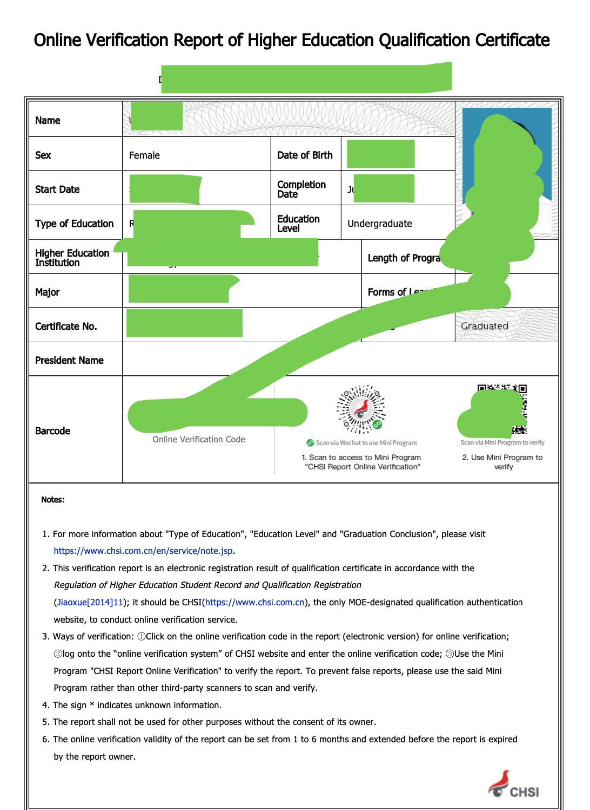

<!-- MDTOC maxdepth:6 firsth1:1 numbering:0 flatten:0 bullets:1 updateOnSave:1 -->

- [面试](#面试)
- [护照](#护照)
- [工作签证](#工作签证)
- [家属签证-老公](#家属签证-老公)
- [家属签证-孩子](#家属签证-孩子)
- [读书问题-孩子](#读书问题-孩子)
- [衣食住行](#衣食住行)

<!-- /MDTOC -->

# 面试

2021/11/15 拿到 offer & 公司资质证明 & 邀请函

# 护照

因为我之前没有办理过护照，疫情期间，新办或续签必须是因商务需求才能办理。

办理方法如下：

| 目标 | 申请护照                                                    |
| ---- | ----------------------------------------------------------- |
| 地点 | 出入境管理局 浦东新区民生路1500号（28951900）               |
| 时间 | 周一至周六：9：00--17：00                                   |
| 材料 | 身份证、户口本、孩子的出生证明、offer、公司资质证明、邀请函 |
| 周期 | 上海户口7个工作日/非上海户口20个工作日                      |
| 方式 | 邮寄、现场取                                                |

出入境的办事人员都是警察👮‍♀️，为了防止中国人被骗会问得比较详细的；推荐直接去我👆推荐的出入境管理局办理，这是上海最大的办理处，效率非常高（整个过程都是催着你哈，例如进去后就是自助的申请，接着去拍照片，然后就可以取号了）费用不多，支付宝微信都可以付款（照片和工本费）

# 工作签证

获取护照后，就可以联系HR办理工作签证EP了。正常情况下等工作签证办理完成了才能够办理亲属准证件DP，但是这里注意⚠️了，如果你的孩子也要办理家属准证，必须提前2个月准备相关材料。具体材料信息在孩子的那一节详细🔎说。

| 目标 | 申请工作签证EP                                                                                    |
| ---- | ------------------------------------------------------------------------------------------------- |
| 协助 | HR                                                                                                |
| 材料 | 护照、身份证、英文简历-Resume、学历原件&英文认证、学位原件&英文认证、ep-and-s-pass-candidate-form |
| 周期 | 材料准备1周；申请后1周获取EP                                                                      |
| 方式 | 网络                                                                                              |

材料当中有两个特别难搞的，分别是学历和学位的英文认证：

> 学历认证：《Online Verification Report of Higher Education Qualification Certificate.pdf》 学信网：<https://www.chsi.com.cn/en/>

> 学位认证：《China Academic Degrees & Graduate Education Development Center Credentials Report_WEI YAPING.pdf》 更详细的帮助：<https://sie.njust.edu.cn/e1/2d/c882a188717/page.htm>

# 家属签证-老公

| 目标 | 申请工作签证DP               |
| ---- | ---------------------------- |
| 协助 | HR                           |
| 材料 | 护照、身份证、结婚证公证     |
| 周期 | 材料准备1周；申请后1周获取DP |
| 方式 | 网络                         |

关于公证文件的办理：

1. 可以自己带着资料去公证处办理
2. 或者选择在淘宝上办理

# 家属签证-孩子

| 目标 | 申请工作签证DP                            |
| ---- | ----------------------------------------- |
| 协助 | HR                                        |
| 材料 | 护照、出生证明&出生公证、HPB 英文疫苗公证 |
| 周期 | 材料准备3个月；申请后1周获取DP            |
| 方式 | 网络                                      |

新加坡HPB英文疫苗公证的办理方法：[link]()

# 读书问题-孩子

外国孩子去新加坡读书

- if 孩子的 age = 6 and ( month between 6月份 and 10月份 )
- then 你将可以为孩子报名政府学校的小一（[第二年1月入学](https://beta.moe.gov.sg/primary/p1-registration/)）
- elif 孩子的 age > 6 then 你可以选择报读国际学校、私立学校 或 [报考AEIS](https://www.moe.gov.sg/international-students/aeis)
- else 还不需要考虑上学问题 fi

我的孩子刚上上海小学1年级，还是想尝试考一下新加坡的政府学校，选择了一家私立学校准备AEIS考试。

新加坡的教育：[link]()

# 衣食住行

- 衣服：带了内衣、夏天衣服、一套长裤长袖；拖鞋🩴；泳衣🩱（新加坡的衣服不贵）
- 食物：啥都没带
- 住行：新加坡租房子特别贵，两室一厅接近2w人民币😭；行也很贵，虽然地铁🚇和公交🚌很发达，但是贵啊，5站路7.5，来回都要15元了,我们准备买辆自行车🚴‍♀️。
- 电子产品：必须能带的都带，新加坡的很贵。例如键盘、鼠标、散热器、支架、各种充电的。本来我想连音响都带过来的哈～最后放不下了。
